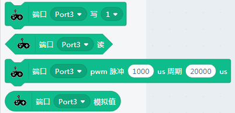
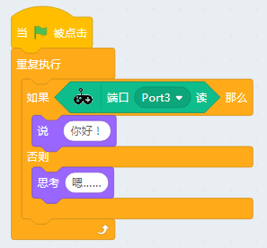
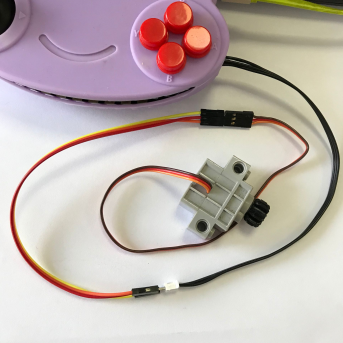
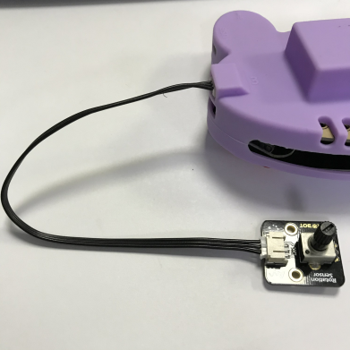

# 3PIN模块读写

## 成功加载青蛙手柄分栏，并连接上

如下图，出现绿色的勾勾图标，就证明串口已经正确连接上了

## 3PIN模块（背后的端口3与端口4）

### 数字写（以LED模块为例）

端口写，适用于逻辑电平的输入模块，如LED模块

Port3口 接好LED模块

程序：

**实验结果：** LED模块每隔一秒闪一下

### 数字读（以按键模块为例）

使用的按键模块，按下是低电平，平时是高电平

程序：

**实验结果：** 当按键按下时（低电平），小猫在思考，嗯....,否则一直说你好

### PWM写（以舵机为例）

舵机是典型的被PWM写的器件，我们可以控制舵机的角度

舵机这边因为没有做特意的转接线，所以只通过公转公杜邦线转接一下，舵机接到port3端口

程序：

### PWM写（以LED模块控制亮度为例）

程序，通过变换PWM值，可以控制LED的亮度

### 模拟读写（以电位器模块为例）

程序：

旋动电位器，观察舞台小猫说出来的值，通过模拟值的大小变化，我们可以结合Scratch舞台做些好玩的项目

