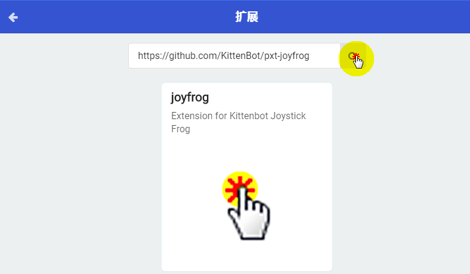
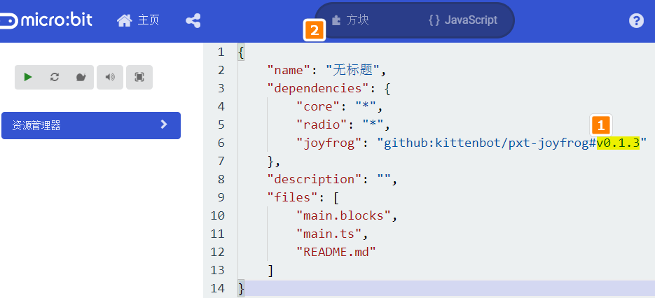
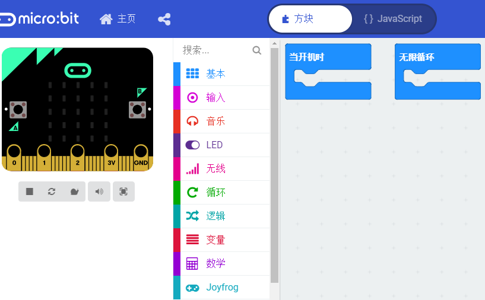
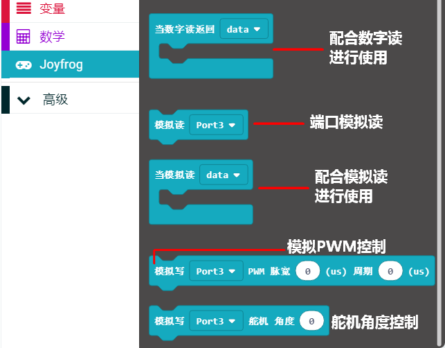
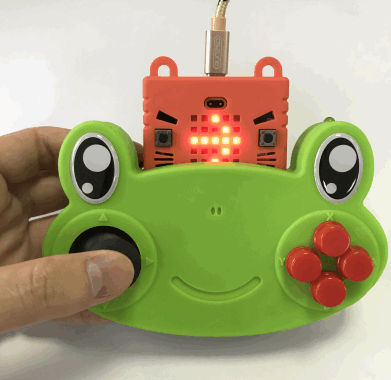
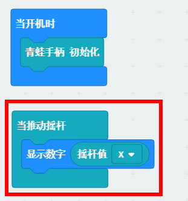

# 呱比特在Makecode中的使用教程

呱比特除了作为Scratch的测控主板以外，它还可以做为Microbit的扩展板进行使用。

## 用途

作为Microbit的手柄扩展板，萌趣可爱足有安全，小朋友会爱不释手。

遥控Microbit格斗小车、格斗机器人会更加灵活而方便

## makecode在线版本，直接加载呱比特插件

直接将链接复制到扩展种，即可，扩展链接如下。

### 扩展件中加载

https://github.com/KittenBot/pxt-joyfrog

## makecode离线版本V3.5加载呱比特插件

因为最近微软更新了makecode，所以插件地址是按照最新的框架去做的。但是我们makecode离线版本V3.5还是旧的框架。所以用makecode离线版本打开，呱比特插件的最新地址是有问题的。我们可以用呱比特插件的上一个版本。操作如下：

### 扩展件中加载

https://github.com/KittenBot/pxt-joyfrog

### 更改版本，使用旧版本

### 插件成功加载

如果使用上还是有问题，可以到Q群444193538 或者微信群联系我们技术。

## 呱比特插件介绍

## 完整快速上手

### 编写程序

以按键检测为例，拖拽积木进行编程

### 下载保存

### 实物测试

摇杆往右边，Microbit点阵屏即显示向右箭头（金手指触摸与按键按下同理）

## 积木块对应示例

### 青蛙手柄初始化

### 摇杆值

摇杆值一定要放置在 当推动摇杆这个事件中才会有变化更新

### 红外发送

红外发送与接收，是遵循最常用的NEC红外码格式。

需要特别注意：

NEC格式必然是XXXXXX（8个位），每个位对应的范围从0~9，a~f(16进制)。当然你也可以发送更少或者更多的位，这样就不是NEC的标准了

NEC格式就是我们平时家用的电视遥控器，空调遥控器遵从的红外标准

### 红外接收

不同按键发射的红外编码不一样，所以如果我们知道对应编码后。

对接收不同的编码进行程序显示处理。下面例子就是演示接收三种红外编码后的处理情况

IR_data 这个变量是自己在左侧栏目中 变量，自己进行设置变量，进行新增

字符串上的左右两边的冒号不是自己打上去的，是有对应的积木块，如下图：

只要字符串相关的，这个冒号积木块就少不了

### 数字读与模拟读

数字读，使用有点特别，需要结合事件函数

### 舵机角度控制

选择对应的Port口，这里选择端口3

### PMW控制

PMW控制一般控制LED灯亮度或者电机的转速

喵家这个PMW控制比较特别，比较开发，周期和脉冲时间都给出来了，给大家的设置更加自由了

可以按键AB控制LED不同亮度

