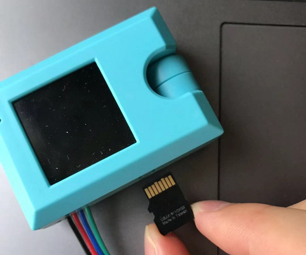
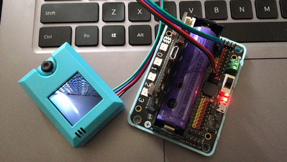

# 机器学习——自定义辨认物体

大家之前可能已经用过Kittenblock的机器学习5的插件，插件中有特征提取器，可以自定义辨别物体。

但Kittenblock中的ML5要求是要开着电脑使用的，不能离线。

KOI锦鲤魔块其中一个功能就是为了解决这个痛点。

## 装上内存卡

使用机器学习特征识别，无需内存卡。

但想永久保存训练的模型，那就需要有内存卡了。

## Robotbit硬件接线

这里以Robotbit为例，当然你也可以用Powerbrick，Powerbrick接线会更简单些，而且不会接反。

电源正负极切勿接反！

电源正负极切勿接反！

电源正负极切勿接反！

接线附图所示，请再三确认后！再打开电源！

## 打开Robotbit电源

打开电源后，锦鲤魔块就会亮起来

## 编写编写辨认物体程序

请自行加载

KOI的插件：https://github.com/KittenBot/pxt-koi

编写程序：

## 程序结果

- 把程序下载到Microbit上
- 把需要识别的物体A放在镜头前，按下Microbit的按键A，录入分类1，多按几次，多录入物体的几个角度
- 更换物体B，按下Microbit的按键B，录入分类2，多按几次，多录入物体的几个角度
- 晃动Microbit，即进入识别模式，当镜头检测到A，Microbit点阵显示1。当镜头检测到B，Microbit点阵显示2

## 常用问题和解答

1，为什么我重新打开电源，按按键A，为什么没有反应？

答：

KOI鲤鱼魔块初始化启动是需要时间，明显比Microbit慢。Microbit的初始化程序已经跑完了，KOI还没初始化。因此按按键A没有反应

**解决办法：**打开电源后，等待KOI屏幕启动完毕后。重新按下Microbit背后的Reset按键，让Microbit重新开始运行（秘诀即让KOI魔块先运行起来，再让Microbit进行运行）。

