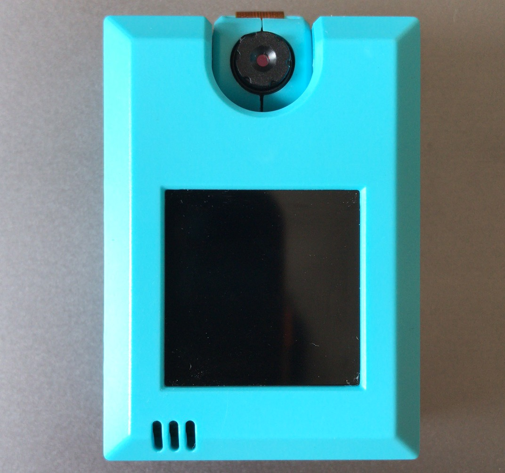
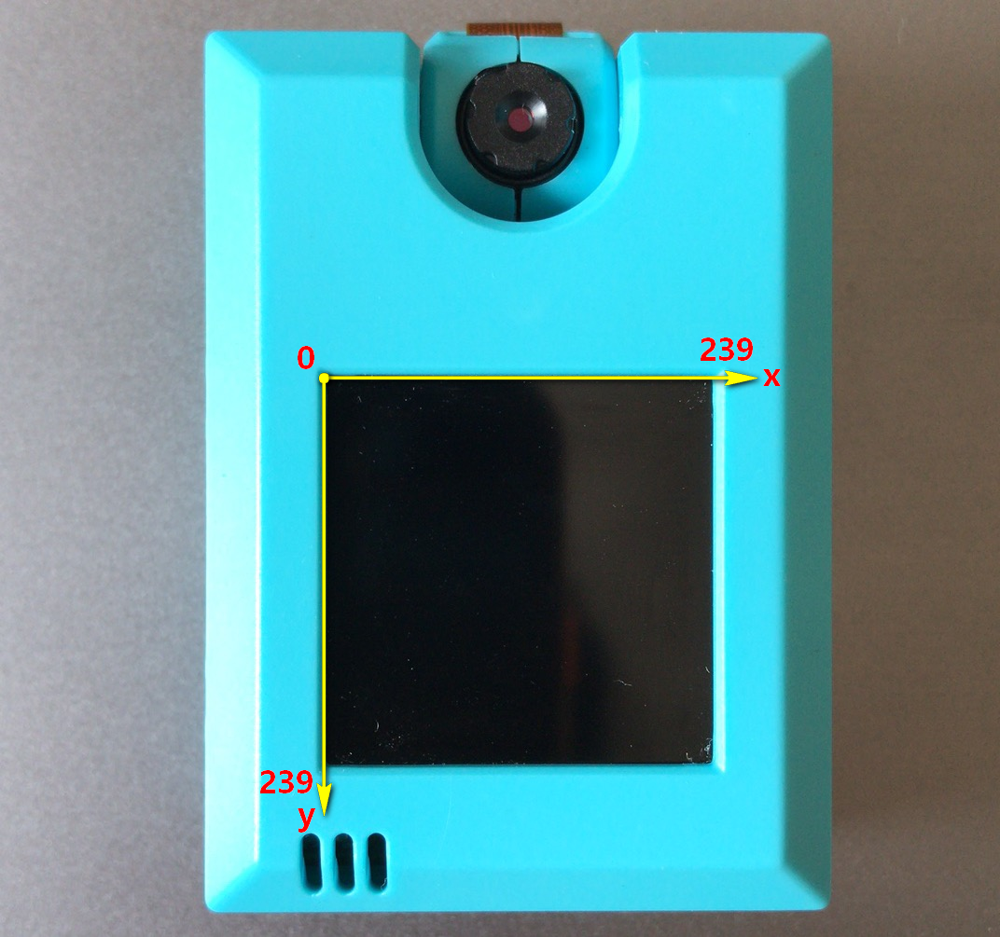
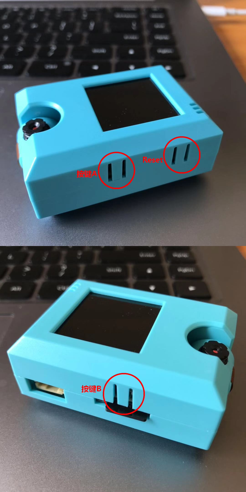
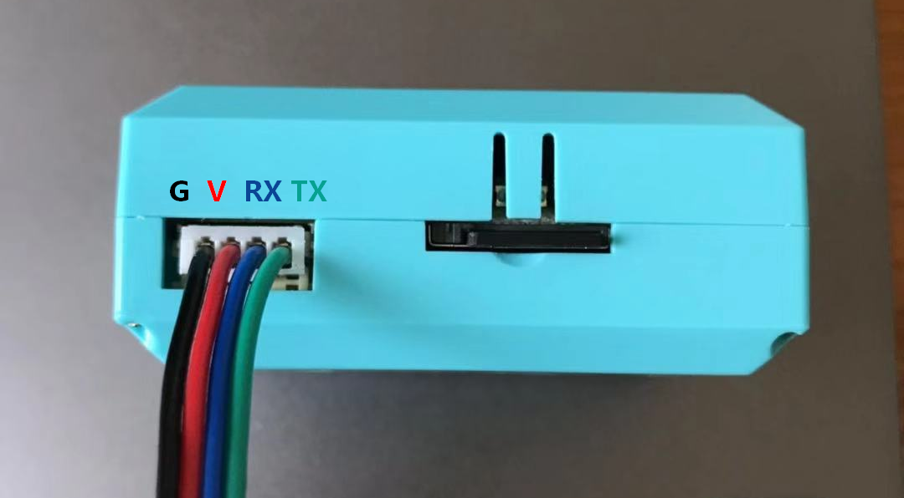
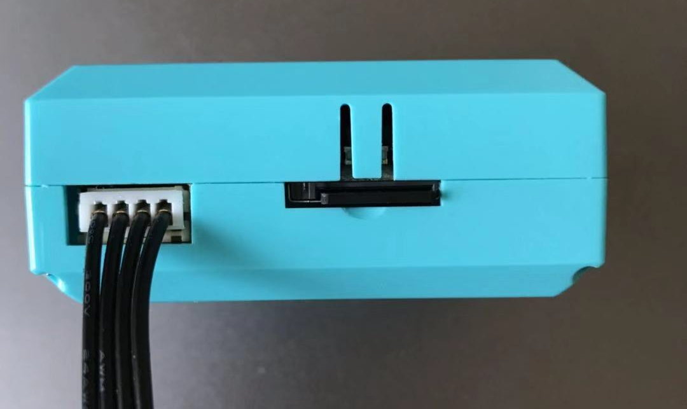
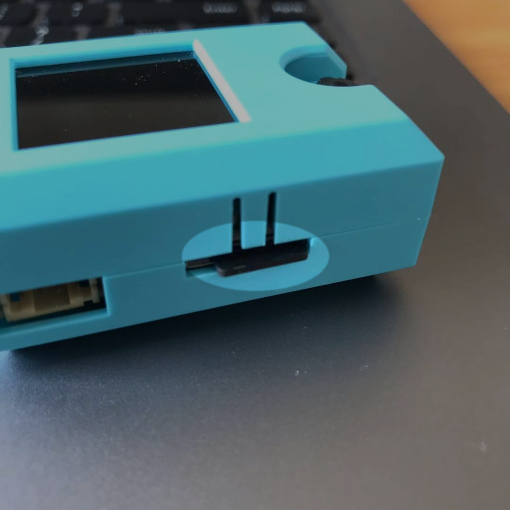
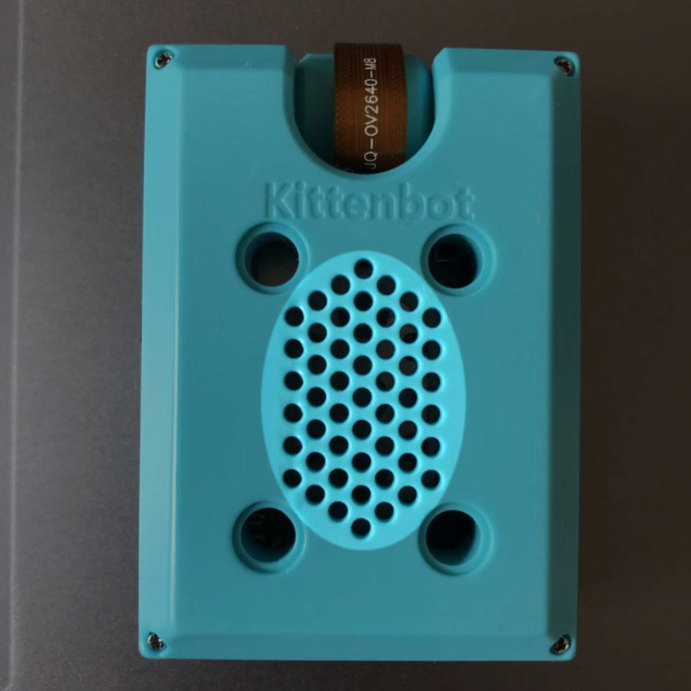
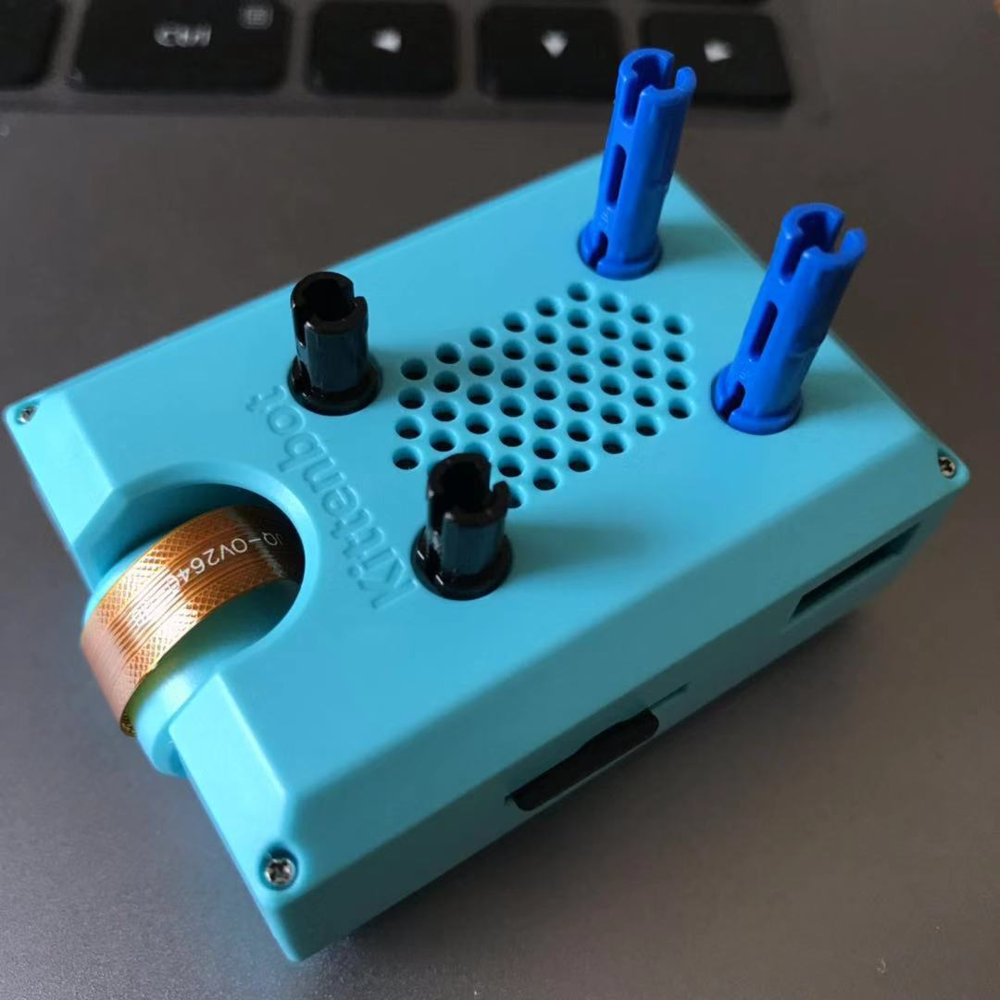

KOI锦鲤介绍
===========

购买链接
---------

前往淘宝企业店购买 → KOI锦鲤人工智能模块_  

.. _KOI锦鲤人工智能模块: https://item.taobao.com/item.htm?spm=a1z10.3-c-s.w4002-21482550023.56.12db5d5fiTwdAk&id=609728329467   

配送清单
----------

- KOI人工智能模块       x1
- MicroUSB数据线       x1
- 防呆端子转4P杜邦线    x1

产品简介
--------- 

- **定义：** KOI是小喵科技针对中小学和爱好者开发一款可图形化编程的脱机人工智能模块，硬件含有摄像头、麦克风、喇叭、IPS屏、WIFI模块等等，可实现视觉识别、语音识别、语音合成、物联网等等。齐备的功能可以让你系统性体验与学习人工智能。模块还集成WIFI功能，可以让你的人工智能作品接入云端，让作品更加出色。   
- **使用人群：** 中小学教学/爱好者/已熟悉kittenblock人工智能的进阶用户

产品特色
---------

- AI与IoT，实现真正的离线AIoT功能  
- 板载资源全面，可实现AI功能包含视、听、说全方位   
- 图形化编程和代码编程有机结合，无论是新手还是创客均适合
- 可自主训练机器模型，并支持由内存卡从外部导入模型使用 

功能枚举
----------  

+--------------+-------------------------------------+------------------+
|功能          |           详细                      |    应用案例      |
+==============+=====================================+==================+
|视觉追踪      |        - 形状追踪                   |- 无人车走公路    |
|              |        - 色块追踪                   |- 自动倒车入库    |
+--------------+-------------------------------------+------------------+
|物体/人脸追踪 |        - 支持20个分类               |- 人脸识别门禁    |
|              |        - 可输出位置和可信度         |- 追踪特定物体    |
+--------------+-------------------------------------+------------------+
|特征分类器    |        - 最多20个分类(100个样本)    |- 猜拳机器人      |
|              |        - 自定义识别物体             |- 垃圾分类装置    |
|              |        - 脱机训练，不需要电脑辅助   |                  |
|              |        - 从SD卡保存或加载分类模型   |                  |
+--------------+-------------------------------------+------------------+
|扫码模式      |        - 二维码                     |- 无人商店        |
|              |        - 条形码                     |- 无人车公路模拟  |
|              |        - AprilTag卡片识别和空间定位 |                  |
+--------------+-------------------------------------+------------------+
|语音相关      |        - 语音识别                   |- 语音识别智能家居|
|              |        - 语音合成                   |- 类智能音箱      |
|              |        - 录音及变声                 |- 天气播报助手    |
|              |        - 调用语音对话接口           |- 自定义语音闹钟  |
|              |        - 播放网络或本地音频         |                  |
|              |        - 关键字识别                 |                  |
+--------------+-------------------------------------+------------------+
|WIFI控制      |        - 支持物联网MQTT             |- 物联网智能家居  |
|              |        - 人工智能信号与物联网交互   |- 远程控制        |
+--------------+-------------------------------------+------------------+
|云端AI功能    |        - 图像内容识别               |- 停车场管理系统  |
|              |        - OCR 文字识别               |- 人脸识别考勤    |
|              |        - 车牌识别                   |                  |
|              |        - 表情识别等等               |                  |
+--------------+-------------------------------------+------------------+
   

产品参数
----------

- 处理器：K210
- 支持的主控：Microbit、喵比特、Arduino系列及任何带有串口功能的主控板
- 显示屏：1.3寸 240x240 IPS屏
- 摄像头：640x480 RGB
- 音频输入/输出：单声道48k采样率输出，8k采样率麦克风输入
- SD卡槽：可插入TF卡，用于储存AI模型和影音资源
- 无线通信：WIFI基于ESP8285
- 数据输出方式：UART / WIFI /USB
- 图传通道：USB / Wifi
- 前置补光灯
- 输入按键：2个，可编程
- 内存卡支持：16 G
- 供电电压：3.3～5v  
- 可支持的编程环境：Kittenblock/Makecode/Micropython/Arduino (PlatformIO)  

认识模块
---------  

为了后续更容易掌握模块的丰富功能，首先需要了解模块的每个部分，为此请通读下列图文。 

**模块的正方向**

此为KOI锦鲤模块的正方向

**旋转镜头**

镜头旋转为0~180。若从前往后旋转，注意摄像头排线的收纳，动图GIF

**摄像头前置**

不难理解，摄像头与屏幕同一方向为摄像头前置，如图

前置一般应用在：人脸追踪交互、物体追踪交互，可从屏幕直观看到摄像头的数据

**摄像头后置**

摄像头与屏幕反方向为摄像头后置，如图

后置一般应用在：条码、二维码扫描、线条追踪等

.. image:: KOI00/03.png

**屏幕与屏幕坐标系**

屏幕为高清IPS屏，像素为240x240

坐标系原点起始为屏幕的左上角

屏幕用于显示摄像头的实时数据流，与一些操作的交互信息

**按键AB与复位按键Reset**

模块左右两侧各有一个可编程按键，类似Microbit的A和B按键

**麦克风**

屏幕左下方有收音的麦克风，收音距离约为50cm

.. image:: KOI00/05.png

**USB数据口**

此数据口用于给模块更新固件或者给模块供电

.. image:: KOI00/06.png

**PH2.0 4PIN串口**

此接口用于与能量魔块主控盒、Microbit、Arduino或者其他带串口的板子进行串口通讯

4PIN引脚定义：

新手强烈推荐使用能量魔块主控盒，这样不会有插错的风险

**TF卡槽**

TF卡槽为弹卡式卡槽，最大内存支持为16G，可以存放音频，图片、机器学习模型等。

**喇叭**

喇叭用于播放内存卡内的音频文件

**乐高插销孔**

模块的乐高插销孔为全孔（普通）插销孔，尺寸符合乐高尺寸。

插销孔间距：

长为4个插销孔间距

宽为3个插销孔间距

