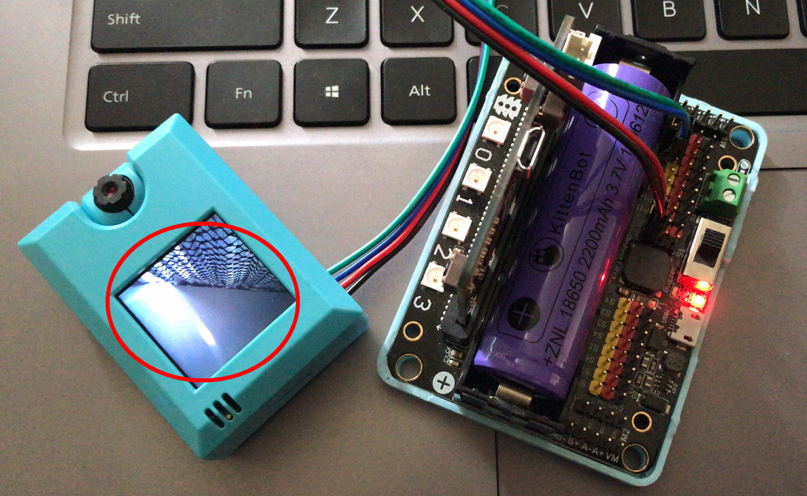
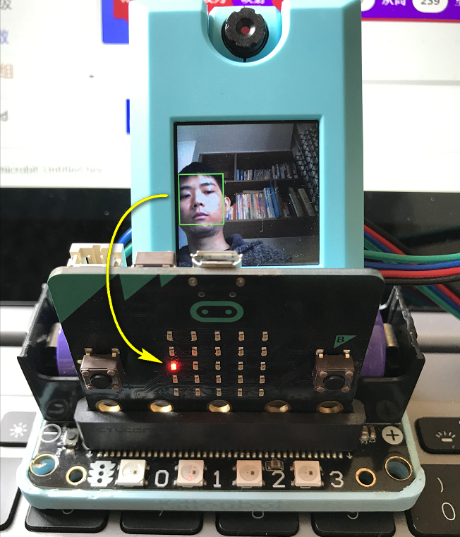
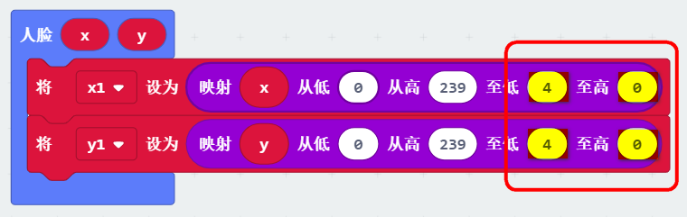

# 人脸检测追踪

人脸检测追踪在安防情况下常常被用到。本节教程教大家如何将人脸位置反映在Microbit的点阵上

## 能量魔块硬件接线

## Robotbit硬件接线

这里以Robotbit为例，当然你也可以用Powerbrick，Powerbrick接线会更简单些，而且不会接反。

此处电源接5V！

电源正负极切勿接反！

电源正负极切勿接反！

接线附图所示，**请再三确认后！再打开电源！**

## 打开Robotbit电源

打开电源后，锦鲤魔块屏幕就会亮起来

## 编写人脸检测追踪程序

请自行加载KOI的插件：https://github.com/KittenBot/pxt-koi

编写程序：

## 程序原理

在无限循环中放入人脸追踪检测，当检测到人脸，调用人脸函数，人脸函数返回人脸坐标xy

## 程序结果

把程序下载到Microbit上，可得到结果，可以看到Microbit的点阵随着人脸的移动而移动

## 改变点阵的映射方向

在某些情况下，如果你想LED的改变运动方向，将“低至4至高0”更改为“低至0至高4”

## 常用问题和解答

1，为什么我重新打开电源，模块屏幕显示“Yolo not loaded”，且卡住了？每次都能重现

答：KOI鲤鱼魔块初始化启动是需要时间，明显比Microbit慢。Microbit的初始化程序（串口指令控制加载Yolo模型）已经跑完了，KOI还没初始化。所以屏幕会有报错信息。

**解决办法：**打开电源后，重新按下Microbit背后的Reset按键，让Microbit重新开始运行（秘诀即让KOI魔块先运行起来，再让Microbit进行运行）。

2、KOI鲤鱼魔块我直接3V电源可以吗？

答：不行，必须要接5V！

3、为什么KOI鲤鱼魔块要接5V

答：在模块功率一定的情况下，5V电压下，对电流的要求没那么高。 

<!-- 
<iframe style="position:absolute;top:0;left:0;width:100%;height:100%;" src="https://makecode.microbit.org/#pub:_2hP2HRfC18k3" frameborder="0" sandbox="allow-popups allow-forms allow-scripts allow-same-origin"></iframe>
 -->