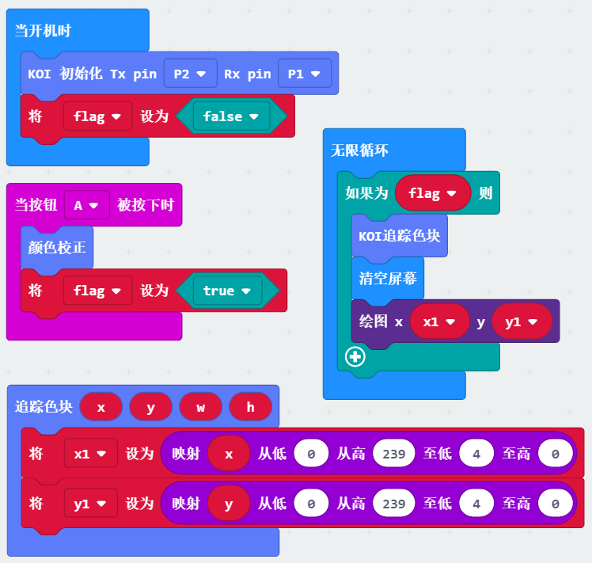

# 颜色检测追踪

颜色追踪一般用于与机器人交互，或者流水线分拣等场景中。

颜色追踪前必须进行颜色校准，否则模块不会知道追踪什么颜色。

## Robotbit硬件接线

这里以Robotbit为例，当然你也可以用Powerbrick，Powerbrick接线会更简单些，而且不会接反。

电源正负极切勿接反！

电源正负极切勿接反！

电源正负极切勿接反！

接线附图所示，请再三确认后！再打开电源！

## 打开Robotbit电源

打开电源后，锦鲤魔块就会亮起来

## 编写颜色追踪程序

请自行加载KOI的插件：https://github.com/KittenBot/pxt-koi

编写程序：

## 按键A触发颜色校准

颜色校准触发后，AI模块会出现一个小方块在屏幕中央，把要识别的颜色放在小方块处，等待一会，颜色校准成功，即可。

## 先进行颜色校准再进行颜色追踪

颜色追踪前必须先校准：

因此这里设置了标志位变量flag。程序初始化时间flag设置为假，当颜色校准后设置为真，在循环中检测，当flag检测为真时，启动颜色追踪

## 程序结果

把程序下载到Microbit上

按下按键A进入校准模式

校准成功后，可以看到颜色已经可以进行追踪了。

## 常用问题和解答

1，为什么我重新打开电源，按按键A，不能进入颜色校准？

答：KOI鲤鱼魔块初始化启动是需要时间，明显比Microbit慢。Microbit的初始化程序（串口指令控制加载Yolo模型）已经跑完了，KOI还没初始化。因此按按键A没有反应

**解决办法：**打开电源后，重新按下Microbit背后的Reset按键，让Microbit重新开始运行（秘诀即让KOI魔块先运行起来，再让Microbit进行运行）。

2、KOI鲤鱼魔块我直接3V电源可以吗？

答：不行，必须要接5V！

3、每次上电后都需要颜色校准吗？

答：是的，存储机制没有做永久保存，因此每次程序复位后，都需要进入校准环节。

