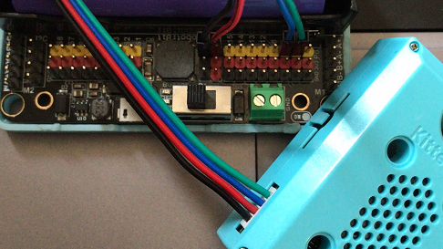
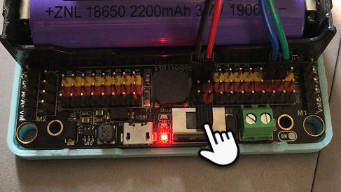

# 二维码、条形码、Apriltag检测

条形码广泛用于我们生活中，例如产品的识别标签。二维码用于支付场景或者社交场景。

Apriltag用于机器视觉中，可以简单理解为是简化版的二维码，具有识别距离远，识别速度快，识别准确的特点。当然随之而来储存的信息远不及二维码。

## Robotbit硬件接线

这里以Robotbit为例，当然你也可以用Powerbrick，Powerbrick接线会更简单些，而且不会接反。

电源正负极切勿接反！

电源正负极切勿接反！

电源正负极切勿接反！

接线附图所示，请再三确认后！再打开电源！

## 打开Robotbit电源

打开电源后，锦鲤魔块就会亮起来

## OLED接线

这里使用了0.96寸的OLED

## 编写条码识别程序

请自行加载

KOI的插件：https://github.com/KittenBot/pxt-koi

OLED的插件：https://github.com/KittenBot/pxt-oled

加载OLED的插件，用于显示线条的两个端点的坐标（x1，y1）和（x2，y2）

编写程序：

## 编写二维码识别程序

## 编写Apriltag识别程序

## 按键A进行识别

以上三个程序都是当按键Microbit的按键A，进行识别，OLED显示屏进行结果显示

## 程序结果

把程序下载到Microbit上

把二维码、条形码、或者Apriltag放在识别镜头前，保证完全入镜且清晰（废话）

校准成功后，可以看到颜色已经可以进行追踪了。

## 常用问题和解答

1，为什么我重新打开电源，按按键A，为什么不会返回结果？

答：

可能有两个原因：

原因1：KOI鲤鱼魔块初始化启动是需要时间，明显比Microbit慢。Microbit的初始化程序（串口指令控制加载Yolo模型）已经跑完了，KOI还没初始化。因此按按键A没有反应

**解决办法：**打开电源后，重新按下Microbit背后的Reset按键，让Microbit重新开始运行（秘诀即让KOI魔块先运行起来，再让Microbit进行运行）。

原因2：识别的二维码、条形码、Apriltag没有完全入镜，无法识别，或者显示太模糊，无法识别。条形码常规食品袋上的条码太小，一般建议条形码的最小高度不小于3CM。

