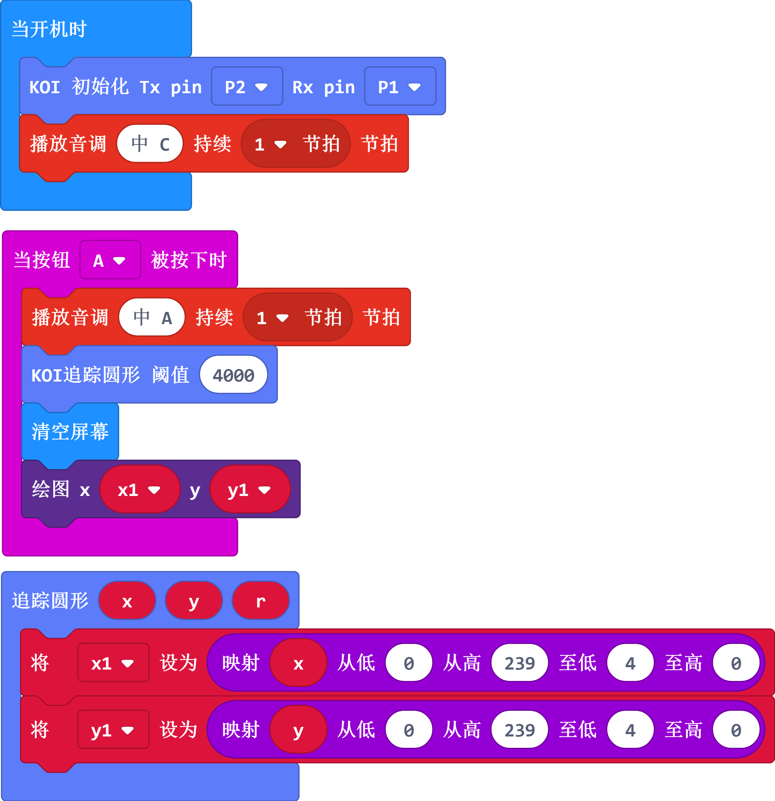
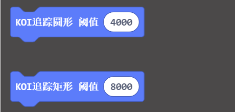

# 矩形与圆形追踪检测

矩形与圆形追踪在生活中用得比较少，一般用在食品工业流水线上的视觉分拣与码垛场景。

## Robotbit硬件接线

这里以Robotbit为例，当然你也可以用Powerbrick，Powerbrick接线会更简单些，而且不会接反。

电源正负极切勿接反！

电源正负极切勿接反！

电源正负极切勿接反！

接线附图所示，请再三确认后！再打开电源！

## 打开Robotbit电源

打开电源后，锦鲤魔块就会亮起来

## 编写矩形追踪程序

请自行加载

KOI的插件：https://github.com/KittenBot/pxt-koi

编写程序：

## 编写圆形追踪程序

编写程序：

## 阈值解释

以上程序都很简单，唯一需要注意就是，需要自主尝试并调整阈值。阈值越大，干扰越少，但识别难度也会提高。因此需要自己根据场景多做测试。

## 按键A进行识别

把程序下载到Microbit上

把矩形或者圆形放在识别镜头前，保证完全入镜且清晰（废话）

当按下Microbit的按键A，进行识别，Microbit的点阵屏显示位置。

## 如何提高识别率

- 保证识别背景比较单调，不能太杂乱
- 矩形和圆形应该要有锐利的轮廓

## 常用问题和解答

1、为什么我重新打开电源，按按键A，为什么不会返回结果？

答：

KOI鲤鱼魔块初始化启动是需要时间，明显比Microbit慢。Microbit的初始化程序（串口指令控制加载Yolo模型）已经跑完了，KOI还没初始化。因此按按键A没有反应

**解决办法：**打开电源后，重新按下Microbit背后的Reset按键，让Microbit重新开始运行（秘诀即让KOI魔块先运行起来，再让Microbit进行运行）。

2、如何提高识别率

答：

调整识别阈值，调整识别环境与调整识别物体。