# makecode快速开始

## 打开Makecode

可以使用在线版本或者离线版本的Makecode

[https://makecode.microbit.org](https://makecode.microbit.org/)

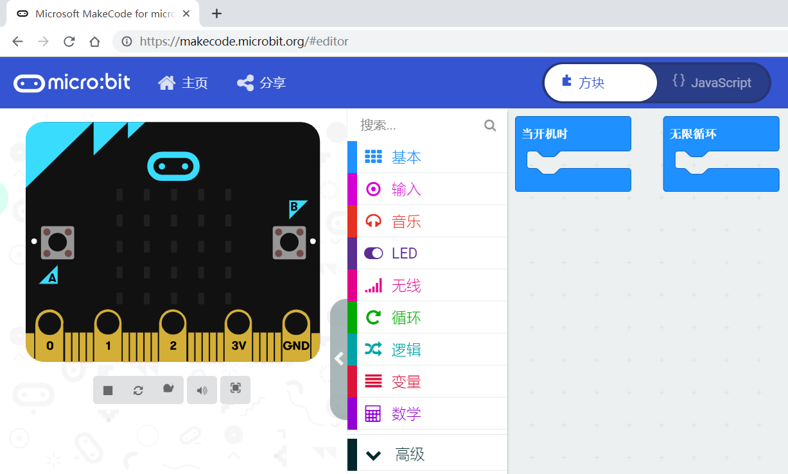

## 加载插件

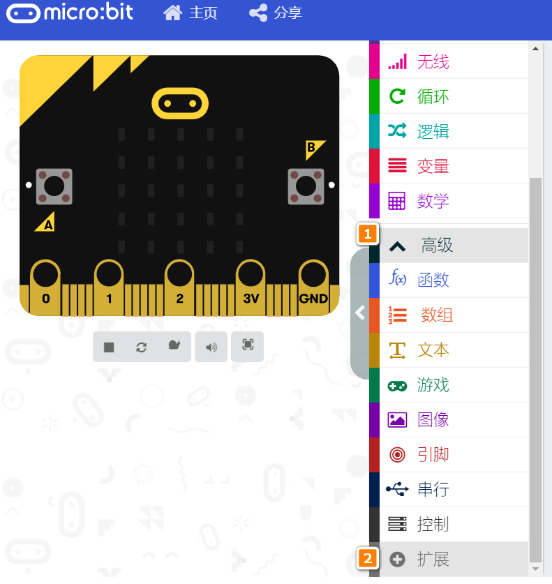

粘贴KOI的插件连接：https://github.com/KittenBot/pxt-koi

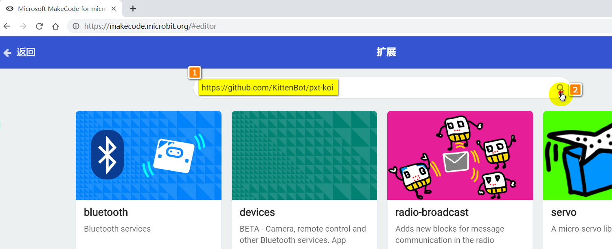

KOI插件成功加载，如图所示	

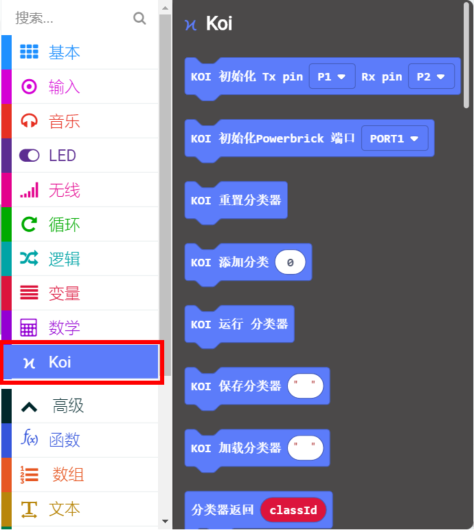

## 连接初始化

第一个积木——针对是Robotbit或者其它Microbit扩展板

第二个积木——针对是能量魔块的Armourbit，新手推荐使用能量魔块套件

## ML5分类器

如果大家熟悉PC端的KittenbotML5插件，那么理解KOI的ML5积木块也就很简单了。

ML5分类器用于自定义学习特定的物体或者场景等等

## 截图与显示

使用此功能前，要求TF内存卡必须已经插在KOI魔块上，否则截图无法保存。

调用截图积木块，会以“XXX.png”存储一张图片到内存卡中。**如无内存卡，显示截图失败！**

调用显示积木块，会在内存卡中寻找一张以“XXX.png”为名的图片，并以显示，显示持续1S左右。若内存卡中无此图片，则屏幕反馈信息无法无法打开此文件。

## 显示信息

调用打印积木块，可在屏幕上显示信息，屏幕是处于不断刷新状态，因此显示信息只是一瞬间就会消失了。

打印坐标用于设置字符串的起始坐标。

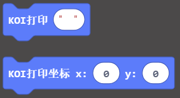

## 设置屏幕显示

前置与后置两种选择，因为模块无法自动检测当前摄像头是前置或者后置的状态。因此需要手动选择设置。屏幕对应会根据选择进行画面翻转处理。

## 圆形追踪

阈值越大，排除干扰越强，但阈值太大，圆形检测会越难。

x与y为检测圆形在屏幕上的横纵坐标，r为圆形半径。

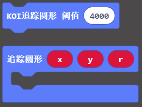

## 矩形追踪

与圆形追踪功能同理

w与h为检测矩形时，框选出矩形的 线框长与宽

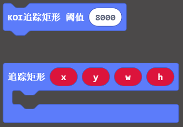

## 颜色巡线与颜色追踪

颜色巡线与颜色追踪前，必须进行颜色校准

视觉巡线对应的坐标是直线段的两点坐标（x1，y1）（x2，y2）

色块参数与矩形追踪同理

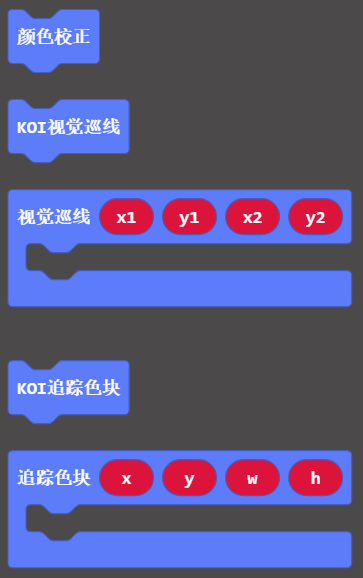

## 二维码

扫描检测二维码，返回二维码结果。

二维码宽度要求不小于3.5cm，一般微信名片二维码大于3.5cm。若二维码太小，会因分辨率太小的原因无法识别。

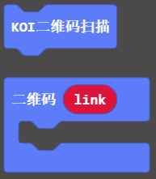

## 条形码

扫描检测条形码，返回条形码结果

条形码要求不小于3.5cm。若条形码太小，会因分辨率太小的原因无法识别。

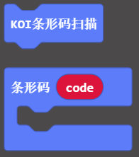

## Apriltag

Apriltag简单理解为简化版的二维码，Apriltag还能监测出坐标与其三轴的旋转角度。

Apriltag广泛应用到机器人视觉识别的场景中

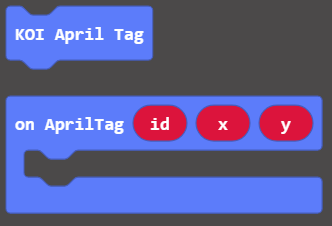

## 人脸模型yolo检测

初始化需要加载人脸模型

每次调用人脸追踪，检测到人脸即返回人脸坐标xy

检测人脸，返回人脸的坐标

