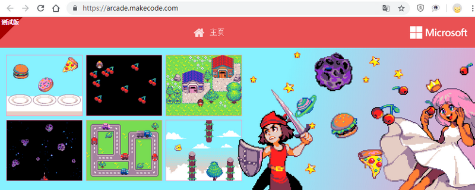

# Meowbit(喵比特)

编程地址：

[https://arcade.makecode.com/](https://arcade.makecode.com/)

## 喵比特视频教程

刚入手喵比特可以首先跟随入门视屏进行最基本的使用了解

00安装锂电池包：[https://www.bilibili.com/video/av48035704](https://www.bilibili.com/video/av48035704)

01开箱入门：[https://www.bilibili.com/video/av41698721 ](https://www.bilibili.com/video/av41698721 )

02角色创建：[https://www.bilibili.com/video/av42208660](https://www.bilibili.com/video/av42208660) 

03角色抛射物创建：[https://www.bilibili.com/video/av42208759](https://www.bilibili.com/video/av42208759) 

04场景创建：[https://www.bilibili.com/video/av42208888](https://www.bilibili.com/video/av42208888) 

05游戏信息使用：[https://www.bilibili.com/video/av42208954](https://www.bilibili.com/video/av42208954) 

06游戏标题信息：[https://www.bilibili.com/video/av42209011](https://www.bilibili.com/video/av42209011) 

## 喵比特入门=>进阶教程文档

[https://meowbit-doc.kittenbot.cn](https://meowbit-doc.kittenbot.cn)

## 论坛——分享与疑难求助

[https://bbs.kittenbot.cn/forum.php?mod=forumdisplay&fid=57](https://bbs.kittenbot.cn/forum.php?mod=forumdisplay&fid=57)

