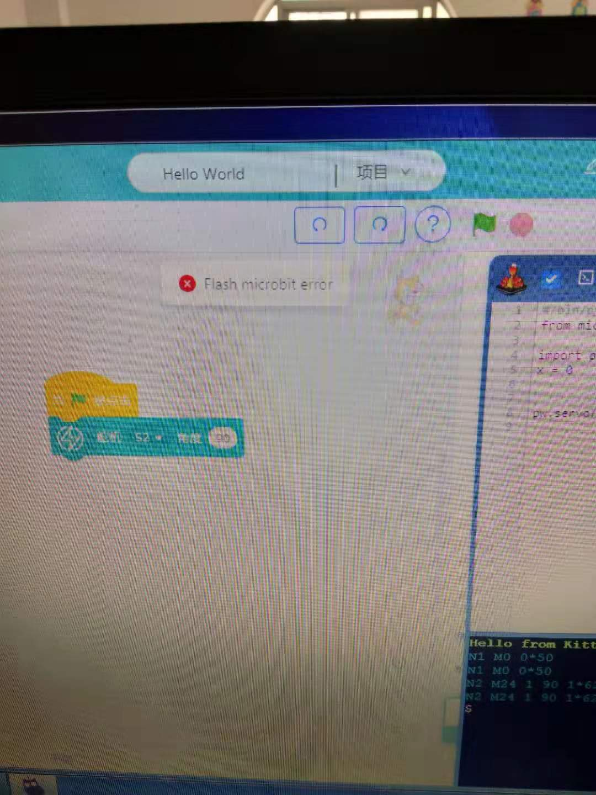

# Microbit使用常见问题解答  

`问：Microbit连上电脑未显示盘符怎么办？ `

答：
- Microbit所使用的USB必须有数据传输功能，而某些USB则可能只有简单的充电功能，尝试换一条 
- 可能是电脑USB口损坏，换个USB口试试 
- Microbit插上未能自动安装驱动，可能是USB驱动顺坏，下载驱动精灵检修试试 

`问：Microbit的盘符名是MAINTANENCE,而且无法下载程序怎么办？ ` 

答： 
- MAINTANENCE意味着进入了维护模式，这个模式下通常是用来更新底层固件的，进入的方式为按着背面Reset键并同时插入USB，优势可能插USB的时候会误触，大部分情况只需要重新拔插USB即可恢复  
- 如果重新拔插依然无法恢复，则可能固件损坏，需要重新烧录固件，此时拖入固件程序即可恢复。首先点击下载 [固件文件](http://cdn.kittenbot.cn/microbit/0253_kl26z_microbit_0x8000.hex) 。将文件拖入盘符等待即可 
  

`问：kittenblock连接不上串口怎么办` 

答： 
如果有这个问题，那么你很大可能没有好好看上面的入门教程。不过也不妨碍。连接串口需要有串口驱动。点击下载[串口驱动](https://bbs.kittenbot.cn/forum.php?mod=attachment&aid=MjUyNnxiM2ZjZTU1OXwxNTQ1MTI0NTI0fDN8NDA0) 
解压出来，右键图标->一管理员身份运行 
(注意需要安装驱动的时候需要先USB连好microbit) 

`问 : `如果恢复固件或者下载程序时出现**Flash Error**字样怎么办 
 

答：  
如果盘符确定显示是Microbit无误，那么说明电脑系统是精简版本的ghost，阉割了Python的库，装一个最新版本的QQ 就会自动把Python的库给补全了。