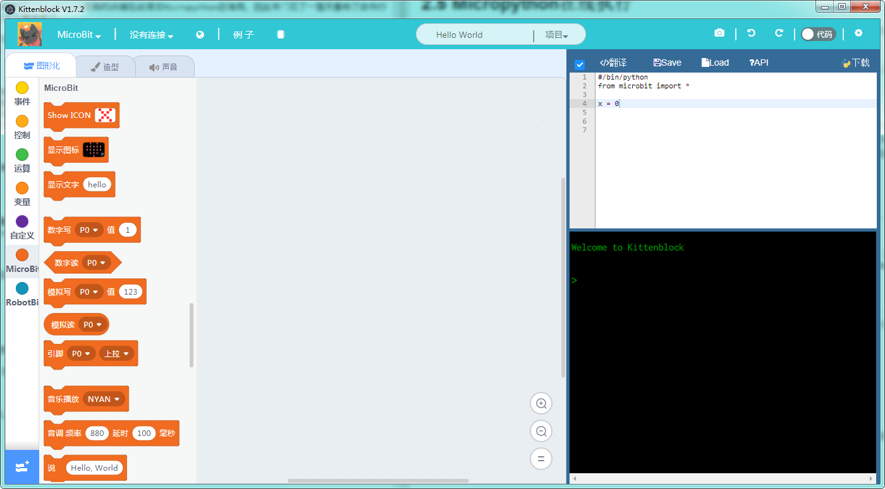

# Micropython在线执行

为什么会有这个2.5章呢？因为在写这个教程的时候发现Kittenblock现有的终端在线调试Micropython巨难用，因此专门花了一整天重构了命令行终端全部代码。虽然现在还不算特别好用，但是应该不算难用了。

在第十章之前我们都是基于1.73以前版本写的，后面会基于新的版本慢慢更新。
这篇教程只针对kittenblock v1.73及以上版本

## Micropython在线执行代码

还记得第一章我们说过的，python语言一个很大的特点就是动态解释吗，我们可以像跟机器人对话一样给他编程。简单来说就是我们写一行代码机器执行一行，之后马上得到结果，而不用重新下载程序。适合代码比较简单并且对实时性要求不高的应用场合。很多时候我们洋洋洒洒写了几百行或几千行代码，结果一执行程序直接崩溃了。更好的方法就是把所有功能分成一个个小的模块和组件，先在命令行下调试ok后再组合。大家看其他python资料，如果提到repl模式其实指的就是类似这种通过命令行将代码发给解释器。

**PS： 注意在线模式需要microbit串口通信的功能，如果在通信下拉栏中还找不到microbit的同学请退回前面章节安装驱动部分，或者在我们的qq群或者社区求助。**

### 准备工作

为了使用需要先给microbit下载一个空固件，所谓空固件就是指在编程区没有其他任何方块的时候生产的固件，如下图：

可以看到在右侧生成的代码除了import和默认变量外什么东西都没有，将这个固件下载到microbit上，之后连接上串口，这时候可能需要手动复位一下microbit。如无意外的话可以在终端下看到Microbit固件的启动信息，其中包括kittenbot团队对microbit固件的改动声明。

另外大家也可以点击菜单栏顶部的快速恢复固件的方法，直接下载一个空的程序到microbit上面。空固件的作用主要是准备好一个python的开发环境，虽然什么程序都没有但是能够马上接收代码指令并开始执行。

## 跟Micropython解释器对话

接下来我们在命令行终端点击最后一行，可以看到光标闪烁告诉我们可以输入代码。这里我们先介绍一下Kittenblock命令行终端几个常用命令，在命令行下输入：

* clear：清屏，快捷键 ctrl+l
* showmsg：显示命令行启动信息
* help：显示默认命令

现在命令还很少，大家可以多去我们群或者论坛提需求。

我们先在命令行输入`help()`，注意要加上`()`表示这是一个函数执行。按回车执行，可以看到返回了一连串micropython的使用说明。

实际上`help()`是micropython的系统默认函数，我们实际上用命令行执行了`help`这个函数。

接下来我们用python做一些简单的数学计算：

`a = 100`

`b = 2`

`a+b`

`print('a/b ={}', a/b)`

大家可以将上面的命令行依次输入到终端看看输出，也可以自己发挥想象。

除了计算我们也可以使用命令行完成micropython基本所有功能，例如显示一个图形：

`import microbit`

`heart = microbit.Image.HEART`

`microbit.display.show(heart)`

