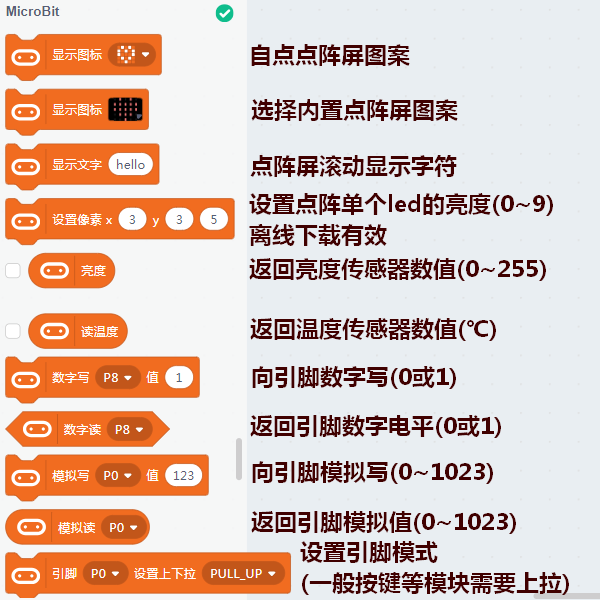
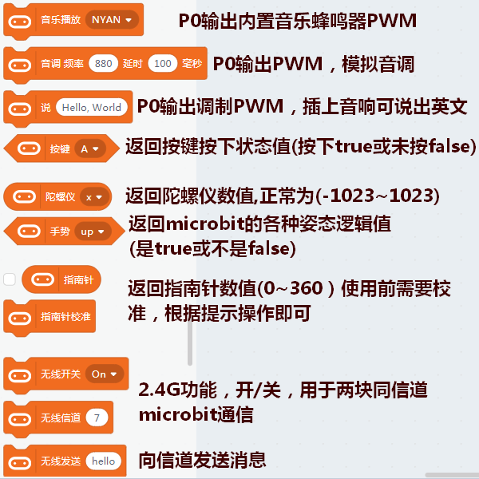
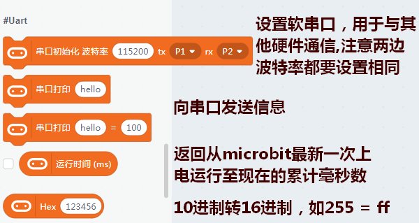
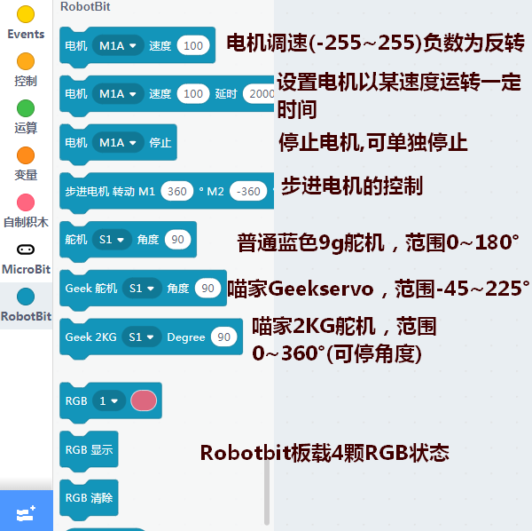
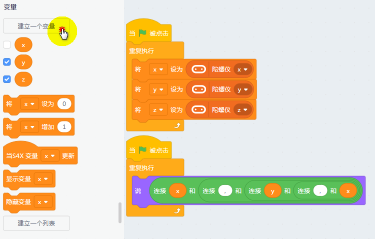
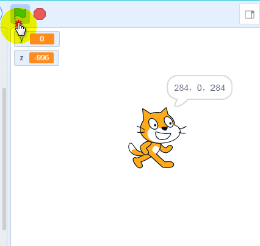
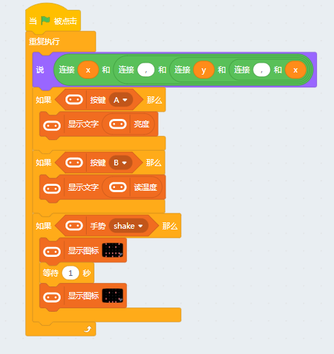
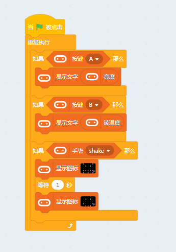
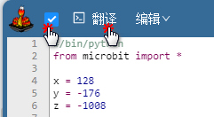

# Microbit在Kittenblock中使用 

## kittenblock的知识准备

你需要确保你已经对kittenblock软件有基本了解了。可以参考这里

## Microbit分栏介绍  

- 这是最基本的microbit积木块功能介绍

 
 
  

- 加载microbit硬件的时候，其中Robotbit分栏也会一同出现，Robotbit指的是Microbit的一块高性能扩展板
**【Microbit本身的驱动能力很弱，而搭配Robotbit使用，可驱动至少8路舵机，以及4路直流电机或2路步进电机】**

 

 


## 在线控制microbit 

所谓的在线，意指给microbit一个通讯固件，使用kittenblock软件通过点击积木块，发送1个对应的行动指令给microbit，从而做出对应反应。 

- Step 1：恢复固件

下载这个通信固件(我们称之为恢复固件，并且默认你已经了解过kittenblock如何选择硬件和连接串口了)  

 

恢复固件成功后重连一下串口，之后会在点阵屏上出现❤图案

   


- Step 2：编写程序  

首先，确定一个程序目的，我们要实现只要我运行程序，我就能实时得到microbit的陀螺仪x、y、z轴的数值，亮度和温度值，还能使用基本的手势功能  

接着就开始设置程序流程：  

**使用舞台小猫说出陀螺仪的数值=>使用A、B按键按下来切换显示亮度和温度值=>通过shake(晃动)来显示表情**

①. 为了显示陀螺仪和让小猫说出来，首先新建几个变量寸返回值，然后搭建如下程序

  

之所以在每个程序开头都放一个小旗子的积木块，因为了一键运行这些程序块，点击小旗子，看着数值的变化，第一步就成功了

   

②. 实现后续的功能只需要接着搭建如下程序，最后再点击小旗子运行。你是否已经理解了在线运行的魅力了呢？

   


## 上传程序离线运行  

我们任然使用上面搭好的那段程序，但先将一些部分删掉，保留如下 

  

```attention::之所以要这么做，是因为要上传的程序不允许有舞台相关积木块，也不允许有多个无线循环积木块
```

调出代码框，点击上传。(实际上传的并不是积木块，而是框框内转译出来的代码)


如果发现代码框内没有代码，请勾选翻译前的框并点击翻译。若任然没有，可能是混用了不同硬件的积木块或使用了舞台积木块(下方会有对应报错) 
 
 


