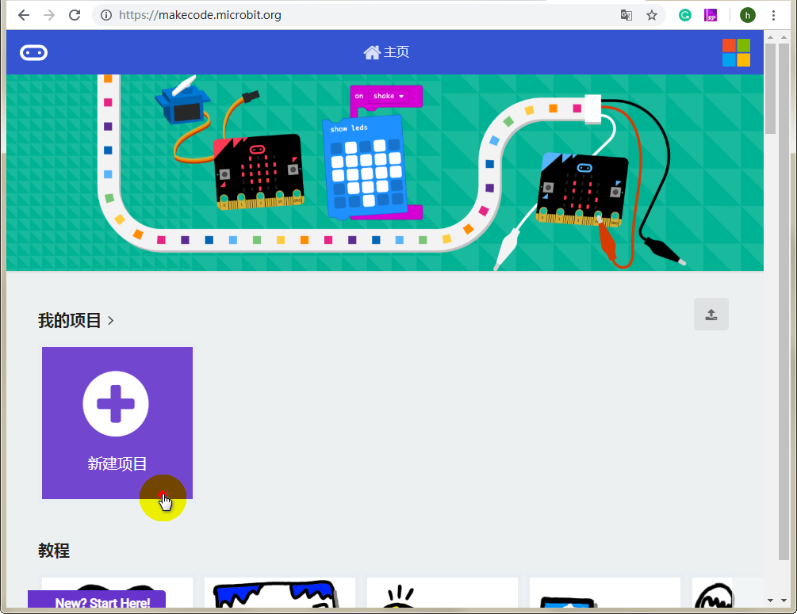
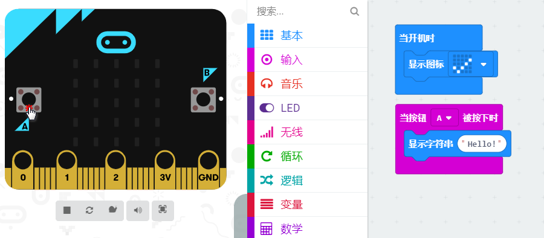
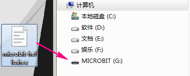
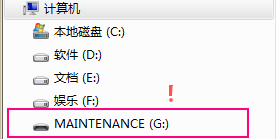

# Microbit在Makecode中使用 

## 网页版makeocode

地址： [https://makecode.microbit.org](https://makecode.microbit.org)   

- 新建项目，进入编程界面  

  

- 简单编程  

搭建如下程序，makecode的优势在于界面内包含模拟器。当年搭建好程序，如果没逻辑错误的话，可以看到效果，电机按键A试试

   

- 下载程序  

电机下载按钮并将程序下载到本地(可以先更改一下你想要的项目名）

   

   

- 上传到microbit运行  

注意，如果盘符一定得是MICROBIT，若为MAINTANENCE，此状态无法下载程序，解决办法查看`常见问题解决`

  
   

## 喵家离线版Makecode 

- 下载离线版软件  

地址： [https://www.kittenbot.cn/makecode](https://www.kittenbot.cn/makecode) 

- 程序上传  

由于和在线版编程无差别就不多叙述，主要是程序上传使用离线版更方便。直接点击下载，程序将自动拷贝到MICROBIT盘符并实现运行，而若要获取本地程序文件，则点击右侧的保存按钮即可。   

  

