# Microbit在Mu中使用  

首先你得确保安装了串口驱动  
点击下载[串口驱动](https://bbs.kittenbot.cn/forum.php?mod=attachment&aid=MjUyNnxiM2ZjZTU1OXwxNTQ1MTI0NTI0fDN8NDA0) 
解压出来，右键图标->一管理员身份运行 
`注意需要安装驱动的时候需要先USB连好microbit` 

## 使用Mu的理由 

- Mu是Mu editor的简称。之所以最后才推荐它，是因为Mu编程方式是纯代码形式，对入门存在门槛。但它却是编程路上必须经历的。

- Mu可以使用REPL(交互式解释器)，这种方式对于编程来说更方便，就好比在kittenblock中点击积木块能立马看到现象一样，不需要每次都传入代码等待运行  

- 纯代码的编程方式自由度更高(当然某格也更高)  

## 下载Mu 

这里有2种Mu可供下载,官方原生Mu优势在于版本最新不容易出现一些奇怪的错误，而喵家定制的Mu则优势在于包含了喵家自己的硬件编程环境，比如喵比特、以及microbit扩展板Robotbit的固件库。如果你只想使用microbit，推荐原生；若需要使用喵比特或者Robotbit则推荐后者。 

- [官方原生Mu](https://kittenbot.oss-cn-shanghai.aliyuncs.com/images/mu-editor_1.0.2_win64.exe)  
- [喵家定制Mu](https://kittenbot.oss-cn-shanghai.aliyuncs.com/images/Mu_1.1.0a1.exe)   

安装过程比较简单，自己随意设置安装目录即可，就不累述

## Mu基本准备  

1. 默认在打开Mu前你已经用USB连上microbit了，并且此时你最好不要打开其他编程软件，至少确保不占用硬件串口。此时Mu会自动检测microbit 
并在窗口左下角 提示设备连接

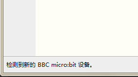  

2. Mu的原本颜色太高亮，长期观看对眼睛不好，所以第二步我们更换主题颜色。(我个人喜欢第二种)  

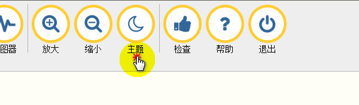  

3. 点击刷入，收入一个空程序。目的是为了让microbit什么也不干。这个操作并不是每次都需要，只是为了接下来的演示我们确保microbit处于纯净的状态。  

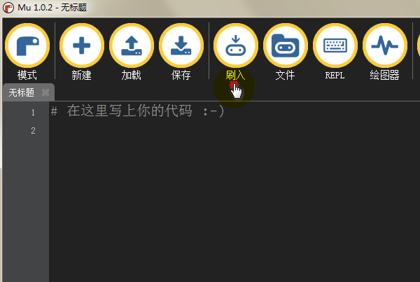   

## 烧入第一个跑起来的流水灯 

顾名思义，流水灯的要点有2个：`①.对个别灯进行亮灭控制；②.对循环语句的掌握`   

1. 为了对点阵屏的led进行亮灭控制，我们需要对microbit的micropython显示模块有基本了解  

[micro:bit Micropython说明文档-显示篇](http://www.qingchuangzhiyi.com/doc/display.html)  

如果英文较好的，可以直接查看[原版文档](https://microbit-micropython.readthedocs.io/en/latest/tutorials/introduction.html)  

通过文档，可以看到这个就是足以完成单个led间断亮灭的函数

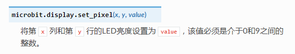   
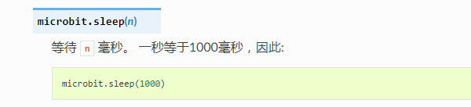 

``` important::根据microbit点阵坐标，我们选左上角第一颗的led 
```  


2. 我们在Mu里写个程序来完成单个led间隔500ms亮灭，写完点击刷入

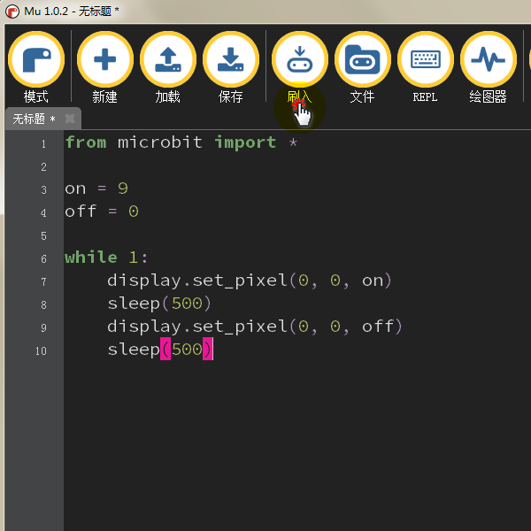  

```python
from microbit import *

on = 9
off = 0

while 1:
    display.set_pixel(0, 0, on)
    sleep(500)
    display.set_pixel(0, 0, off)
    sleep(500)
```

``` attention:: 刷入的时候不要打开其他的编程软件，可能会报错。当然还有from 模块 import * 也不是一个好习惯。如果不明白它坏在哪里建议查看这篇文章
```  
[from import和import的详解](https://baijiahao.baidu.com/s?id=1595360515695157210&wfr=spider&for=pc)

**如果你看到有颗led一闪一闪那么恭喜你成功啦，通过以上的流程我们学会了如何成功给microbit刷入程序(当然前提是你的程序没写错)** 

## 使用REPL玩转microbit 

REPL意指交互式解析器，通俗的作用就就是通过在一个小窗口里打入代码，而这些代码可以一句句运行并实时返回结果。要实际了解它的妙用，且跟着操作
(默认你已经按照文章开头的步骤装过串口驱动了)  

1. 点击REPL，顺利的话下方窗口便如下出现(没有出现的话请首先确定已经安装串口驱动，单击REPL关闭窗口后按下microbit复位再次点击REPL)  
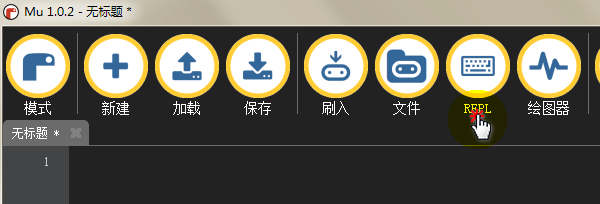 
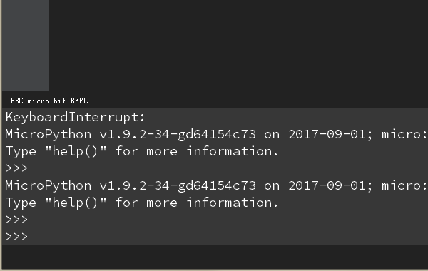    

2. REPL的妙用：  
①. 实时可分步执行  
按如下分别敲下两行代码，没敲完一行按一次回车(执行该行代码)
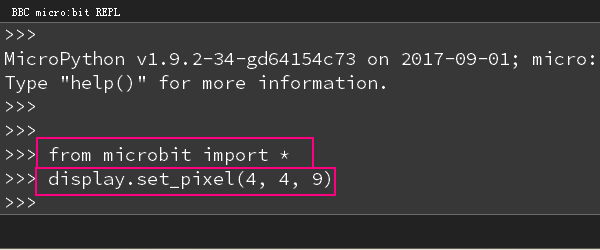  
`可以看到microbit的右下角4，4处led点亮` 

②. 查看模块中其他的函数 
通过以上的实训，只进行过显示相关的1个函数的使用，那么我们想知道关于microbit这个模块或者它的display类下还有哪些其他的函数呢。那么我们先来看看microbit模块还有哪些类或函数可以使用。敲入import microbit重新导入模块，接着敲下microbit.+Tab键

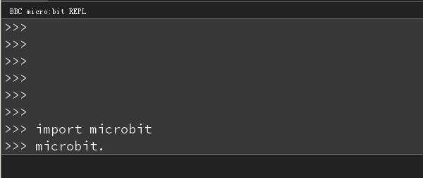  
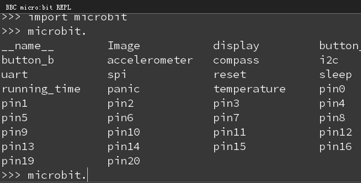  

②. 找到display类中的获取led状态量的函数 

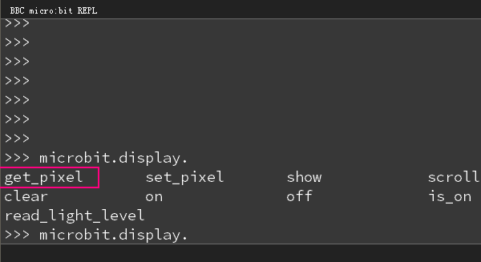 

通过文档可得这个函数就是我们想要的。 

那么这个函数要怎么用呢，如果不想在文档里查来查去的你可以使用help() 
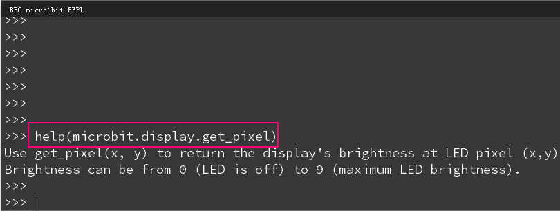  
返回的提示可知没使用这个函数将返回给定坐标点led的0~9状态值

那么我们来看看4，4这个点的led状态吧，还记得我们第①步点亮过这个灯么，此时返回为9，符合实情。

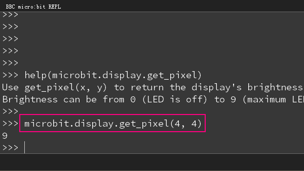  


3. 还有更多的有趣用法将陆续更新...


