# Nanobit

## 简介

Nanobit是喵家推出一款兼容Makecode编程编程平台的mini主控板，主打DIY制作，因形状酷似Arduino的Nano板子，因此命名为Nanobit。

Nanobit可兼容市面上的Arduino Nano的扩展板，方便通用模块的插件，降低制作成本。

Nanobit中的编程下载器是与主板拼接在一起。在DIY制作作品完成后期，可以进行掰断分离处理，可以使作品电路更加小巧。

## 技术参数

Nanobit硬件参数主控芯片：nRF51822  ARM Cortex-M0

尺寸：18.3x75x17mm

重量：6.9g 

- 可编程资源：

无线通讯，2.4G和蓝牙功能

加速度传感器

指南针传感器

温度传感器

可编程LED灯（P15）

可编程A/B按键

可编程IO口

I2C接口

- 引脚排布兼容arduino Nano

- 支持USB 盘符形式下载程序

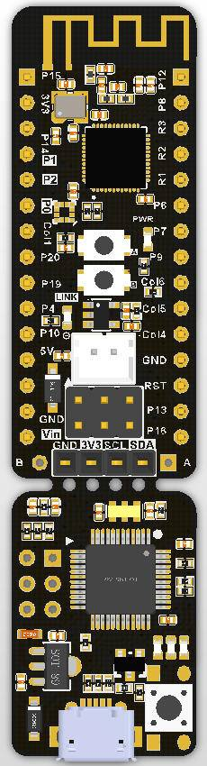

## 供电方式

USB供电电压：5V

锂电池供电PH2.0接口：3.7-4.2V

Vin脚输入电压：3.3-5V

主控芯片工作电压：3.3V

## 接口说明

## 特色

兼容makecode平台的迷你主控板

采用常规的2.54间距的针脚形式，方便插接面包板与传感器

引脚兼容Nano板子，可以使用Nano的扩展板

I2C接口兼容市面上常用的OLED引脚顺序，即插即用

带锂电池接口，可插接常规锂电池

主板与编程下载器采用可掰断设计，降低用户制作成本。

## 编程平台

编程平台：**Makecode**

编程地址：https://github.com/KittenBot/pxt-nanobit

插件情况如图所示：

除了加载Nanobit的主插件，还自动加载OLED插件，Nanobit与Microbit相比缺少了5x5点阵，但预留I2C接口，使用OLED模块更加方便。

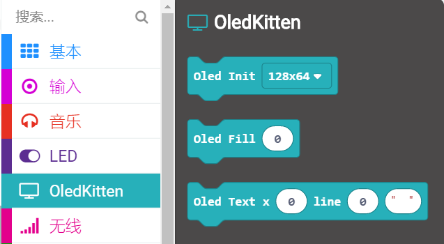

## 具体使用

### 插上Nanobit

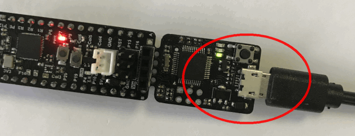

电脑会显示Nanobit的盘符。（首次插上会提示自动安装驱动，与Microbit类似）

如果无法显示,一般是USB数据线或者电脑USB口不良导致的，请自行处理

### 加载插件

打开Makecode，加载Nanobit插件

除了点阵屏相关的积木块(点阵显示、光敏)，其它积木块的使用方式与Microbit使用的一致。

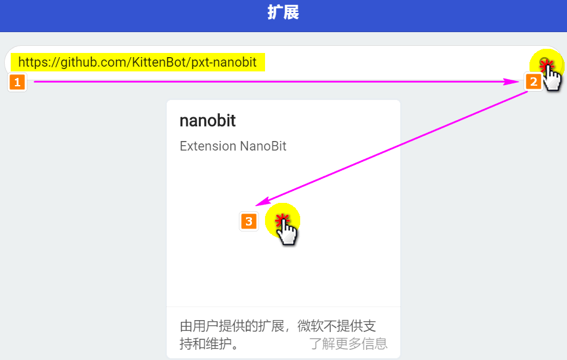

### OLED屏幕显示

这里接了0.91寸的OLED，因此对应OLED初始化，高为32，宽为128（对应0.96寸OLED，高为64，宽为128）

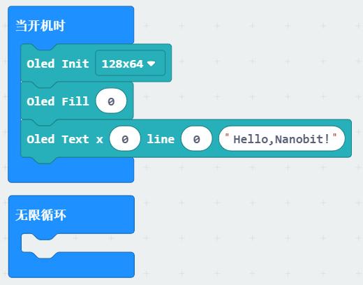

下载后的实物现象。相比Microbit少了5x5点阵，但如果平时插着OLED屏幕，你会感觉到OLED比点阵好用不止一点点。再也不用等待字符串流动才能看到结果了。

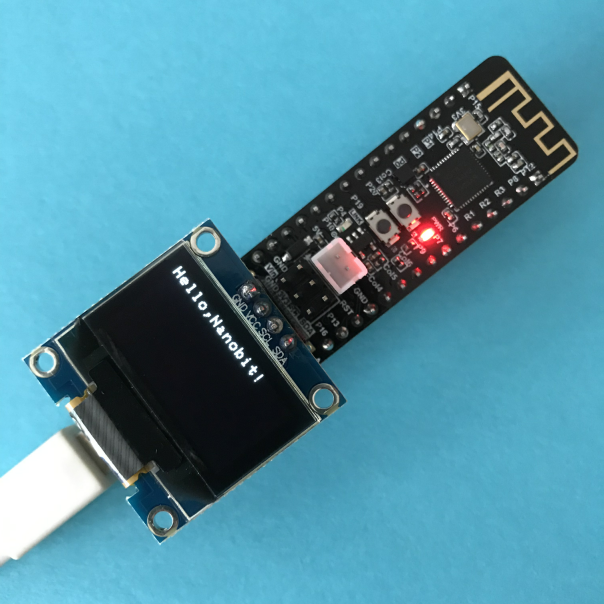

### IO模拟读写

Nanobit的引脚定义与Microbit的引脚定义一致。可以直接通过引脚分栏，对IO进行数字与模拟读写。

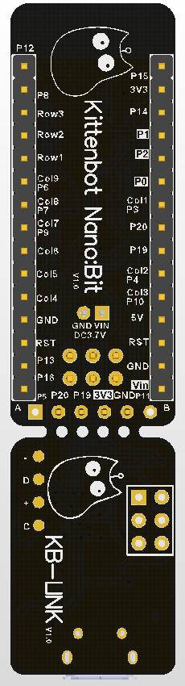

引脚分栏如下：

数字写，模拟读，模拟写，一般不会有什么问题。

新手需要注意的是，**数字读，需要设置上拉**（Microbit也是一样）

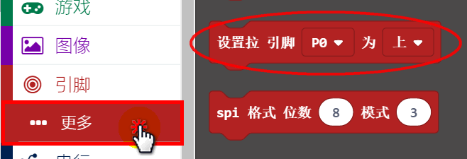

我在P0口接了一个按键，当按键按下时，控制Nanobit上的Link灯亮。对应的程序如下：

Nanobit上Link灯是接在P15上

## 插上Nano的扩展板

大家可能发现Nanobit的引脚排布比较乱，是因为它的体积限制，只能迁就PCB不嫌，不过这也算是一种Geek风格吧。为了方便大家引脚插件，我们做了Nano的IO扩展板的引脚映射。

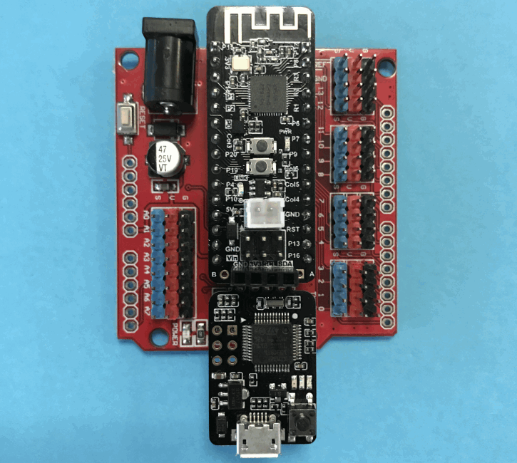

使用这些积木块就感觉引脚排布舒服多了，因为底层进行了映射。切记数字读，还是需要设置上拉或者下拉。

另外,如果你配合nano的扩展板进行使用，模拟读需要注意下，如果给Nanobit供电，nano扩展板上的V只有2.7V，换句话说，即使电位器拧到拧到最大也不会出现255的数值。

## 外接锂电池

推荐使用喵家锂电池包，带外壳完全可靠。（**锂电池包不能用于Microbit的电池接口，会烧坏Microbit**）

Nanobit上**没有集成锂电充电电路**，因此锂电包充电需要外部进行充电。可以用专用的锂电充电模块，或者你想简单点，可以直接用喵比特，喵比特上含有充电电路，可以给锂电包进行充电。

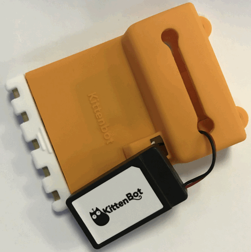

## 关于仿真器

仿真器是通用的cmsis-dap仿真器设备，自动usb串口设备功能。可用于一般通用开发，例如keil和gdb。
目前拖拽式下载功能只支持目标硬件nrf51822 (micro:bit的mcu)

## 将仿真器与nanobit分离使用 

首先需要注意，要分离使用请确保手头有工具，需要自行焊接排母 

  

准备2排排母，自行剪切处理如图焊接  

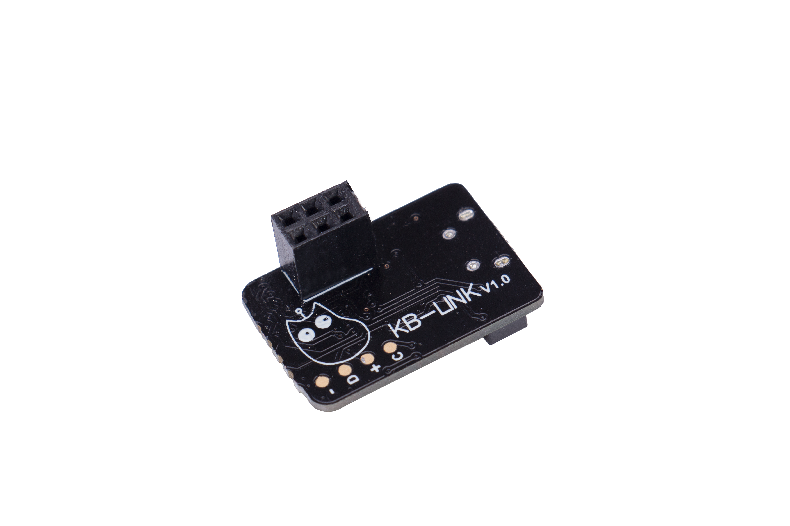   

按照如下方向插在nanobit的排针上，即可使用

 

用于下载程序，供电以及复位程序都是OK的，下载完程序后可拔掉，单独给nanobit供电即可跑程序，另外仿真器请自行保管好。
