# Rosbot 

## 购买链接

__转到淘宝购买__----------→[Rosbot主控板](https://item.taobao.com/item.htm?spm=a1z10.3-c-s.w4002-17001215033.56.3faf762eFB6CPG&id=551011963085)

## 产品名称   
Rosbot主控板   

## 适合人群   
中小学生图形化编程/非专业DIY玩家

## 配送清单   
Rosbot X1   

## 产品简介   
Rosbot主控板是由深圳市小喵科技研发的一款图形化编程主控板。它基于Mega 328P芯片的一款板子，与Arduino UNO的的主芯片是一样的。为了方便之前已经学过Arduino用户，我们做了兼容性管脚定义。因此喜欢用代码编程方式的，也可以用Arduino IDE进行编程制作。   

Rosbot主控板所用的图形化编程软件Kittenblock，也是由小喵科技进行开发。由于图形化积木编程的容易理解，易上手。受到中小学生和老师、非专业爱好者的一致好评，轻松编程，快速上手，降低制作的门槛。   

Rosbot上拥有非常多的可编程资源。丰富开放的IO口资源，板载直流电机/步进电机驱动芯片，还有各种扩展接口，Rosbot支持wifi下载程序，这个是其他arduino主控板不能做到的，非常方便产品DIY与调试。   

## 产品特色   
- 四路直流电机驱动/两路步进电机驱动，无需外接驱动   
- 黄红黑常用arduino 3PIN接口，方便接插市面上的常用模块   
- 支持wifi模块无线下载（需要另外购买wifi模块）   
- 丰富的扩展接口，I2C接口，喵家4PIN接口，板载串口转出接口   
- 精美特色丝印，让用户使用更加方便   
- 支持与树莓派结合，非常方便控制底层电子模块   


## 产品参数   
长x宽x高：6.5CMx6CM   
净重：23.1g   

   


## 技术参数   

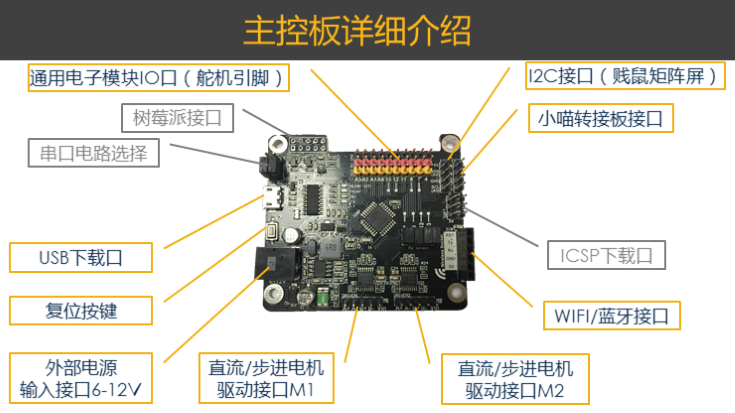   

主控芯片:MEGA328P(arduinoUNO)   

串口芯片:CH340   

USB电压:5V   

外部电源接口:6~12V   

过流保护:自恢复保险丝   

Digital I/O 数字输入/输出端:2、3、4、7、8、11、12、13   

Analog  I/O 模拟输入/输出端:A0-A5   

直流电机接口:四路   

步进电机接口:两路   

舵机接口:十路   

扩展接口:   

- I2C接口   
- 喵家4PIN接口   
- 树莓派接口   
- WIFI/蓝牙接口   

串口功能:支持转出外部   


## 使用方式
编程方式：

Kittenblock(基于Scratch3.0)   

ArduinoIDE（UNO）


## 快速上手

### Kittenblock软件安装

软件下载与安装：https://www.bilibili.com/video/av70344368

安装驱动与恢复固件：https://www.bilibili.com/video/av70344368?p=2

在线控制与离线下载：https://www.bilibili.com/video/av70344368?p=3

在线控制与舞台交互：https://www.bilibili.com/video/av70344368?p=4


温馨提示：以上的视频的硬件板子基于Microbit。对于Rosbot除了硬件选择不一样，与安装驱动不一样，软件的其他操作方式都是一样的。大家先看看视频，先有个大概的概念，再跟着本文操作，就不会有问题了。本图文教程中还会针对于视频中不一样的地方进行讲解，所以大家可以安心看视频。


### 安装Rosbot的驱动

假设你已经**成功安装软件**，软件也**升级到最新版本**了。接下来你要安装Rosbot的驱动。

#### 插上Rosbot

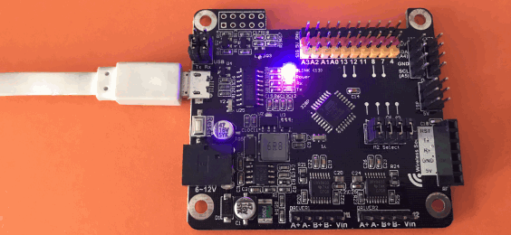


#### 选择右上角小齿轮安装驱动

打开Kittenblock软件，选择右上角小齿轮

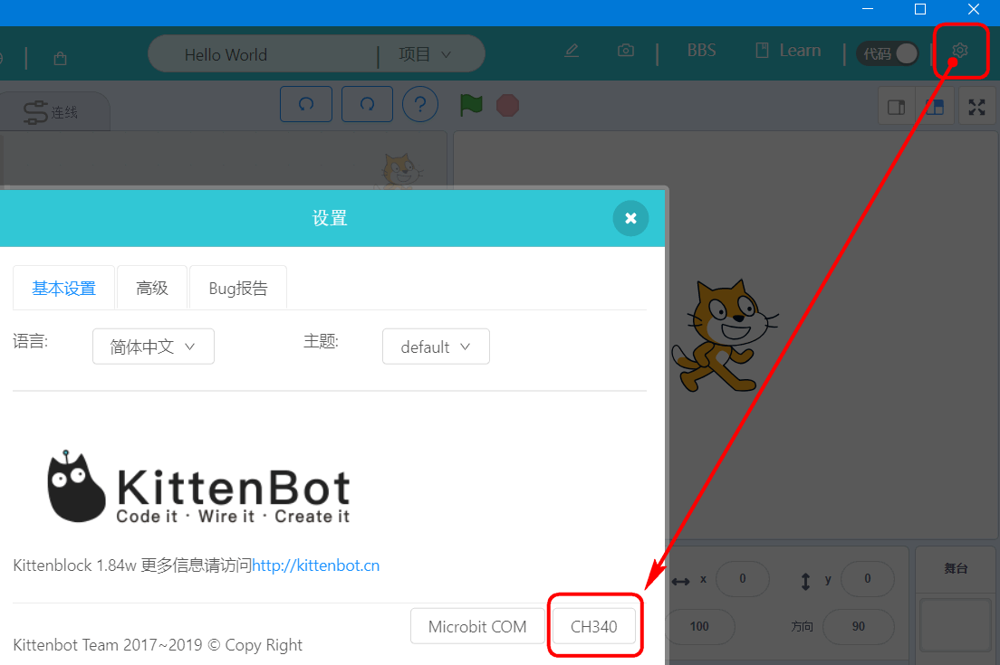

#### 

#### 弹出窗口确定安装


PS：如果点击没有反应，应该是你软件的权限没有设置！

解决办法：右键Kittenblock图标——属性——兼容性——“以管理员身份运行”把勾勾给打上——应用，确定。再重启Kittenblock，再重复安装CH340驱动的操作。


#### 选择Rosbot，连接串口

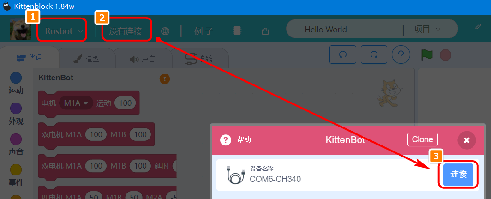


#### 恢复固件

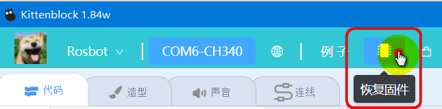


稍等片刻等待固件恢复上传，固件恢复成功后，即为——**在线模式**

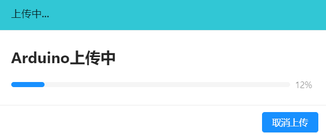

```attention:: 在线模式下（连接串口，恢复固件），直接点击积木块，板子或者传感器就会有反应。在线模式下一般用于程序调试，这样就不用每次修改程序又下载一次，节省时间。如果发现在线模式下控制没反应，请检查是否连接串口恢复固件！

```


#### 测试在线通讯是否成功

可以直接使用板子上13脚的蓝色LED进行测试，拖拽如下的积木块，进行点击


实验结果与点击的积木块一致。

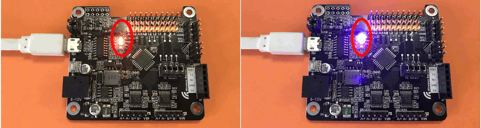


#### 如何离线下载

假设你已经在线模式下调试好程序了，想下载到主控板上，脱机运行。

程序必须包含绿旗子帽子模块，否则积木块无法转换为代码，点击右上角代码切换按钮。

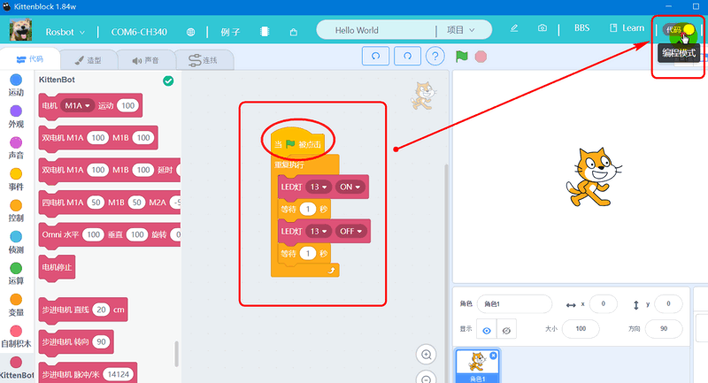


积木转为代码，实时转换

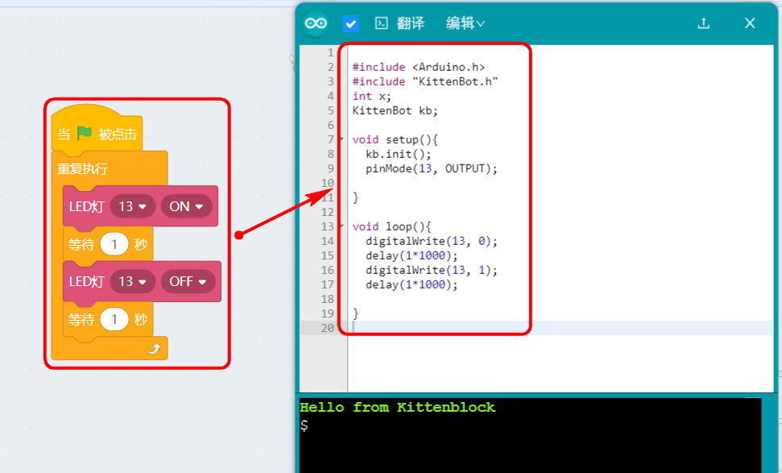


左侧的勾勾是指——自动翻译，如果不打勾，积木转代码就需要自己手动点击“翻译”按钮

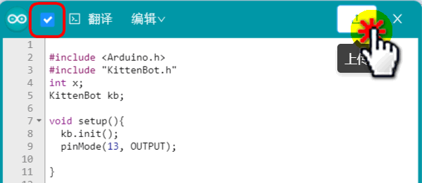


等待程序上传，上传完毕后，程序就能直接跑起来。

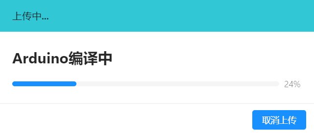

```attention:: 假设你已经下载了你自己的程序，你想用在线模式，这时你需要重新恢复固件。

```


## 关于Rosbot的更多积木块

大家可以参考我们之前的Kittenbot钣金车（主控板是Rosbot）的教程

虽然是之前的教程，积木块大体都是一样的，学习一定要动手尝试。

http://learn.kittenbot.cn/zh_CN/latest/kits/kittenbotKit/index.html


## Rosbot使用注意事项   

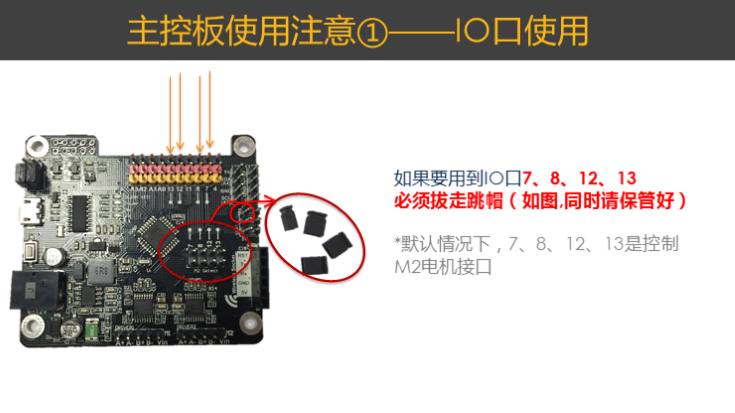   

   

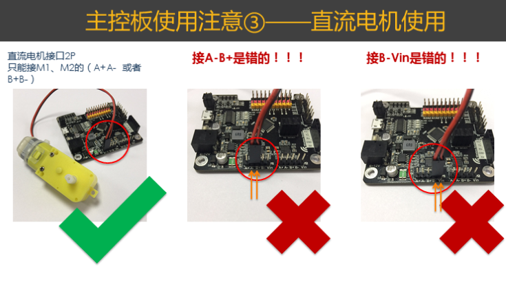   

   

   

   


## 常见问题与解答   

问题0：哪里可以卖到这么优秀的扩展板？   

答案：万能的淘宝 https://kittenbot.taobao.com/  请认准小喵科技官方淘宝店    


问题1：怎样给Rosbot主控板供电？   

答案：

方式1：用移动电源插到Rosbot主板上的usb口上。   

方式2：6~12V的电源插到板子上的外部电源口上。   


问题2：控制M2电机接口的时候，13脚的蓝色灯会亮？   

答案：是的，M2电机接口复用了13脚的LED灯   


问题3：使用IO口7、8、12、13任意一个IO口的时候，M2电机控制好像不正常？   

答案：是的，7、8、12、13刚好和M2电机接口复用了。所以不能同时用，要用IO口的时候，要把跳帽给拔了。   


问题4：IO插反会不会烧坏？   

答案：有可能，所以插接模块，必须反复确认安装是否正确！   


问题5：可以把主控板放在金属表面吗？   

答案：不能，板上有很多针脚，放在金属表面会短路！   


问题6：板子上有很多跳帽，我可以随意拔掉吗？   

答案：不可以，尽量保持跳帽处于出厂的状态，如果要拔跳帽，要注意问下小喵的技术人员   


问题7：Rosbot主控板可以用Arduino的IDE编程吗？   

答案：可以的用法，一样，并且板子上还多了一些资源。具体一些控制指令可以参考Kittenblock中的积木转代码窗口查阅   
