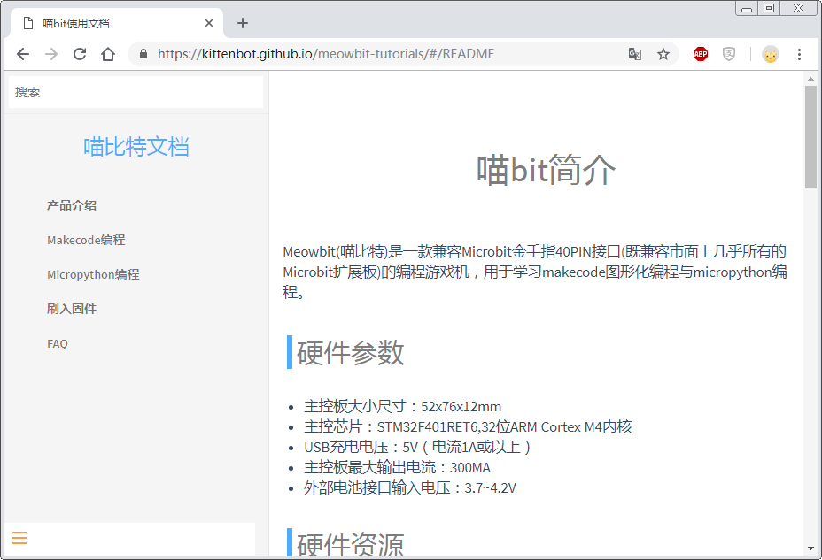
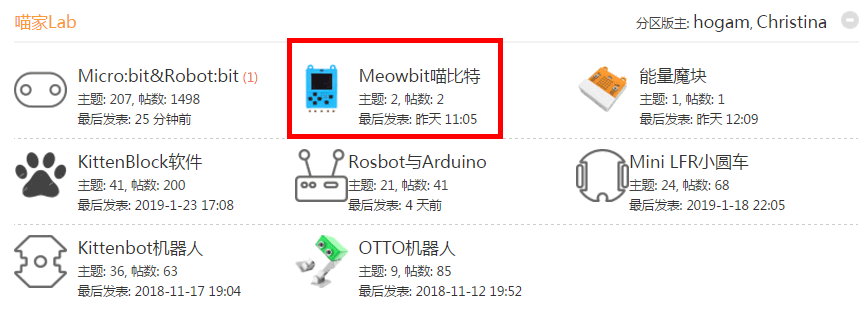

# 喵比特教程引导

因为喵比特的教程比较多，所以我们特意为喵比特做了一个教程网站，这样会更加方便大家学习。这里只是作为一个跳转的引导。

近期喵比特的硬件功能迁移到微软官方Arcade平台需要一段时间，所以硬件有部分功能暂时不可用，所以学习路线，建议大家先学习游戏课程，游戏课程那边是完全没有问题的。

## 更新注意

因为之前教程是按照旧的在线编程网站做的（已经旧的在线编程网站下线，全部迁移到微软），所以教程界面和你实际使用的编程页面有点偏差，可能是颜色上和部分的积木块位置有点变动，界面大同小异，后续小喵会把新的教程文档进行更新，视频也稍后进行更新，大家注意下就可以了。

## 喵比特编程地址

编程地址：

[https://arcade.makecode.com/](https://arcade.makecode.com/)

（上面编程地址已经是最新的编程地址，之前喵家的在线编程已经下线了，后续所有功能全部迁移到微软官方Arcade平台上，迁移需要点时间，大家耐心等候下）

## 喵比特makecode Arcade 教程

[https://meowbit-doc.kittenbot.cn/#/makecode/makecode%E5%BF%AB%E9%80%9F%E5%BC%80%E5%A7%8B](https://meowbit-doc.kittenbot.cn/#/makecode/makecode%E5%BF%AB%E9%80%9F%E5%BC%80%E5%A7%8B)

## 喵比特Micropython 教程

[https://meowbit-doc.kittenbot.cn/#/micropython/micropython%E5%BF%AB%E9%80%9F%E5%BC%80%E5%A7%8B](https://meowbit-doc.kittenbot.cn/#/micropython/micropython%E5%BF%AB%E9%80%9F%E5%BC%80%E5%A7%8B)

## 喵比特 固件更新 教程（现最新固件V2.7.0）

固件版本号怎么看？喵比特usb连接电脑后，进入U盘模式，就可以看到版本号。

[https://meowbit-doc.kittenbot.cn/#/more/upgrade](https://meowbit-doc.kittenbot.cn/#/more/upgrade)

## 喵比特视频教程

如果你是第一次接触Meowbit（或者甚至没有听说过Microbit），建议从视频教程入手，新手从视频教程入手会相对简单一些。

00安装锂电池包：[https://www.bilibili.com/video/av48035704](https://www.bilibili.com/video/av48035704)

01开箱入门：[https://www.bilibili.com/video/av41698721 ](https://www.bilibili.com/video/av41698721 )

02角色创建：[https://www.bilibili.com/video/av42208660](https://www.bilibili.com/video/av42208660) 

03角色抛射物创建：[https://www.bilibili.com/video/av42208759](https://www.bilibili.com/video/av42208759) 

04场景创建：[https://www.bilibili.com/video/av42208888](https://www.bilibili.com/video/av42208888) 

05游戏信息使用：[https://www.bilibili.com/video/av42208954](https://www.bilibili.com/video/av42208954) 

06游戏标题信息：[https://www.bilibili.com/video/av42209011](https://www.bilibili.com/video/av42209011) 

## 喵比特论坛——分享与疑难求助

[https://bbs.kittenbot.cn/forum.php?mod=forumdisplay&fid=57](https://bbs.kittenbot.cn/forum.php?mod=forumdisplay&fid=57)

