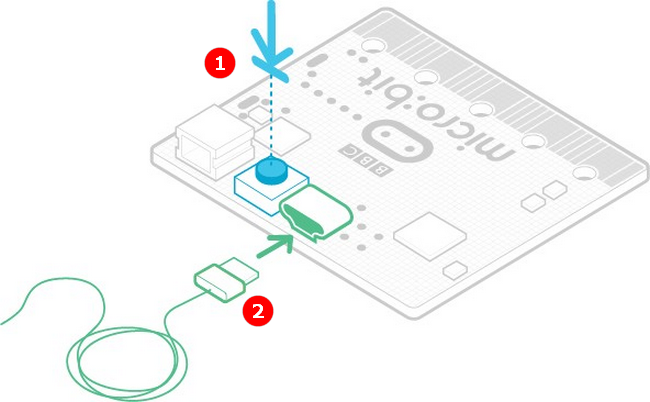
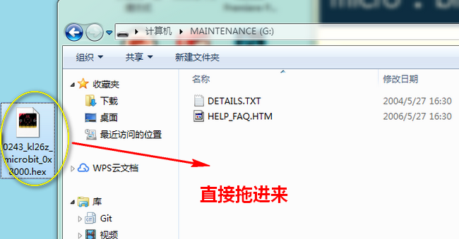

# Microbit底层固件更新  
  
关于Microbit底层固件需要更新是为了解决一些老板子经常性程序无法下载或失败的问题。目前的较新固件版本是0250，下面请按照步骤详细操作。  
  
## 查看手中Microbit底层固件版本的方法    
   
首先确保USB接线接上，点开MICROBOT盘
 
    
    
点开DETAILS.TXT记事本，带Version后面跟的就是版本号。

  
  
  
## 更新底层固件方法  
 
     

小喵为你准备好了：[点击下载](http://cdn.kittenbot.cn/microbit/0253_kl26z_microbit_0x8000.hex)
  

拔掉USB线，按住Microbit的复位按钮，一直按住的同时插上USB线，如下图，原本的MICROBIT盘会变成MAINTENANCE即表明已经进入维护模式，此时才可以松开复位按钮  

    
    
这个时候Microbit是以存储设备存在，点开MAINTENANCE盘，将给你的.hex最新固件按照下图方式直接拖进去即可，不要操作，等待一会儿看到盘符又变回MICROBIT说明完成更新

  
  
最后再次按照上述步骤查看版本确保更新成功    
    
  
  

如果操作不成功，请检查：  

- 是否串口正常
- 是否成功进入了维护模式  

如果以上都不能解决问题，请联系小喵科技，热诚为你服务
  

  
