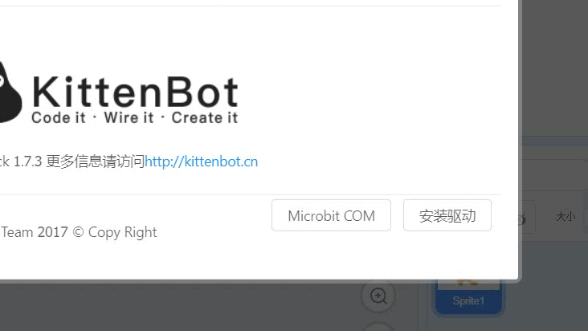
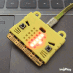
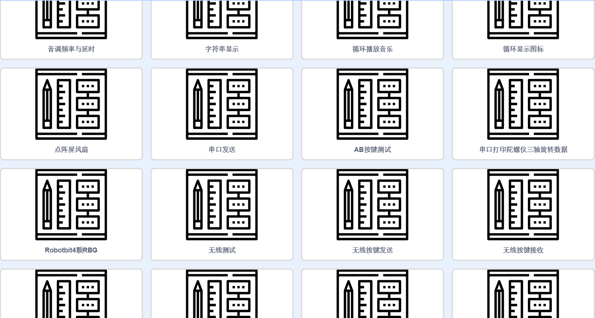

# Microbit快速开始 #   
       
   

## 安装驱动 ##   
选择右上角齿轮——Microbit COM，下一步下一步确认安装完毕   
   
   
   
## 下载示例程序 ##
硬件选择Micorbit，如果驱动安装成功后会自动连接上串口如图   
   
   
打开小喵官方例子——字符串显示如图   
   
   
   

从舞台模式切换到代码模式   
点击下载   
等待下载完成提示   
   
   
   
最终得到实现现象   
   

   
喵家软件中内置了很多Microbit的示例可自行进行学习   
   
   
如果你Microbit还没入门，可以先观看Microbit在makecode下的教程，喵家出品个个精品