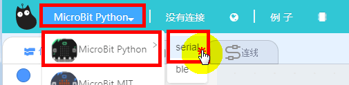
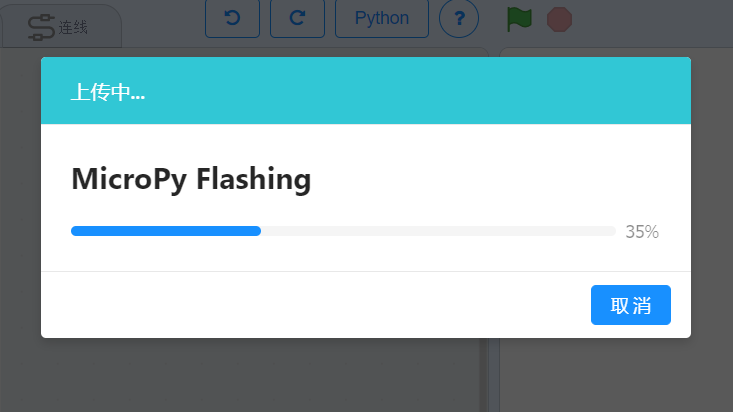
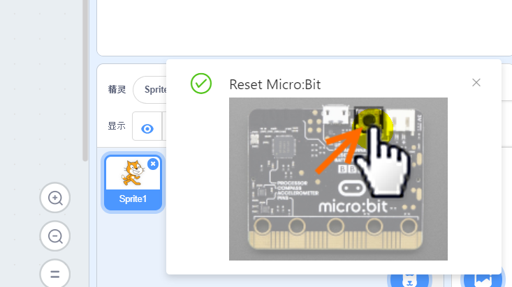
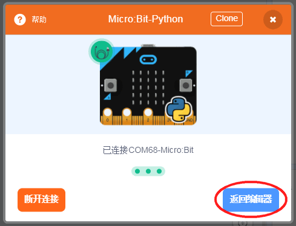
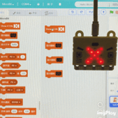
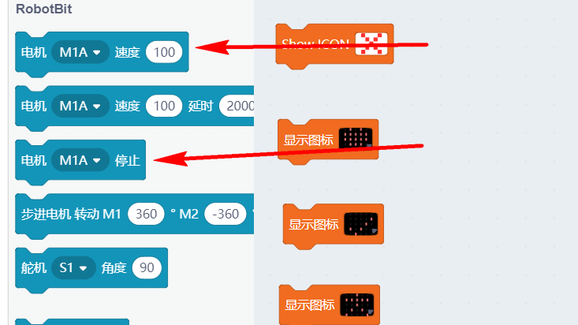
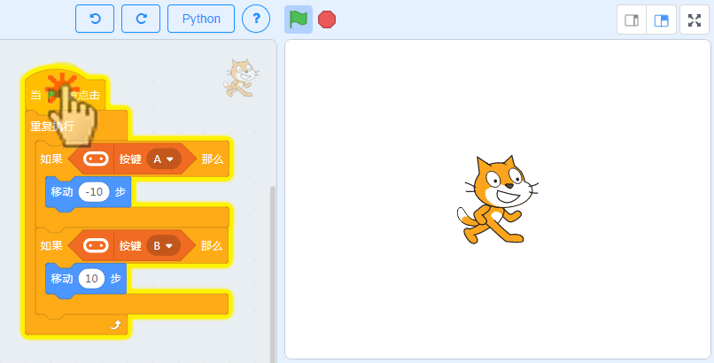
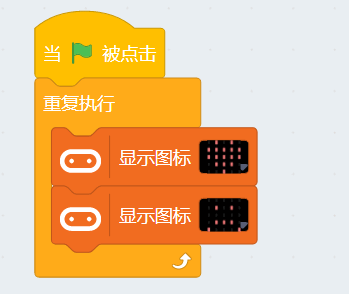
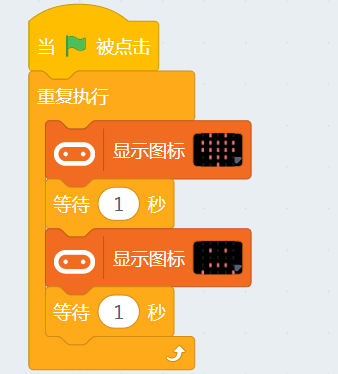

# Microbit使用在线调试模式 #   
       
   
这个是Kittenblock中Microbit特有的功能，使用在线模式调试，可以方便用户进行调试程序，无需把程序下载到Microbit中就能看到现象   

## 恢复固件
 
使用在线模式的前提——先恢复喵家官方固件  
 
- 选择硬件——Microbit Python——Serial

   

- 点击恢复固件按钮   
   
   
- 等待下载完毕

  
 
- 下载完毕后必须按一下Microbit上的复位按键！

   

## 重新连接串口

这一步大多数人会漏掉！

  

串口成功连接上了！

     
   
## 进行测试

鼠标点击左侧的Microbit积木，板子就有对应反应。（保证串口已经连接，否则没反应）
）   
 

----------
  
如果您想在线控制Robotbit的电机，只需要把对应的电机接线接好，点击Robotbit分栏中的电机积木块即可。

   
   
## Microbit按键控制舞台小喵左右移动

首先，保证，固件已经恢复，串口已经连接上，如下图：

 

编写一个microbit A和B按键控制小猫移动的程序：

编写完成后，点击绿旗子运行，然后可以按Microbit的A与B按键，看下是否有反应

  

## 在线调试模式使用注意

- 在线模式调试只是常规下载的一个补充，无法代替常规的下载，它必须依靠电脑和数据线，脱离了电脑串口通讯就不会执行，所以所谓“在线”   

- 在线模式的原理是：Micobit恢复了一个喵家官方固件后，连接上串口，当你点击积木块，此时电脑端通过串口数据线发送对应执行指令给Microbit板子。板子收到指令后对应执行动作。   

- 由于在线联机，因此指令发送不能太快。 

  
错误示范： 
  
错误的原因指令与指令之间没有任何延时，指令无间断的从电脑往Microbit发送，Microbit执行不过来，会有死机不执行的现象。

   
   
正确示范：

保证指令之间有一定的延时

   
## 在线调试模式 Microbit死机不执行解决办法 ##   

当由于发送指令太快，Microbit进入死机不执行状态，这时候先点击一下正在执行的指令（此操作是为了取消指令发送）
   
   

然后重新按一下Microbit上的复位按键

   
串口重新连接！串口重新连接！串口重新连接！然后又可以继续刚才的操作

  