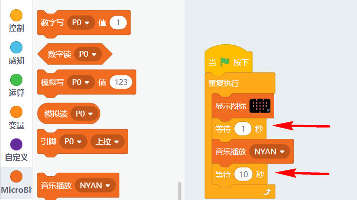

# Microbit使用在线调试模式 #   
       
   
这个是Kittenblock中Microbit特有的功能，使用在线模式调试，可以方便用户进行调试程序，无需把程序下载到Microbit中就能看到现象   

## 恢复固件 ##   
使用在线模式的前提——先恢复喵家官方固件   
- 选择硬件——Microbit（如果驱动成功安装后会自动连接上串口）   
- 点击恢复固件按钮   
   
   

- 等待下载完毕   
   
- 下载完毕后必须按一下Microbit上的复位按键！
- 下载完毕后必须按一下Microbit上的复位按键！
- 下载完毕后必须按一下Microbit上的复位按键！
- 重要事情说三遍！   
   

   
## 进行实验现象测试 ##   
鼠标点击左侧的Microbit积木，Microbit板子就有对应显现出现。（此过程必须连接着串口，否则没有反应）   
   
同时如果您想在线控制Robotbit的电机也是没有问题的，只需要把对应的电机接线接好，点击Robotbit分栏中的电机积木块即可。
   
   

## 在线调试模式使用注意 ##   

- 在线模式调试只是常规下载的一个补充，无法代替常规的下载，它必须依靠电脑和数据线，脱离了程序就不会执行，所以所谓“在线”   

- 在线模式的原理是：Micobit恢复了一个喵家官方固件后，当你点击积木块，此时电脑端通过串口数据线发送对应执行指令给Microbit板子。板子收到指令后对应执行动作。   

- 由于在线模式的原理，因此指令发送不能太快。   
错误示范：   
错误的原因指令与指令之间没有任何延时，指令无间断的从电脑往Microbit发送，Microbit执行不过来，会有死机不执行的现象。
   
   
正确示范：   
在指令之间加入适当的延时   
自己需要大概估算一下这条指令执行完需要多长时间，给定的延时需要比执行时间稍长一点点   
所以在线模式也有它的局限性，不过用于来调试完全足够用了。可以快速去读引脚的值，不需要下载然后再串口打印直接得到实验现象   
   
   
   
## 在线调试模式 Microbit死机不执行解决办法 ##   

1. 当由于发送指令太快，Microbit进入死机不执行状态，这时候先点击一下正在执行的指令（此操作是为了取消指令发送）   
   

2. 然后重新按一下Microbit上的复位按键
   
3. 一切和好如初，重新使用在线模式