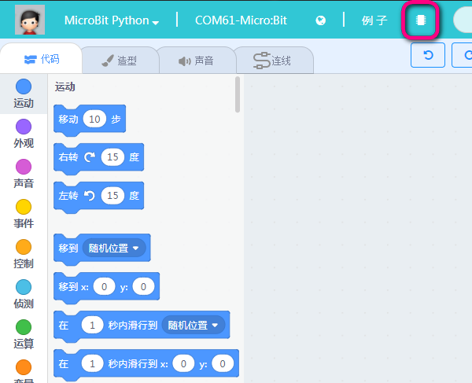
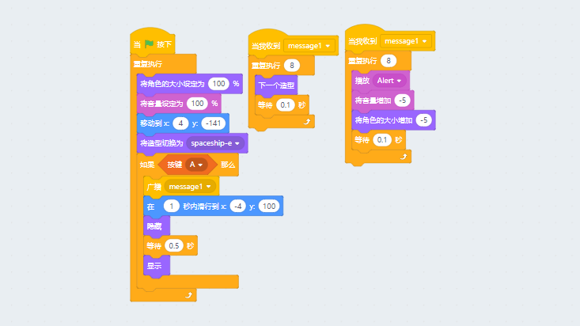

# microbit与Scratch舞台进行交互（火箭升空） #   
       
   
这个是Kittenblock中Microbit特有的功能，makecode官方中并没有Scratch的舞台，所以只有在小喵家软件下才能得以实现   
所以如果您的Scratch制作已经玩得很溜，不妨尝试下用Microbit控制Scratch进行交互。

## 控制原理 ##   
Microbit恢复固件后，在程序中编写一个Scratch橘猫与Microbit传感器的交互的逻辑程序。实际它们之间是通过串口通讯的。
   

## 具体操作 ##   

首先连接上microbit和串口，选择恢复固件，等待恢复固件完成，记得点击Microbit上的复位按键！   
   
   
编写一个Scratch舞台的交互程序   
此程序是利用Microbit按键控制火箭发射升空   
核心控制，检测Microbit按键A是否按下，如果A按下则执行火箭角色位移
并且进行广播
两个广播事件当被触发时，一个执行角色的造型切换，一个是播放声音   

   
   
编写完成后，点击绿旗子积木块执行   

按下按键A观察下实验现象   
   
    
是不是很有趣？您还在等什么？   
   
程序下载：   
