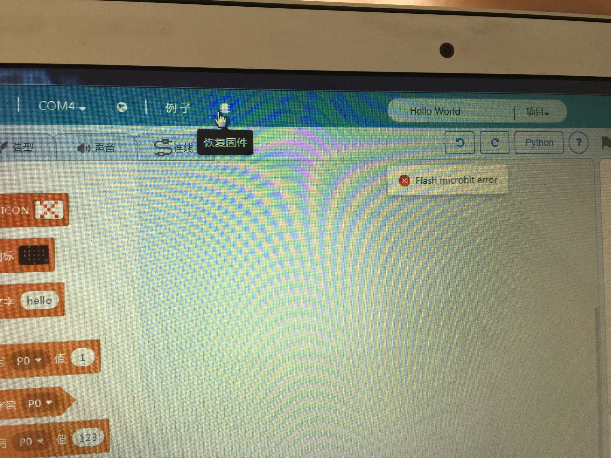

# 关于Microbit无法在Kittenblock中下载解决办法   
最近越来越多用户使用我们Kittenblock对microbit进行编程，主要是因为Kittenblock中可以使用python对microbit进行编程，并且小喵在Kittenblock中加入例如视觉识别，语音识别，让Microbit发声说话等等一系列黑科技。   
但不少用户用的是ghost版本，可能会遇到以下的现象，程序无法下载到Kittenblock中   
## 失败具体有下列几个现象   
### 弹出 Flash microbit error   

### 点击恢复固件或者下载程序，下载一闪而过（一秒都不用）   
一闪而过太快了，截不了图...   一般下载程序都需要三四秒以上，有看到进度条等待，然后等待个几秒，提示下载成功。   

## 出现问题的根源   
有些用户可能说我makecode给Microbit都能下载成功，为什么Kittenblock不能下载成功？
原因是Kittenblock中给Microbit编程的语言是python（虽然你也只是用图形化积木块），ghost版本的电脑可能系统精简了一些python必要的文件，所以导致python本身程序都有问题，更不用说下载到Microbit上。所以根源的本质是电脑系统的python依赖文件缺失。解决办法很简单，补！  

## 解决办法   

### 解决方法1：简单办法——安装一个新的QQ

最新版QQ会帮你补全你系统对应的python缺少的库，帮你补全后，你的Kittenblock就可以正常给Microbit下载了

### 解决方法2：

#### 去到Kittenblock目录下，把api打头的文件复制一份   
   

#### 把复制的文件粘贴在这个目录下   
   

#### 重启软件即可
如果还是不成功，还是无法下载，请到爱上小喵科技官方Q群568084773讨论求助