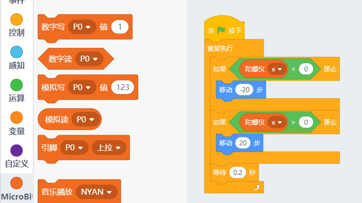
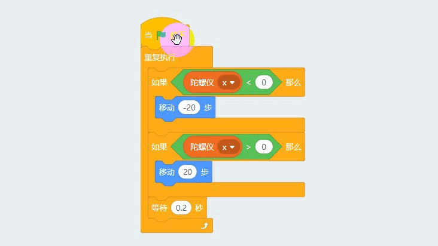

# microbit与Scratch舞台进行交互  
       
   
这个是Kittenblock中Microbit特有的功能，makecode官方中并没有Scratch的舞台，所以只有在小喵家软件下才能得以实现   
所以如果您的Scratch制作已经玩得很溜，不妨尝试下用Microbit控制Scratch进行交互。

## 控制原理
Microbit恢复固件后，在程序中编写一个Scratch橘猫与Microbit传感器的交互的逻辑程序。实际它们之间是通过串口通讯的。
   

## 具体操作

1)首先连接上microbit python

2)选择恢复固件，等待恢复固件完成，记得点击Microbit上的复位按键！ 

3)连接上串口，如果忘记如何连接串口，请看第三节
 
   
   
编写一个Scratch舞台的交互程序
   
此程序是利用Microbit的陀螺仪对舞台的橘色猫进行移动
   
用两个条件语句进行判断
   
当x轴陀螺仪为负数（Microbit灯针朝上，往左倾），橘猫往后移
   
当x轴陀螺仪为正数（Microbit灯针朝上，往右倾），橘猫往前移 
  
   
   
编写完成后，点击绿旗子积木块执行 
  
   
   
左右摆动下Microbit板子观察下实验现象
   
   
    
是不是很有趣？您还在等什么？   
   
程序下载：   
