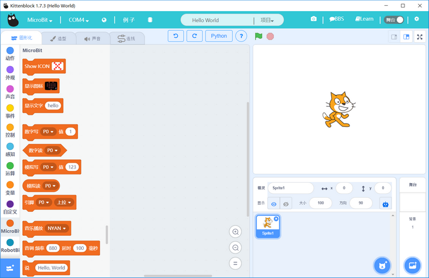
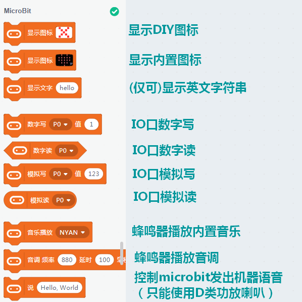
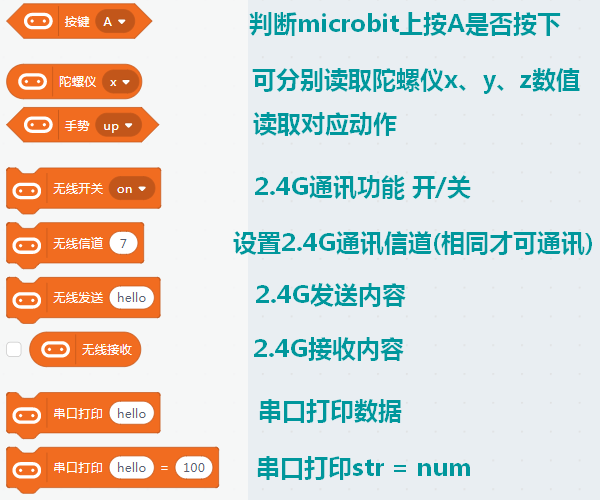
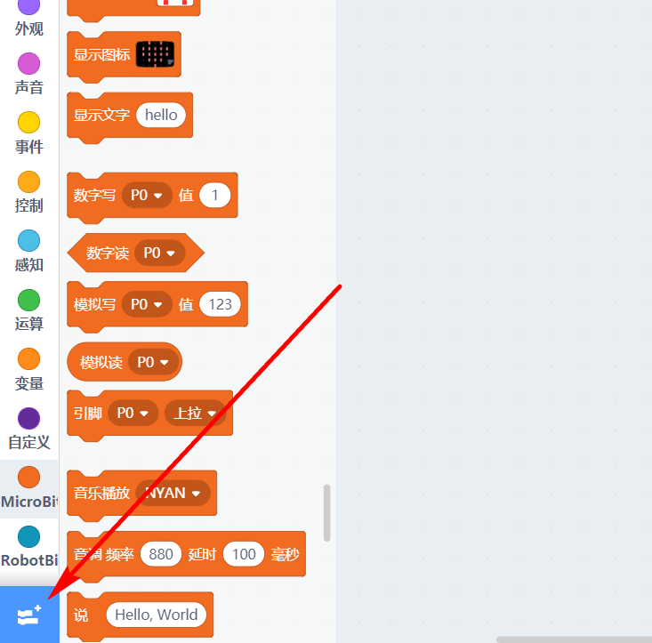

# Microbit分栏介绍 #   
   
   

## 综述 ##   
Kittenblock的Microbit是基于Microbit官方的Micropython做的，有别于makecode官方直接由js转化为汇编语言。   
使用上是大同小异。只有部分指令使用的时候稍微需要注意下。   
建议先从左上角的例子入手，先打开例子，把例子下载到Microbit上，再尝试自己改动一下程序。   
   
## 相比Makecode优势 ##
对于新手入门，CC喵建议大家可以从Makecode入手，熟悉后再转向Kittenblock的microbit，毕竟Makecode中CC喵为大家准备了很多图文教程和视频教程。   

Kittenblock中Microbit具有的优势：   
- 学习python的好工具，使用的是Microbit的官方Micropython语言。makecode中暂时没有python支持。   
- 支持图形化转换python，makecode官方只支持图形化转js   
- 支持Microbit发出简单的机器语音（利用到Micropython的speak库）      
- 支持在线固件，可以在线调试Microbit，不需要频繁下载程序，即点即得到实验结果。   
- 支持DIY控制Microbit的蓝牙“APP”   
- 精选Microbit的例子，比makecode官方例子友好，例子还在不断增加   
- 有电路板连线引擎，保存程序可以连同连线图一起保存好   
   
## 积木具体介绍 ##   
硬件需要选择Microbit后才能显示Microbit的分栏积木   
选择Microbit会同时加载Robotbit的插件
各个积木介绍如图所示：   
   
   
   
  <!--  
需要添加蓝牙插件，可以选择扩展件加载（蓝牙扩展件默认是不加载的）
   
    -->