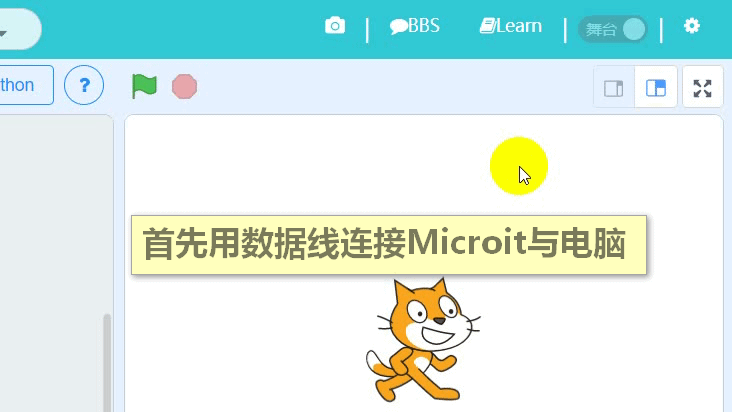
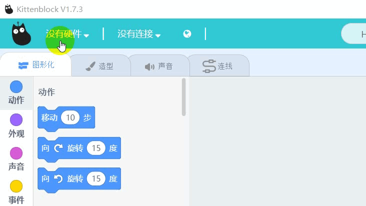
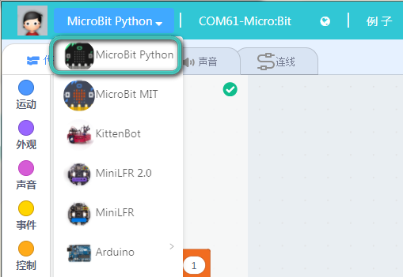

# Microbit快速开始  
       
   

## 安装驱动
 
首先将Microbit与电脑使用USB线连接

选择右上角齿轮——Microbit COM，下一步下一步确认安装完毕
   
 
  
   

如果安装无反应，应该是你电脑是win10系统的权限问题。

[解决方法请戳我](http://learn.kittenbot.cn/zh_CN/latest/microbit/microbitFAQ/microbit%E4%B8%B2%E5%8F%A3%E5%AE%89%E8%A3%85.html)

## 下载示例程序 ##

硬件选择MicorBit Python——Serial

<!--    --> 
                     

   
打开小喵官方例子——字符串显示如图
   
<!--   -->  

  
   

从舞台模式切换到代码模式 
  
点击下载   

等待下载完成提示 
  
   
   
   
最终得到实现现象   

   

   
喵家软件中内置了很多Microbit的示例可自行进行学习
   
   
   
<!-- 如果你Microbit还没入门，可以先观看Microbit在makecode下的教程，喵家出品个个精品 -->