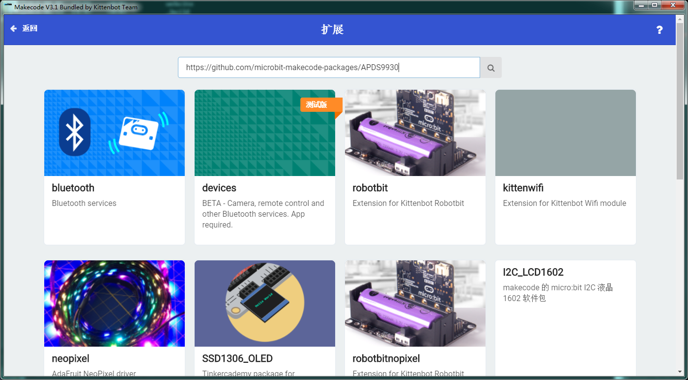
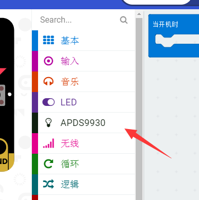
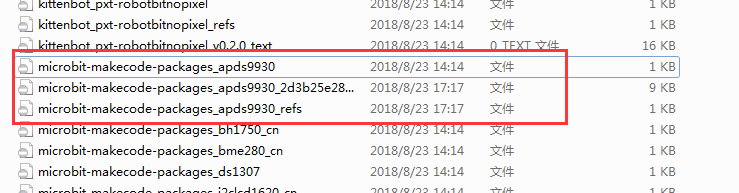

# 定制你自己的Makecode离线版本

很多老师反映想自己定制Makecode离线版本，在2.x迭代中我们尝试了很多次，但是均以失败告终。但是在makecode3的迭代中我们重写了所有对接硬件和操作系统的所有底层代码，这样我们有更大的自由并可以更好地维护离线版本的makecode。 

这篇文章就是讲述如何挂载直接的离线插件到makecode3中。

## 准备工作

首先需要升级您手上的makecode离线版本到最新的3.1或以上版本，具体地址请前往我们论坛的makecode离线版本发布帖子。 将makecode安装到您电脑上，并且保证makecode目录有读写权限，等下我们会详细讲述。 

部分win10电脑如果将程序安装在c盘根目录或者用户目录中是没有读写权限的。

## 安装所需要的插件

打开makecode后新建一个项目，并选择添加插件。 这里我们以saoziyang老师的apds 9930为例子

	https://github.com/microbit-makecode-packages/APDS9930

在搜索栏输入完整的github地址，并加装插件。

 

加载完成后会出现插件的目录

实际上插件已经下载到你的电脑上了，具体在makecode安装目录下的：

	\resources\app\app\extensions 

大家可以前往这个目录看到所下载的插件文件：

