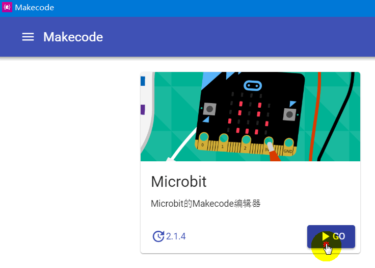
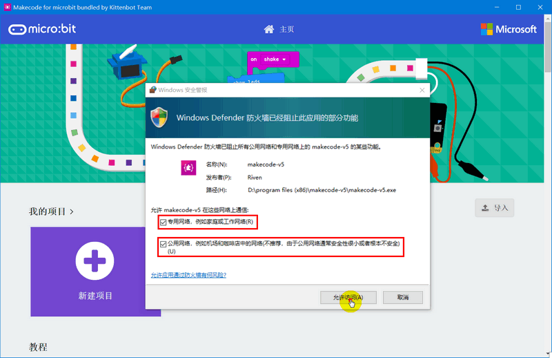
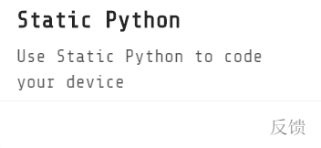

# 新版Makecode离线版本——MakecodeV5来了

## 前言

喵家的makecode离线版在很长的一段时间没有更新了，一直停留在V3.5，一个是比较稳定，另外一个老师作为课堂需求，希望软件更新不要太快。因此喵家放缓了的离线版本更新的速度。

由于最近Makecode在线版本最新有很大的更新，另外喵家的离线版本内置的插件版本很久没更新了。还有一个微软爸爸答应做喵比特的Arcade离线版本，一直跳票。嘘~我们把makecode的离线版本和Arcade离线版本打包在一个软件里，一起发布了。

## 下载

下载地址：

https://cdn.kittenbot.cn/makecode/makecode-v5%20Setup%203.6.0.exe

## 安装Microbit

双击图标安装

首次打开，需要选择安装Microbit或者Arcade（程序猿的克制，把选择权交给用户）

我们这里点选了“安装Microbit”稍等片刻，图标就变成“GO”（不好意思程序猿没做进度条）

第一次点击“GO”，进入后，有个网络选项，记得将两个选项都选上，以免有访问不了网络的问题，如图所示：

进入后就当最新版本的Makecode进行使用即可。喵家之前的一些教程和示例都有内置在里面，大家可以自由选择看看。

## 安装Arcade

安装Arcade同理，这里不再赘述。

Arcade是微软推出类似makecode的，主要针对掌机游戏编程的图形化编程平台。用于编程喵家的——喵比特（meowbit）

喵比特更多的相关资料：

https://meowbit-doc.kittenbot.cn/#/

## MakecodeV5新特性

### 1.软件集合Makecode和Arcade

应喵粉要求，很多喵粉既是microbit用户也是喵比特用户。所以程序猿把两个软件打包在一起。

### 2.让xp也能用

众所周知，Makecode离线版本不能在xp上运行，是因为Makecode的软件技术框架不支持的问题。

现在喵家找到一个非常取巧的办法！

教师用机要求是win7以上的系统，安装并且打开了makecodeV5。例如已知，教师用机的IP：192.168.1.121

学生用机XP，用XP版本Chrome访问，192.168.1.121:5566

如果是Arcade平台则是：192.168.1.121:5577

教师用机充当服务器的角色，教师用机和学生用机只需要在同一个局域网即可。这个特性对于xp大班上课是一福音~对于普通用户来说就没什么用了

CC喵手上没有xp系统的电脑，麻烦有条件的老师测试下~win7上浏览器访问教师用机木有问题~

### 3.软件支持热更新

后面软件更新无需让用户重新下载安装包，支持联网直接更新，用户体验会更好

### 4.把静态python模式开放出来

在makecode，你可以学图形化！可也学JavaScript！可以学Python！你在这里完美找到！

选择后，Python就会出现在主的编程界面中。

###  常见问题与解答

问1：这个离线版本没网可以使用吗？

答1：可以的,还是原来的配方，内置好的插件无需联网。

问2：Microbit编写的hex文件Arcade平台能打开吗？

答2：不能，虽然它们都是微软做的平台，但是hex文件不能通用。

问3：这个离线版本能打开以前的文件吗？

答3：这个离线版本的makecode是已经和微软在线版本官方版本同步了，如果在线版本能打开，这个离线版理论上也能打开。但是大家都知道微软改makecode每次都有些程序可能打不开。如遇到打不开的，大家重写就好，软件更新肯定是越来越好用，如果能兼容，程序猿都会努力兼容，可能是因为技术上的限制吧。

问4：Microbit的Python可以转出py么？

答4：microbit里面Python是静态python，你可以理解为，实际就是将js又一对一翻译成另外一种语言，和直接放在U盘形式.py跑的那种不一样。不过对于初学者来说，可能感受不到有什么不一样。

