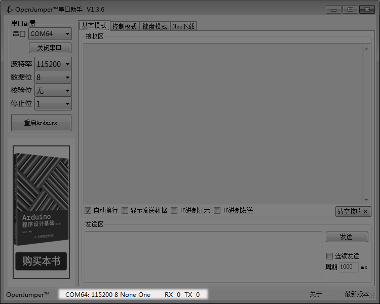
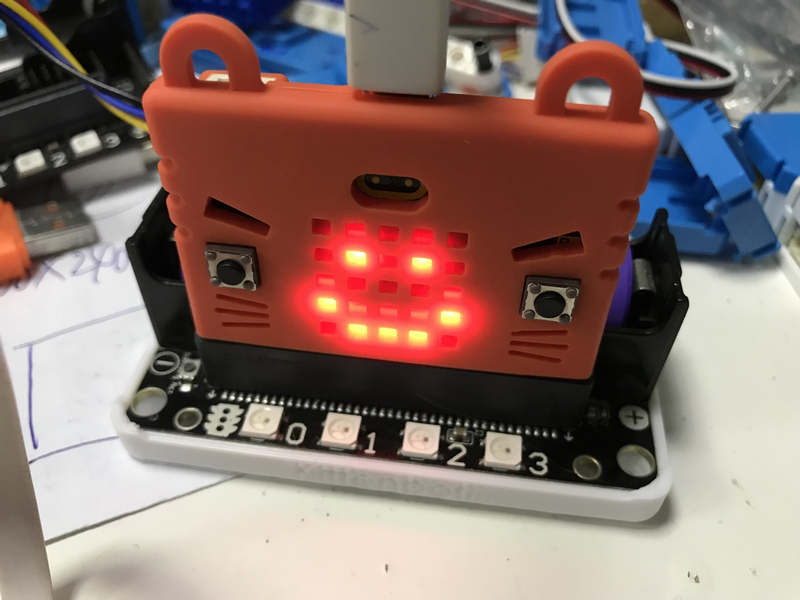
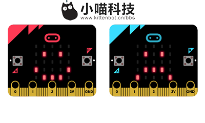

# Microbit与串口触摸屏交互  

    
前些天有Microbit用户在谈论说，不知道如何用Microbit控制大一点的屏幕，因为Microbit常规控制显示类的东西，几乎都被热心的老师写完了，大家也用起来了。这里特别感谢邵子扬老师、吕启刚老师的辛勤写的详细教程。CC喵所知的，Microbit现在已经可以控制4位数码管、I2C的1602液晶屏，I2C的OLED屏幕，8x8点阵屏。其他没有补充的麻烦知道的友友留言告知下。

既然常规的屏幕都已经有教程了，那么今天CC喵写点大一点的屏幕，也是市面上很常的串口屏。如果你喜欢我的这篇文章，记得留言或者转发，这样CC喵就有更多经费购买配套Microbit好玩的东西，笔芯~

## 什么是串口屏
用于简化屏幕开发的一个集成度比较高的屏幕，一般屏幕上集合了运算能力比较强的单片机，用于独立处理屏幕事件与通讯。一般通过串口协议与其他主控板进行通讯，从而对屏幕进行交互控制。
这种串口屏一般配搭一个PC端比较好用的图形化开发界面，用于降低开发难度。
厂家看到请付广告费哈~

## Microbit控制串口屏思路

大概理一理思路，这样我们学习就有目的性了。只要逐个击破所要学的知识点，这样我们很容易就达到预期的效果。

串口通讯不要害怕，串口通讯是单片机控制中最常见的一种协议，你只需要记住这个就可以了。

本教程由于篇幅的原因，只讲串口屏屏幕事件触发串口指令，Microbit对应接收串口指令，执行程序。（串口屏幕最常见的用法）

## 小试牛刀——Microbit串口发送

还记得喵家出品的Makecode离线版本里面，最讨人喜欢的除了可以离线，还有那个大明湖畔的CC...啊！~不对，那个强大串口打印的功能吗？

这个串口打印功能是用于，Micorbit的传感检测到的数值，通过usb串口传到电脑上显示，最适合超声波距离检测，模拟传感器检测。有人肯定会问，Micorbit上不是可以点阵屏显示数值吗？CC喵告诉你，Microbit点阵屏显示太慢了，特别三位数以上，要滚完整数要费很长时间，而且对一些实时检测的数据，串口打印可以通过图形曲线呈现出来一个趋势，特别方便。

串口很简单，希望多多进行使用。

程序下载后，串口打印回来的数据显示，记得选“显示数据Device”，不要选“模拟器”，就看到Microbit打印回来的串口数据。

## Microbit串口接收程序

如果在此之前，你已经用过Microbit的2.4g接收信号程序，那么下面这个串口接收程序也很容易理解。

首先当开机时，串口初始化，串口初始化方式用两种：

1、一种重定向到USB。一般用在Microbit与电脑直接通讯

2、另一种重定向到microbit某两个引脚上。一般用在Micorbit与其他串口电路板通讯。

当接收到串口数据时（一般以换行符作为结束的标志）

把读到的字符串存为一个变量，然后通过条件语句判断变量是否与阈值相等，让后对应触发Microbit的控制动作。

文本操作比较有点陌生，大家多多练习就可以了。啥？你问为什么不能直接比较变量a，而是要通过文本操作？因为“从串口读取字符串”这个数据里面包含了一个换行符。

例如“ab换行符”与“ab”比较，永远都不会相等的，CC喵愚钝，我也是卡在这里很久了，后面做了实验才知道“从串口读取字符串”里面有换行符！！哎呀~卡了好久，我以为是理所当然的只有“ab”！阴谋！~

编写完这个程序后，下载到Microbit板子上。下面的使用准备用到。

## 验证下我们的串口接收程序是否正确

程序已经写好了，我们需要对Microbit进行串口数据发送，让它接收点正确的数据，看下能不能对应触发我们想要的效果。

那么我们用什么工具对Microbit进行串口数据发送，嗯，水能载舟亦能覆舟，既然Microbit能通过水对~滚，能通过串口对电脑发送数据，那么理所当然，电脑也能通过串口对Microbit进行数据发送。

好了，CC喵要安利一个比较好用的串口调试软件，由Arduino中文社区奈何大大写的，这里表示感谢，麻烦看到记得支付广告费。

推荐理由，中文...界面简洁免安装...还有自定义按钮发送指令功能，对于普通用户够用了（好吧，说好用又被程序猿鄙视了~）

## 验证开始

首先你要确保你已经安装了micorbit的串口驱动，如果没有安装或者不知道什么是串口驱动，请到喵家论坛搜索关键字“串口驱动”

当你插上Microbit与电脑usb连接起来的时候，打开这个串口软件，你对发现有一个除COM1以外的COM几，具体是几这个每个人的电脑都不一样，是由电脑的喜好分配的（滑稽脸）。

例如CC喵这里显示的是：COM64

还会要进行设置下，波特率就是通讯的速率，不要问我为什么是115200，Microbit usb串口通讯速率就是115200。

最后点击打开串口

串口已经成功打开了，电脑与Micorbit通讯的“桥梁”已经建立起来了。

我们尝试发送指令 ab+换行（回车）,在发送区中，键盘输入ab然后按回车键，再点击发送按钮。如下面的动图

实验结果

OK~实验成功，秘诀输入完ab一定一定一定要按回车（换行符的意思），再点击发送，否则你只发送了ab，然后就无法触发Microbit的串口检测程序了。
我们在测试下cd按回车，再点击发送，如果显示哭脸，那么说明程序都写对了。

如果得不到实验现象可能有以下几方面原因：

1.Microbit的程序写错了

2.串口软件操作不正确

3.串口选错了？

## 购买串口屏

CC喵买的是这一款，带触摸的，根据自己需求购买屏幕的大小，一般屏幕越大就越贵，屏幕无论多大，使用的软件和编程方法都是一样的，只是做界面的图片相应用大点的图片。之前有个老师说带学生做项目的一个事情，之前一直为了省费用，用1602小屏幕，没起什么大水花。后面用了一个7寸屏幕触摸屏，然后居然上电视了（滑稽脸）。

大触摸屏交互确实会给项目加分，大家酌情购买，触摸功能是必须的，屏幕尺寸大小没有关系。市面上还有其他串口屏，有些性价比会更高，由于经费的问题，CC喵只随便挑了一款之前有朋友3D打印机上用过的串口屏。报上CC喵的大名，店家会给你打成骨折~

购买后，下载资料安装软件，首先按照视频教程先学习下如果制作界面。

坑我已经踏平了，唯一的坑就是，他们软件升级了，但是教程没有更新。所以首先要新建字库（先跳到视频的8分20秒学习新建字库），否则软件编译会报错。

如果没有添加字库，编译会报错，报错如下。

## 串口屏编程

首先准备好图片素材，CC喵用笨拙的图片编辑技能做了两张图400x240，刚好是对应购买的屏幕的大小

然后所有操作按照串口屏的视频教程来，素材就是我们上图的笑脸和哭脸，按照教程来新建两个触发按钮。

这里唯一跟教程不同的是，我们需要触发按键时，串口发送出对应控制Microbit的指令“ab回车”和“cd回车”

操作很简单：

按键事件那里，我们加入代码，如按键b0的按键事件

prints "ab",0

printh 0a

按键b1的按键事件

好了~UI和程序弄好后，我们编译调试测试下，仿真功能真香~，没问题后就下载到串口屏上。

## 串口屏与Robotbit连接

连接没什么难度，对应接好即可。请再三检查接线是否正确再进行上电，否则烧坏屏幕我可不会借个肩膀给你哦~

## Microbit程序更改

之前Microbit的程序是以usb为串口通讯接口，现在要根据我们上图的连接，把串口重定向到P1、P2。

重新把程序下载到Microbit中

## 结果现象

打开Micorbit的总开关电源,OK啦~

我们用的比较多的方式都是这种：主控板的串口信息监测程序写好后，屏幕交互对应发送指令给主控板即可。再由主控板控制其他电子模块。

至于Microbit如何把数据发送给串口屏，我们下次有时间再讲，怕文章太长大家看了都打瞌睡。

## 补充——Microbit如何发送16进制

    function send() {
    let buf = pins.createBuffer(3);
    buf[0] = 255
    buf[1] = 255
    buf[2] = 255
    serial.writeBuffer(buf)
    }
    input.onButtonPressed(Button.A, function () {
    send()
    })
    input.onButtonPressed(Button.B, function () {
    serial.writeString("hello")
    })
    basic.forever(function () {
     
    })

将以上的代码复制在Makecode的js代码编程界面中，然后再点击转换成block，就可以看到生成一个send的积木块函数了。虽然有些指令没有翻译，但是这个是没有关系的。

这个Send就是对应串口屏的通讯指令结束命令（发送3个0xff）。16进制转10进制，大家可以用电脑计算机计算，或者直接上网查，0xff换算成10进制就是255，所以按下A就是连续发送3个0xff

这里用了广州某老师的程序图，可以控制串口屏显示不同颜色，实测OK

## 大礼包

- Microbit程序
- 对应串口屏的程序
- 串口屏的素材
- 串口工具

打成一个[压缩包(戳我)](https://bbs.kittenbot.cn/forum.php?mod=attachment&aid=MjU3MHwzODEyZDU5YnwxNTQyMzcxNzAwfDN8NDMz)

或者请移步到[喵家论坛](http://www.kittenbot.cn/bbs)进行下载~对应搜索关键字“串口屏”

