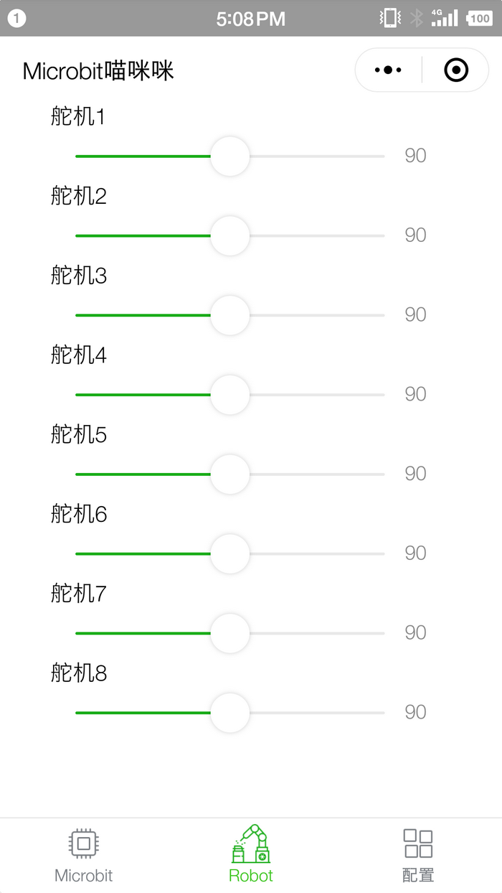
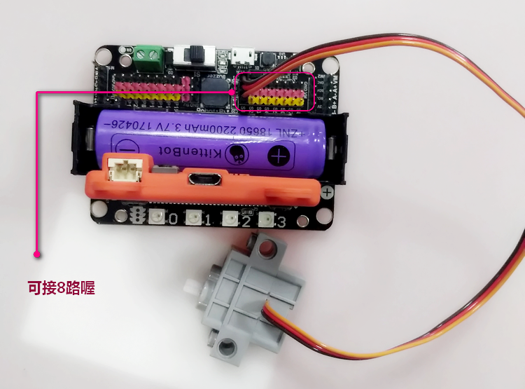

# 微信小程序：Microbit控制器

Microbit喵咪咪是由Kittenbot团队个人推出的微信小程序，支持通过手机蓝牙链接Microbit进行无线控制。

微信搜索框中，搜索microbit
 

## 使用步骤

①.需要使用1.80版本以上的kittenblock刷入Microbit固件，如果没有Kittenblock的小伙伴推荐先下载一个[kittenblock下载链接](http://www.kittenbot.cn/#/software)  
并且跳转至 [kittenblock基础入门操作文档](http://learn.kittenbot.cn/zh_CN/latest/kittenblock/index.html)  
如果已经入门了kittenblock的小伙伴继续往下看  
选择硬件MicroBit Python-连上COM口-点击恢复固件 
  

**固件恢复成功microbit屏幕会循环闪过几个字符，就是蓝牙的编号**  

 

②.打开手机蓝牙（这个你手机的蓝牙，很多新手都忘记打开自己手机蓝牙，然后就说没有搜索到Microbit）  
 
 

③.扫描蓝牙，找到对应蓝牙编号，并点击结果连接  

  

## 小程序控制功能

1.Microbit的点阵屏——支持对5x5点阵屏进行涂鸦

最顶上4个小方格就是制定Robotbit前面4个RGB灯，只要对齐进行点击，就会进行颜色轮换

另外也可以对Microbit点阵屏进行发送字符串

  

2.对应Robotbit电机控制，点入“感叹号图标”设置4个方向按钮的电机数值,电机数值上面为M1A，下面为M2A（Robotbit上的M1A与M2A），均采用红+黑-的接线方法

  
  

 
3.对应Robotbit舵机控制,目前支持舵机的0-180°控制   

   
    

**以上就是小程序Microbit喵咪咪的操作内容。小程序的功能会持续更新**

