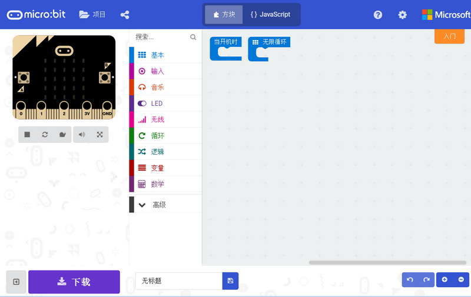
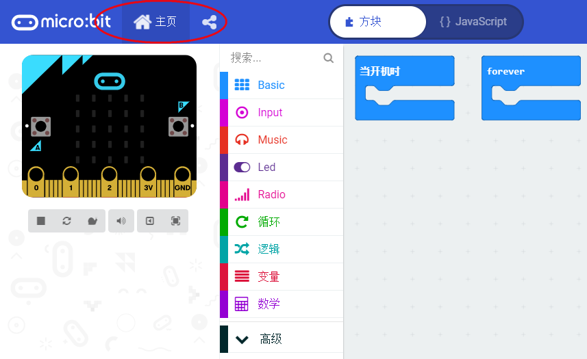
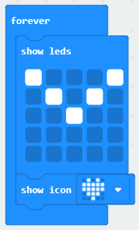
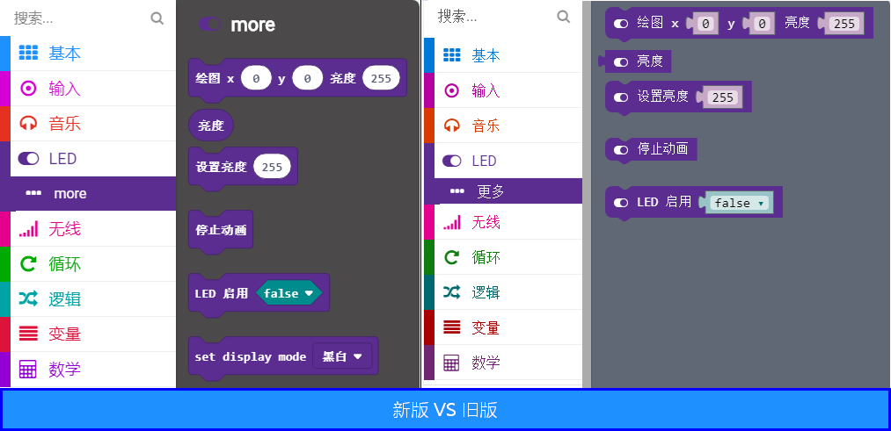
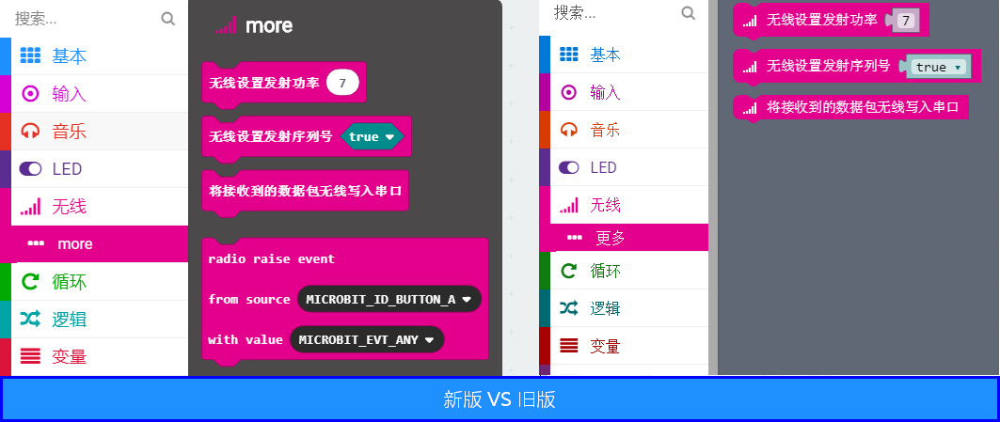

# 微软Makecode新版更新了什么

10月26号，微软官方将会正式发布新的Makecode

大家可以提前体验[新版的在线版](https://makecode.microbit.org/beta "https://makecode.microbit.org/beta")。过几天就会正式上线，到时我们访问https://makecode.microbit.org/就会直接跳转到新版界面。

当然你也可以下载喵家[最新的离线版本V3.3](http://cdn.kittenbot.cn/makecode/win/Makecode%20Setup%203.3.0.exe)，是基于新版makecode做的。如果之前没有安装过喵家离线版本makecode，需要多下载一个[microbit串口驱动](https://bbs.kittenbot.cn/forum.php?mod=attachment&aid=MjUyNXxiZDFkMTBhYnwxNTQwMjYwNDM3fDB8MTU2)。当然有用户说微软win10用户商店有microbit官方离线版本下载，喵家程序猿测试了，还是需要网络的，大家也可以测试下。

之前也有些帖子介绍过新版makecode，这篇帖子从CC喵理解的角度重新介绍下这个新版Makecode。

## 更新提纲

总结下来，新版makecode有三大更新点：

1. 用户操作习惯更新——体现在主页

2. Makecode界面换皮肤了

3. 底层代码大变动（对普通人什么感觉~）

## 用户操作习惯更新具体介绍

**之前**我们打开makecode在线版本时，是直接接入积木块编程界面:

**新版**打开，是进入到一个主页管理界面，可以查看历史编辑过的文件和一些教程与示例

一些具体的操作：

新建项目进入程序编辑界面：

可以发现左上角，只有主页，换句话说，如果你正在编辑界面中，如果你突然想导入一个外部程序，那你只能回到到主页后，进行导入。

> 当然也有个小技巧，就是直接将hex文件拖拽到这个编辑界面，程序就会被打开了。

## Makecode界面换皮肤了

**之前**

**新版**

可以感觉到新版积木块UI更加肥，，但是从拖积木块的用户体验上来说，肯定是面积越大鼠标点击更加方便，尤其对触摸屏设备体验更好，据说UI是从Blockly的UI转到Blockly和Scratch的组合UI，我们确实可以看到Scratch积木块形状的影子

----------

**之前**

**新版**

某些积木块的UI确实提升不少，例如CC喵最喜欢的点阵积木块，相比之前，点阵排布看上去更加舒服，而且紧凑了。

另外有一个很大的变化，旧版UI对应积木块头有个积木块分栏的图标，用来表示这个积木块是属于左边的哪一栏积木块。新版取消了！！！可能是为了移动设备节省有限的屏幕空间吧，所以这个需要花时间去熟悉下~根据积木块颜色去对应查找

----------

## 底层代码大变动

对于大家的影响就是，之前旧版本的程序，放在新版本打不开了，或者打开出错，微软官方更新那里声明了！**对于旧版本的程序是明确不兼容了**，有些程序能打开，那就是运气好。这个确实对用户使用影响很大！

所以大家摆正心态就好，毕竟软件是要迭代的，只会越来越好。

如果大家还是想用旧版本的，那么只能安装我们喵家的V2.3

## 分栏变动对比

大家可以浏览下新版与旧版的积木块对比，有些分栏中积木块增加了，例如无线分栏，有些分栏积木块改进了，例如基本分栏中的暂停增加了下拉菜单。

