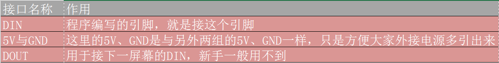
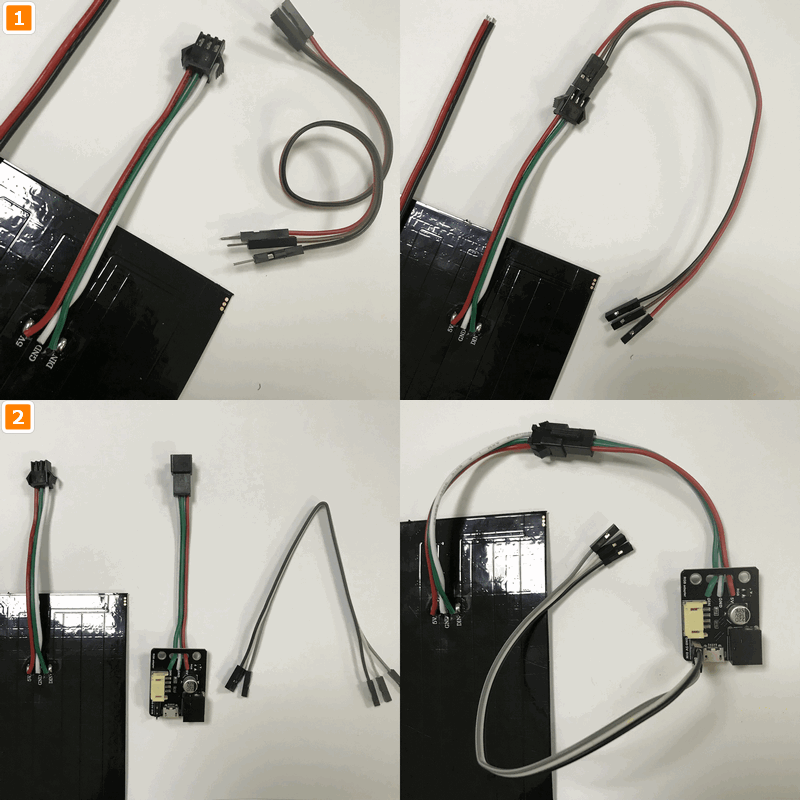
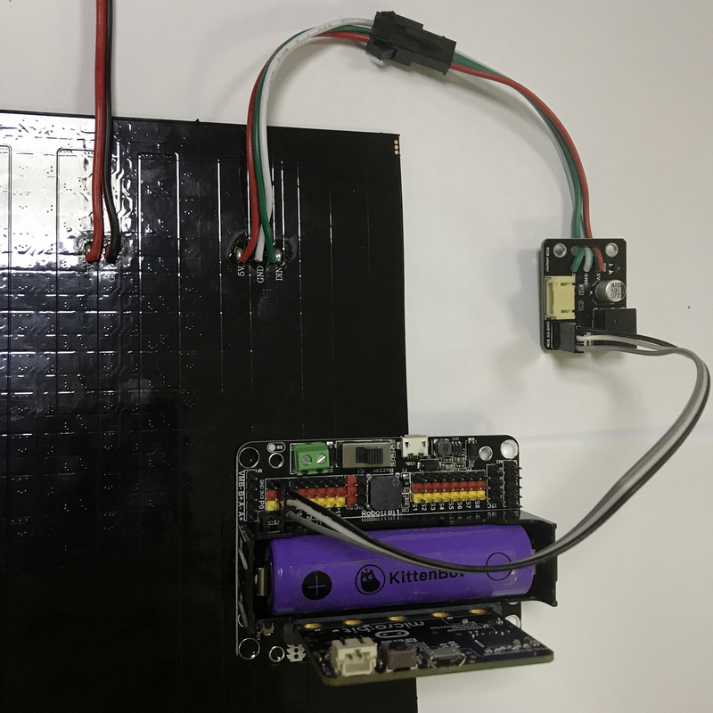
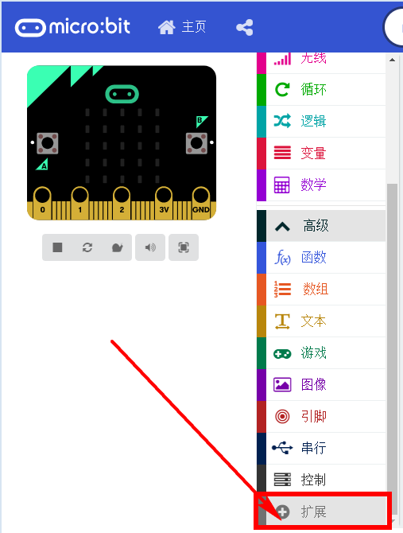
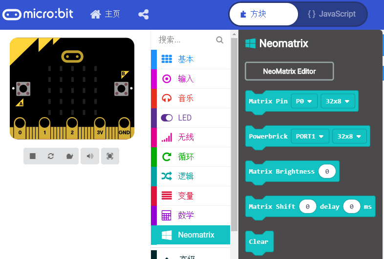
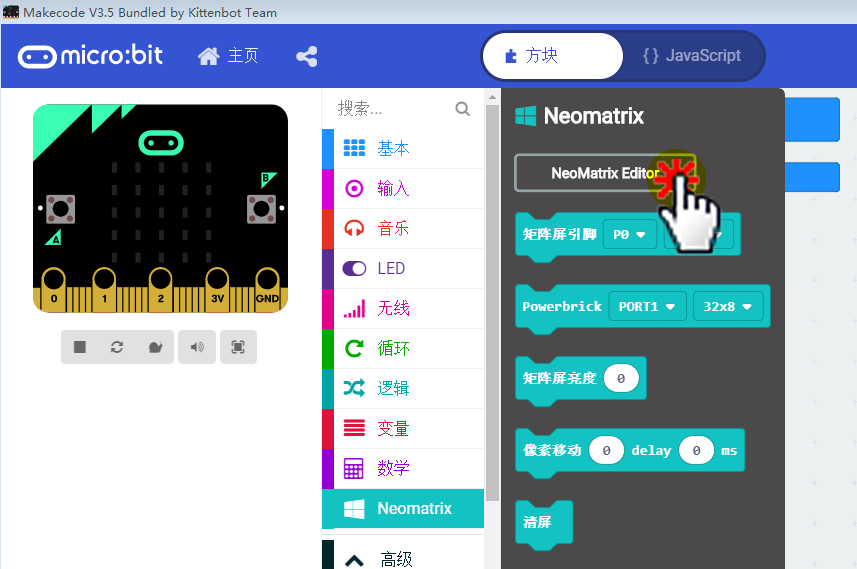
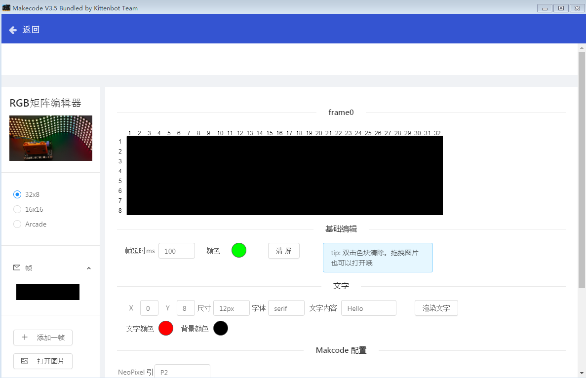
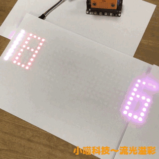

# 全彩点阵屏在Makecode中的使用

[程序下载，戳我](https://bbs.kittenbot.cn/forum.php?mod=viewthread&tid=627&extra=page%3D1)

大的全彩屏一般在学校的展示活动中会大放异彩，可以显示一些图案，一些字比较亮眼。但是由于屏幕比较大，像素比较多，控制上也比较麻烦，所以很多友友望而却步。

有需求没有被满足的地方，就有喵家的身影。喵家隆重推出专用的流光溢彩柔性屏与能量魔快组合屏。帮助大家快速上手大的全彩点阵屏。

## 喵家全彩点阵屏种类

[全彩点阵屏在喵家淘宝店有售，可以戳我](https://item.taobao.com/item.htm?spm=a1z10.3-c-s.w4002-21482550023.9.1c7e762esHwtyf&id=569267292484)

屏幕有几种，应该要怎么选择呢？

### 流光溢彩16x16

新手推荐4颗星~

如果你想要显示中文字，那就选择16x16，因为一个汉字渲染的最低要求是12x12，8x32的流光溢彩屏无法以常规的方式显示出汉字。

### 流光溢彩8x32

新手推荐3颗星~

8x32比较擅长演示流动的英文字符串或者数字

### 能量魔块8x8

新手推荐5颗星~

能量魔块全彩点阵屏是能量魔块套装中其中一个模块。它本身是8x8的点阵大小。但是可以通过相互的拼接可以组成16x16的（田字形式）或者8x32的（直线形式）

插接方便而精美。

推荐购买一组（4个），4个8x8的全彩点阵屏可以组合组合拼接成16x16或者8x32的形式，自由度会大很多，并且每个模块都有带有乐高孔的外壳。便于与乐高科技积木件组合在一起使用。

能量魔块点阵8x8 4个一组暂未上架，需要购买的，请狂呼淘宝客服，购买隐藏套餐~哈哈

## 使用前的注意事项

- 流光溢彩屏有严格的线序！接好线后，请再三确认才上电！！！

- 流光溢彩屏16x16或者8x32上有256颗全彩灯珠，如果全部亮起来的时候，所需电流和发热都会比较大。所以建议亮度控制在10-20都已经比较合适了。
- 如果需要全彩点阵屏长时间工作，请外接5V电源，这样可以保证电量比较充足。

## 全彩点阵屏详细介绍

### 流光溢彩介绍

先看下流光溢彩这两个屏线的定义。它们本质上只是灯珠的排列方式不一样，接口是相同的，接口的功能也是相同的

接口功能，请牢记，几乎适用于大部分全彩点阵屏

### 能量魔块拼接介绍

接线的方式都是一样的，从IN接入，从OUT接出；再接入下一个屏幕的IN。

只是拼接方式有点区别。分别可以平成田字形式和一字形式。

## 硬件接线

### 流光溢彩屏接线

方式1：用3PIN公转母的杜邦线（优势：方便，便宜。劣势：如果外接电源需要自己接）

方式2：3PIN母对母杜邦线+用喵家专用转接板（优势：可靠，插接方便，支持DC头外部和充电宝5V接头。劣势：比杜邦线稍贵）

最终引脚接在P1口上

### 能量魔块接线

方式1：拼接成田字形式

方式2：拼接成直线形式

以下图示以田字形式，最终引脚接在Port2上

## 软件编程

### 打开离线版本

### 加载插件

成功加载

### 修改插件版本号

更改： 0.1.4->0.0.1.5

点击方块返回

### 重新进入插件

如果第一次进入是显示空白，则需要重新再进一次

### 编辑界面操作方法

按照如图所示操作：

每次生成完成后，必须点击输出，再返回makecode编程界面，点击输出按钮会有信息提示。

### 编程显示

小字已经成功渲染出来

我们继续返回生成界面，生成另外的字——喵

同样的操作，返回makecode编程界面

最终程序，如图，你可以按照自己的想法自行再改进下。亮度推荐10即可

## 同理8x32

亮度推荐10即可

## 同理能量魔块16x16

亮度推荐10即可

需要注意输出的时候对应选择——Powerbrick

## 实物显示

16x16

8x32

