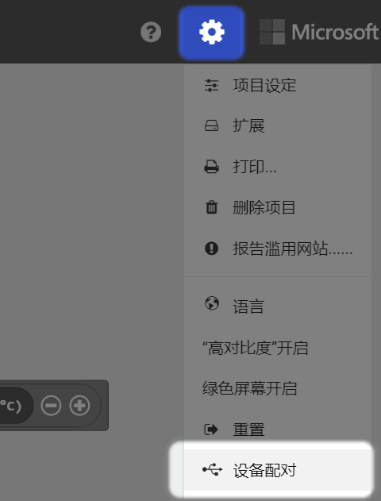
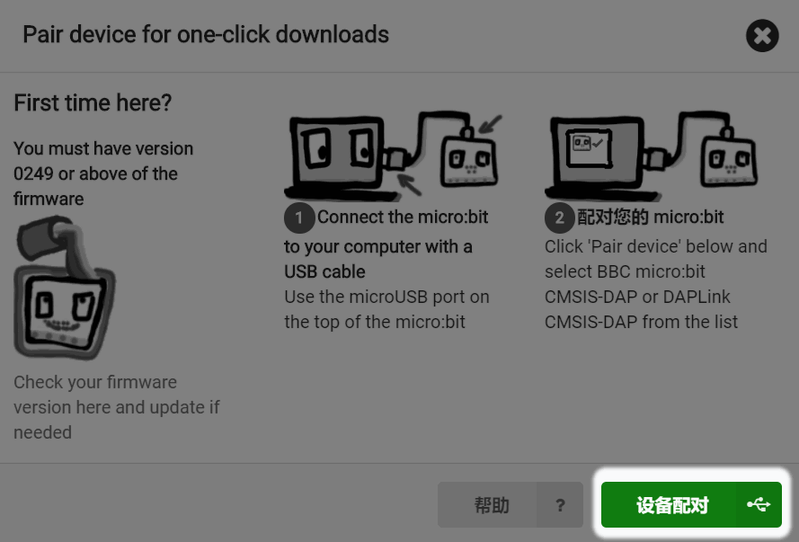

# 如何加快Microbit/Nanobit的下载速度

## 介绍

如果大家不是用喵家的Makecode离线版本，而是采用在线版本，你会发现，每次电机下载都会让你选择下载的盘符，而且会弹框，比较麻烦。

其实微软在现有版本已经做了一个配对的功能，只要你配对Microbit或者Nanobit，你就无需每次进行下载选择，程序会直接下载到板子上，而且速度也比较快。

## 操作方法

打开Makecode编程页面右上角的小齿轮——设备配对

弹框选择——设备配对

选着连接设备（我这里显示的是Nanobit）——确定

配对连接成功提示

后面只有点击下载按钮后，就不再弹框，只会显示正在下载，一下就下载完成了。

