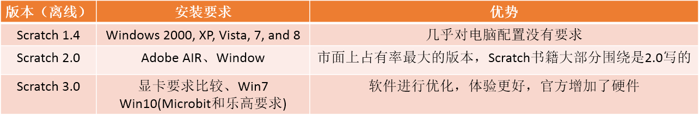
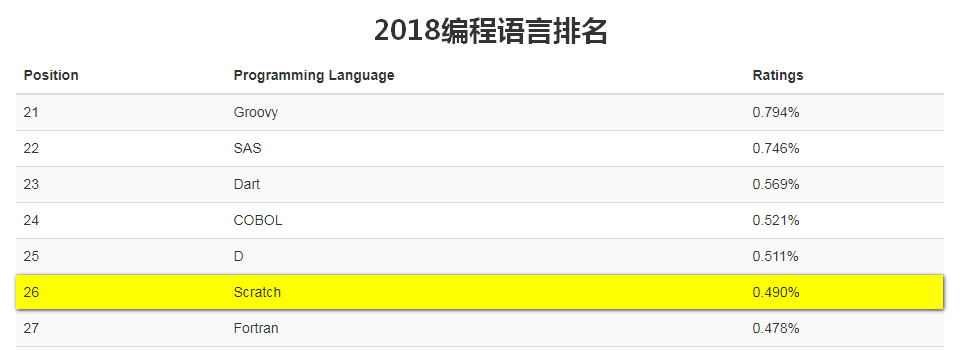
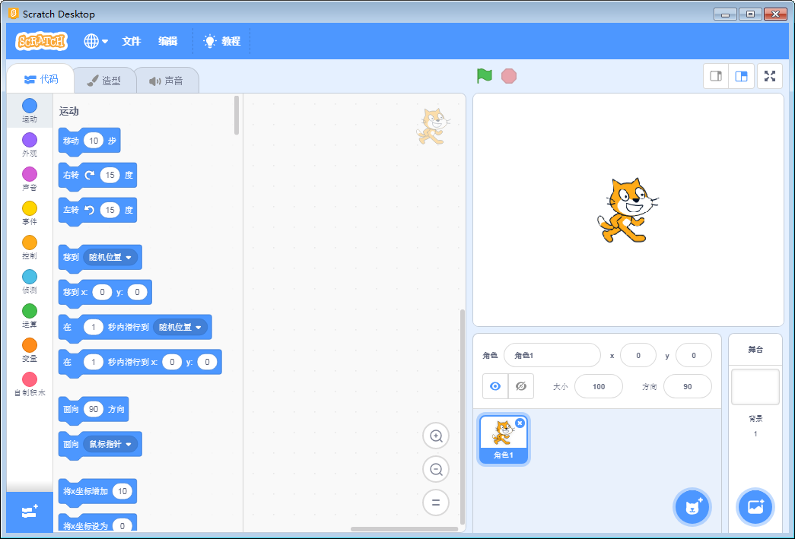
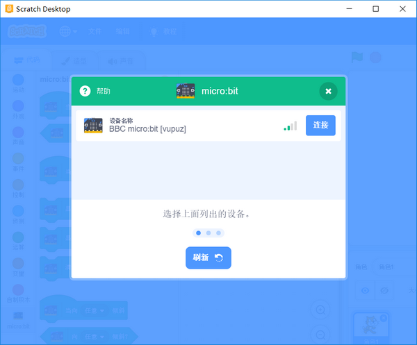

ian # 喵星人不一样的解读——MIT Scratch 3.0

MIT Scratch3.0正式上线了，Scratch3.0的离线版也同时发布了，在这里非常感谢MIT团队对全球编程教育做出的巨大贡献！

如果你身处编程教育领域，没有听说过Scratch，那就有点OUT了。Scratch是全球的范围内用得最多的一个图形化编程教育软件。

由于它的流程程度，国内K12的图形化编程教育的书籍讲解都是基于Scratch写的。

Scratch总共经历了三个大版本1.4、2.0，到现在的3.0

每个版本都有其特定的用户群体

Scratch也算是一门编程语言，2018年全球的编程语言排行26：

排名26似乎不算是什么，但是它是榜上唯一少儿编程语言排得那么前的语言，已经很厉害！

这个是Scrach的百度搜索指数情况：大概可以看出Scratch处于一个被关注的势头

这个是谷歌的搜索指数，同时我把编程教育界经常听到的几个热词放进去同行对比下，令我比较惊讶的是，Scrach的搜索热度居然比Arduino还高，可见Scratch的魅力

## Scratch3.0到底更新了什么

相信今天图形化教育领域界的老师和爱好者被Scratch刷了朋友圈，Scratch的具体更新的细节这里不再细讲了。

软件更新，CC喵总结了实际就是更新了两大点：

第一点：软件UI和软件使用体验提升了，如果将Scratch 1.4的风格比喻为xp系统的风格，那么3.0版本那就是win10的的清爽风格。语法用法上并没有太大的变化。

第二点：增加新插件，如Microbit、乐高套件、语音朗读翻译等。

当下最火的教育硬件Micorbit也被支持！

## 体验Scratch3.0的Microbit编程

### step1：下载Scratch3.0官方版本（https://scratch.mit.edu/download）

### step2：打开软件，扩展件添加选择Microbit

然后我遇到一个问题就是...需要安装Scratch Link和蓝牙

### step3：那就安装Scratch Link吧

点击帮助，跳转，安装，好吧，Scratch Link只支持win10 并且要求你的电脑设备需要有蓝牙4.0，无奈只能转战我的小米笔记本电脑继续操作。将以上的步骤重做一遍。

### step4：给Microbit下载一个对应MIT固件

**下载下来后，拷贝到Micorbit的U盘上**，拷贝成功后，Microbit上会滚动显示一串英文字符串，即成功刷入。

### step5：Scratch连接Microbit

假设你的电脑Scratch Link和 蓝牙都OK了，如下图：

重新连接Microbit：

连接成功：

### step6：进行测试控制Microbit吧

拖拽了2个点阵屏相关的积木，点击一下，Microbit立马有反应，scratch与Microbit通讯这个还是没有问题的。

## 感受与体会

官方scratch3.0与硬件通讯，我觉得是它本次3.0更新的最大亮点，但是体验下来，我发现了几个问题：

1. 电脑系统需要是win10的，不然你无法安装Scratch Link。

2. 你电脑需要有蓝牙4.0，不然你没有办法连接硬件。

作为教育的一款编程软件工具，首先是普及，win10和蓝牙4.0这两点已经把把多数学校的机房挡在了门外，至少这次Scrach3.0这个microbit硬件通讯对大部分学校机房的挑战难度很大。系统需要是win10，好点的学校应该已经上了win7，win10对电脑配置要求比较高，而且很多教育软件还没支持到win10，不可能因为一个软件去更换一个系统，或者换一批好的电脑。另外一个就是蓝牙4.0这个问题，学校机房大多数都是台式机或者一体机，根本没有配置蓝牙设备，如果要控制Microbit还需要增添蓝牙设备器，市面上最常用的蓝牙设备器就是类似U盘那种蓝牙设备器，这样每台电脑上需要安插蓝牙设配器，器材上购买和保管又是一个难题。

所以本次Scratch3.0增加硬件对学校机房上课意义不大，但是对个人老师笔记本上（现在市面上哪款笔记本没有蓝牙4.0）作为一个展示是没有问题的。暂时只能独乐乐不能众乐乐。

## 官方Scratch3.0的问与答，你所关心的问题

问1：Scratch3.0现在支持arduino和arduino的插件吗？

答1：不支持，Scratch现在只支持Microbit、乐高套装等。

----------

问2：Scratch3.0如果与Microbit连接需要有什么要求？

答2：电脑系统必须是win10（Scratch Link要求win10才能安装），电脑需要配备蓝牙4.0

----------

问3：Scratch3.0中Microbit能支持离线下载吗？像makecode的那种方式

答3：不支持，只支持在线蓝牙通讯。毕竟Scratch主打还是舞台交互这块，离线下载了就没有舞台交互这块玩了。

----------

问4：Scratch3.0支持python吗？

答4：不支持，MIT比较专一，一直只专注于Scrach图块化编程。

----------

问5：CC喵，你建议我更换官方Scratch3.0吗？

答5：只能说看结合实际情况，看个人的需求。

如果你是老师，从来只教Scratch舞台交互的，不做硬件编程的，并且机房的电脑是win7以上，配置还OK的，可以更换。毕竟新版软件从某些程度上来说体验会更好。

如果你既教纯Scratch也教硬件，那么我觉得老师你们可以选择一款既是Scratch3.0内核的，又能支持各种硬件的图形化软件，不妨可以考虑喵家的Kittenblock（假设你还是不是我们的Kittenblock用户）

## Scratch连接Microbit的“正确打开方式”

Kittenblock的有很多优势，这里只以Microbit为例，来说明下

这里直接录制了个视频

请移步视频网站。

