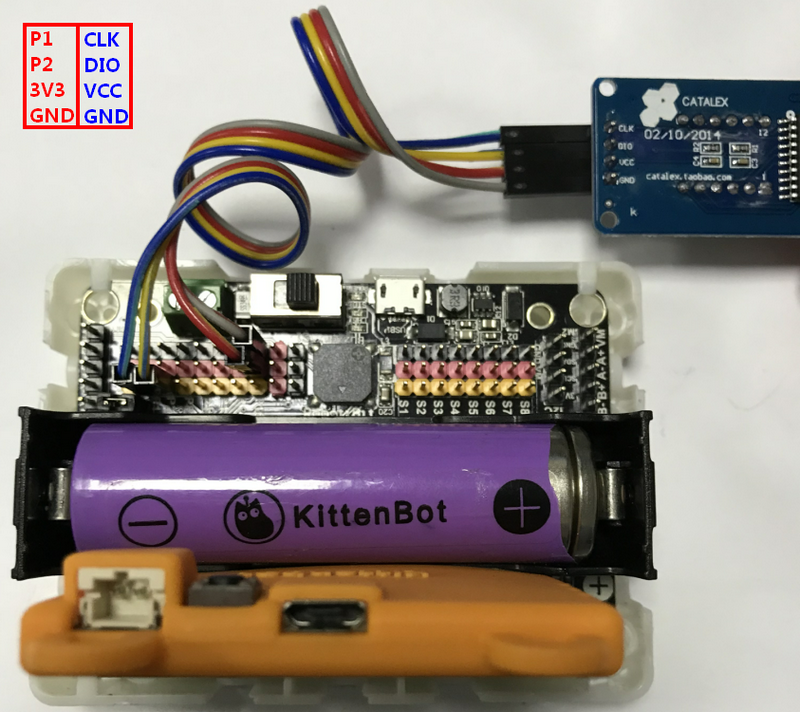
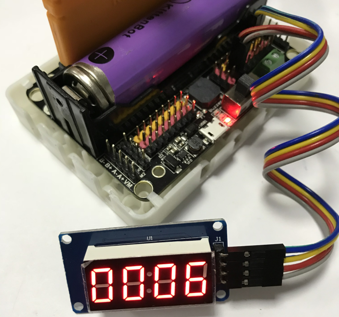
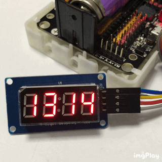

# 四位时钟数码管TM1637  

有部分友友私信CC喵，说在一些DIY制作中需要有个显示屏，用来显示一个稳定的数字。Microbit虽然有点阵屏，但是显示数字是滚动的，显示上不够直观。例如做一个投篮计分装置。稳定显示数字那就十分有必要了。

今天CC喵就在此安利一款性价比到爆炸的显示模块——四位时钟数码管TM1637。你问Microbit怎么连接这个TM1637?那肯定是买喵家的Robotbit啦

## 连接    

连接很简单，只需连接4根线(接错要去面壁思过)，电源VCC可以接3.3V或者5V，都是支持的，这里我接了3V3

## 编程前准备  

### 打开编程环境  

打开makecode在线版 https://makecode.microbit.org/

或者 makecode离线版V2.3（最新版本是3.1，3.1是新框架不支持这些旧插件）

### 加载TM1637插件   

这里我们加载的插件是邵子阳老师写插件，再次感谢邵老师的无私奉献。插件原贴地址：
http://www.micropython.org.cn/bbs/forum.php?mod=viewthread&tid=823&extra=page%3D1

插件地址：https://github.com/microbit-makecode-packages/TM1637

直接复制到makecode加载插件栏

如果你用的是makecode离线版V2.3，在插件加载页面中，是可以直接选TM1637的

### 加载成功   

## 正式编程   

### 初始化   

是不是看到英文感觉又点晕晕的，别怕！

首先开始我们需要初始化告诉程序，我们是怎么连接数码管的

你已经成功了大半了。CLK和DIO就是直接对应实物的CLK和DIO

### 显示6666   

程序

现象

如果你初始化设置了4位数，但是你只输入了一个6（1位数）剩下的三位数就会被0填充上

写一个最简单的程序显示6666，送给好学的你们

所以这个使用是很简单的。

### 冒号闪烁   

程序

现象

  
## 积木分栏解释   

## 推荐购买   

CC喵你说了一大堆哪里有这个性价比爆炸的TM1637买呢？[炸裂推荐购买地址](https://item.taobao.com/item.htm?spm=a230r.1.14.112.30bf508676FOIq&id=541976810761&ns=1&abbucket=4#detail)

