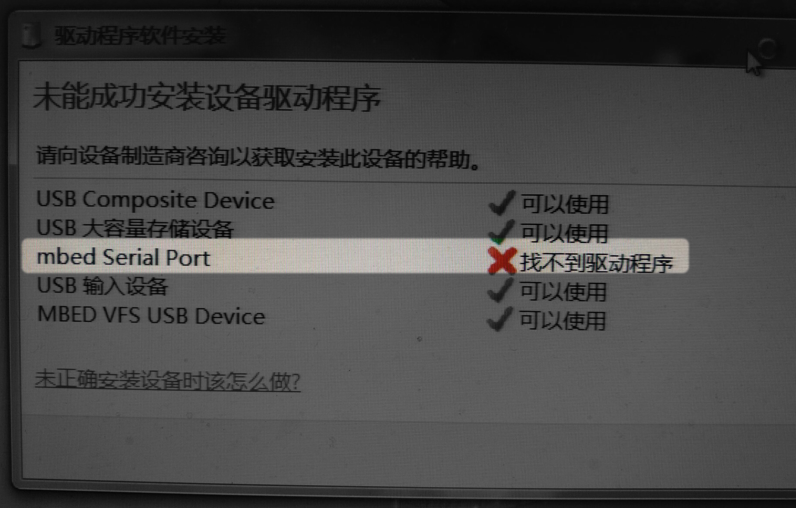
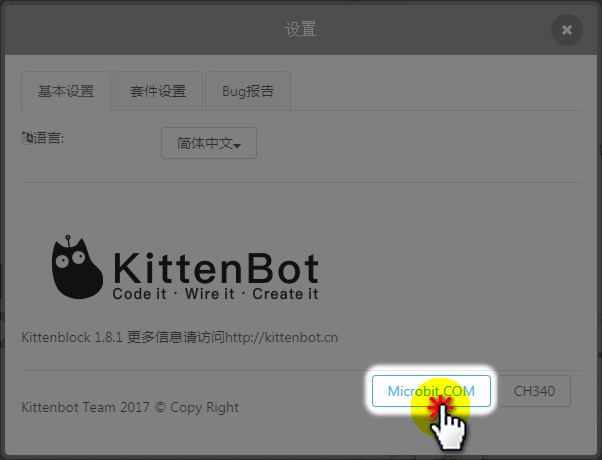
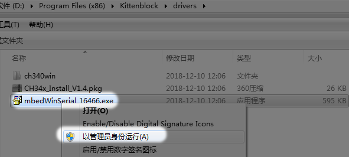

# Microbit串口驱动安装

## 问题现象

弹出mbed Serial Port找不到驱动，这个驱动其实是不影响Microbit下载的，但是如果你Microbit进阶一定会用到。

[具体如何使用Microbit串口，可以戳我](https://bbs.kittenbot.cn/forum.php?mod=viewthread&tid=202&highlight=%B4%AE%BF%DA)

## 串口安装方式

### 如果你只使用Makecode
那么你直接下载，[Microbit串口驱动](https://bbs.kittenbot.cn/forum.php?mod=attachment&aid=MjUyNnxiM2ZjZTU1OXwxNTQ1MTI0NTI0fDN8NDA0)，
**插上Microbit后**，再双击进行安装

### 如果你已经安装Kittenblock

Step1：

点击软件右上角小齿轮

----------

Step2：

点击“Microbit COM”

----------

Step3：

弹出的对话框后，点击安装

----------

温馨提醒：

如果Step2点击后，无反应（一般电脑系统是win10，经常会遇到这个问题）。

则需要自己手动去到软件的目录下，进行双击安装，一般都可以解决的

如果双击打不开，那么就对图标右键，以管理员身份运行

如果以上的步骤都不能解决你的问题，请在Q群进行咨询讨论