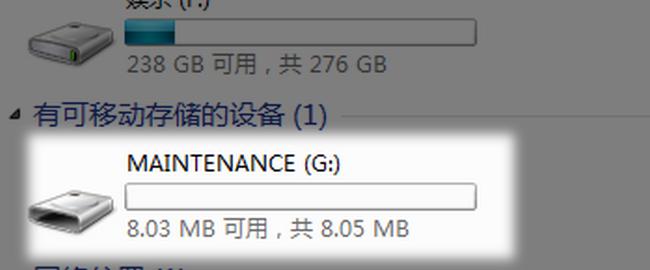

# MICROBIT盘符变为MAINTENANCE的原因及恢复方法

正常情况下，Micorbit与电脑连接后是出现MICROBIT的盘符，表明可正常烧写程序
（请注意，虽然烧写的方式是将.hex文件拷贝进盘符，但所拷贝的文件并不会被看到，也就是说MICROBIT盘符内始终应该只有DETAILS.TXT和MICROBIT.HTM两个文件）

**一旦盘符变为了MAINTENANCE，意味着你的bit进入了维护模式，有以下两种原因**

- 在插上USB的同时按下了复位按键自主进入到了维护模式（重新拔插后恢复）
- 在使用bit的拔插过程中固件丢失（无法自动回到正常状态）

在固件丢失的这种情况下，我们只需要重新烧入固件即可恢复
都给你提供好了，是比较新的固件，进到论坛下载即可：    
[固件连接](http://kittenbot.cn/bbs/forum.php?mod=viewthread&tid=442&page=1&extra=#pid2029)

**烧入方法**

之后看到进度条走完后就能恢复令你感到安心的MICROBIT盘了~

