# Microbit控制王校长吃热狗小游戏  
  
前几天朋友圈几乎被iG牛逼刷屏了，还有王思聪吃热狗、。作为一个不玩游戏（xiangwandanshimeishijian）的圈外人来说实在是一脸懵B。

    

大概给各位圈外人士科普下，就是韩国举办全球性的游戏竞赛，中国的一支不被外界看好的iG队伍（iG是一支东拉西凑拼起来的队伍）取得了冠军，也是这个游戏竞赛举办以来（已经举行了第八届），中国队伍首次获得最高荣誉！恰好这支队伍的老板就是王思聪，恰好王思聪在比赛现场吃热狗，所以也顺便上热搜的。在圈子中，这个游戏首次夺冠不亚于中国足球夺冠的那种轰动性~这里CC喵也祝贺中国电竞圈子越来越好~（wanshenmeyouxiganjinxuexiqu）

    

## 做这个小游戏的由来

作为专注图形化编程教育的软硬件小喵科技来说，市面上Scrach的教程也够多了。我们也希望和小学神们可以打成一片，所以特意挑了这次和游戏相关的热门素材。希望他们不只是平时自己玩游戏，还能自己学编程做游戏。
这里从零开始，把所有步骤过一遍，希望对大家做Microbit与Scratch交互的程序有帮助。

过程比较详细，配合Kittenblock一步步操作风味更佳~

## 游戏思路

做这个小游戏前，我们先做个思维导图，有助于我们把游戏脉络理清楚。

    

## 收集素材

嗯这个很简单，在浏览器搜索栏中输入关键字“王思聪吃热狗”“iG奖杯”等关键词

选择素材的标准，图标比较清晰，简单，背景最好简单点，突出你想要的物体

我选择了这两张，奖杯与王校长吃热狗图漫画

    

## 打开Kittenblock

如果你还没下载，可以到喵家官网进行下载安装

打开后，界面是这样的

    

## 增加三个角色

首先删除小猫

导入我们下载的角色，需要导入三次

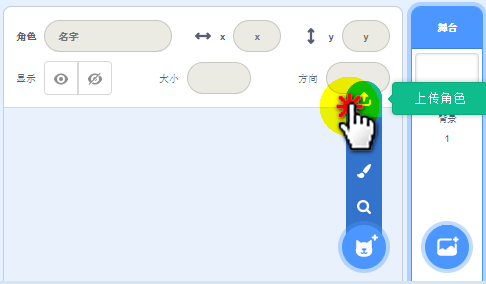

导入完成

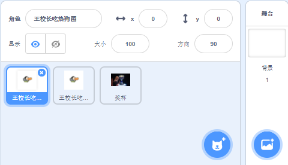

## 橡皮擦加工角色

擦除我们不要的东西

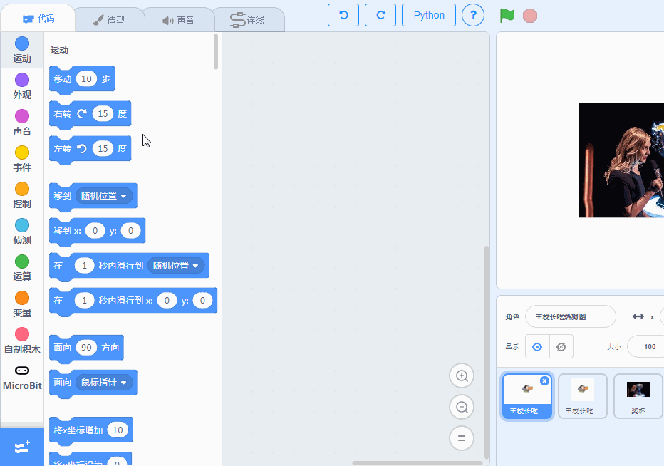

最终角色完成图

## 对王校长进行按键控制编程

首先对热狗和奖杯隐藏起来，如果操作

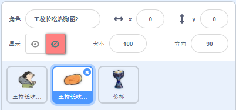

选择王校长角色，调整他面向的角度，因为热狗是从上往下掉，所以让王校长的口朝天就对了~

拖拽积木，编写按键左右，控制角色坐标变动，坐标变动后，即角色的移动

## 对热狗进行编程

如图操作，首先名称重命名，并显示出来，调整大小为150，方向为0

把热狗移动到舞台的左上角

把热狗移动到舞台的右上角

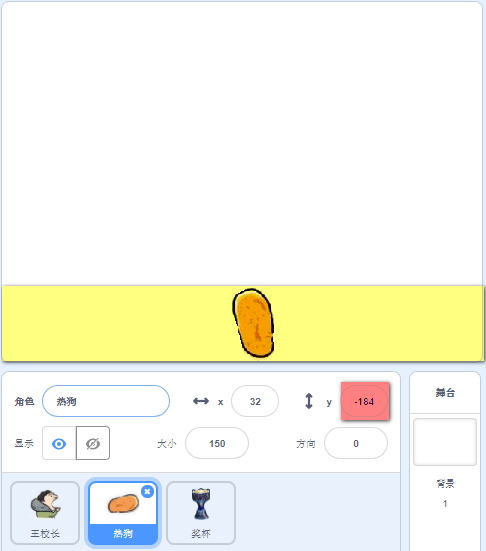

把热狗移动到舞台的底部

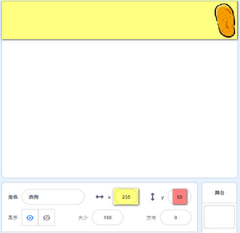

这样做的目的，我们大概可以测试出：

热狗在舞台最顶端时，y轴坐标大概是99，在舞台最底的时候是-190

在舞台最左端大概是-190，在舞台最右端大概是220

这样的程序可以让热狗随机在舞台最顶端的任意一个位置出现~

并且在循环过程中，对y值进行减少，那么热狗就会往下落了。

当落到最底时，又重新瞬移到最顶端。如此重复，就是一个热狗雨？

## 对热狗得分进行检测

先建立一个得分的变量

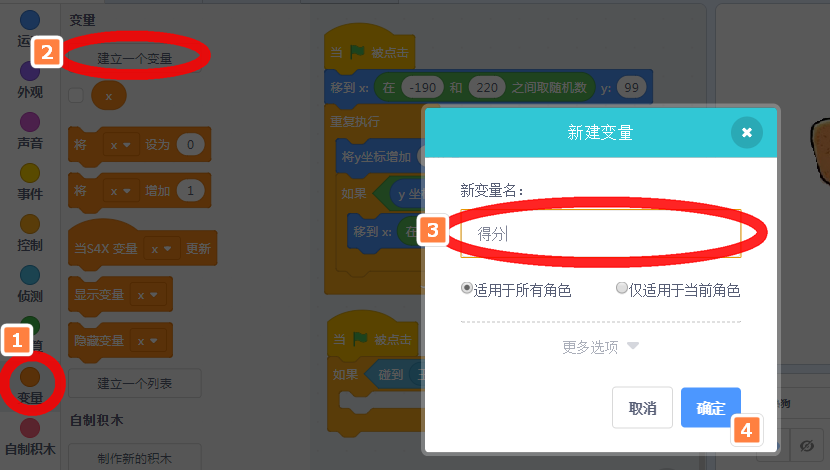

对热狗移动的同时进行检测，当碰到王校长，得分+1

好像热狗碰到王校长消失后，就不再重新往下落了。我们再修改下程序

## 广播事件

新建广播事件——热狗开始

重新修改下程序，让热狗碰到王校长后，消失后，再继续循环往下落

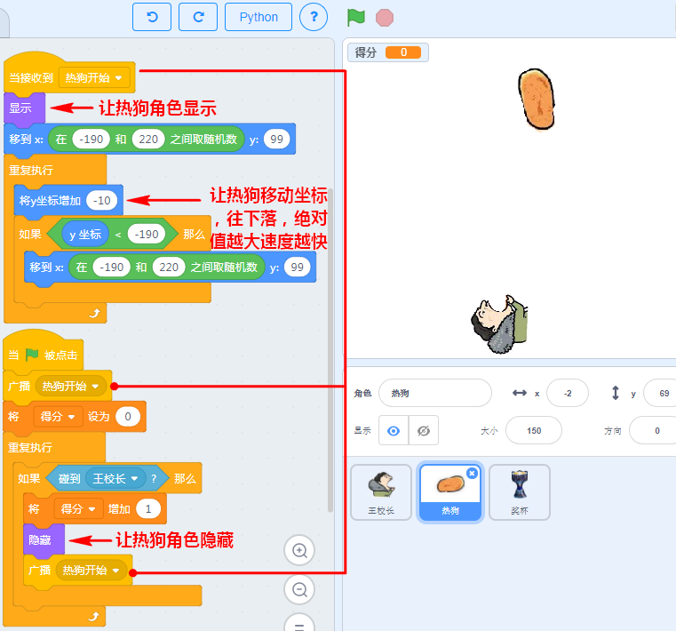

## 奖杯触碰停止事件

我们可以利用复制热狗的程序，然后对其进行改造下，看我的复制操作

改造下程序，修改下数值，还有其他位置的积木块

最终点击绿旗子运行后，按键左右就可以控制王校长进行左右移动了，热狗和奖杯也不断从上往下落

## 改造程序，让Microbi控制王校长

Micorbit插上数据线后，首先软件设置，如下图所示，恢复Microbit固件

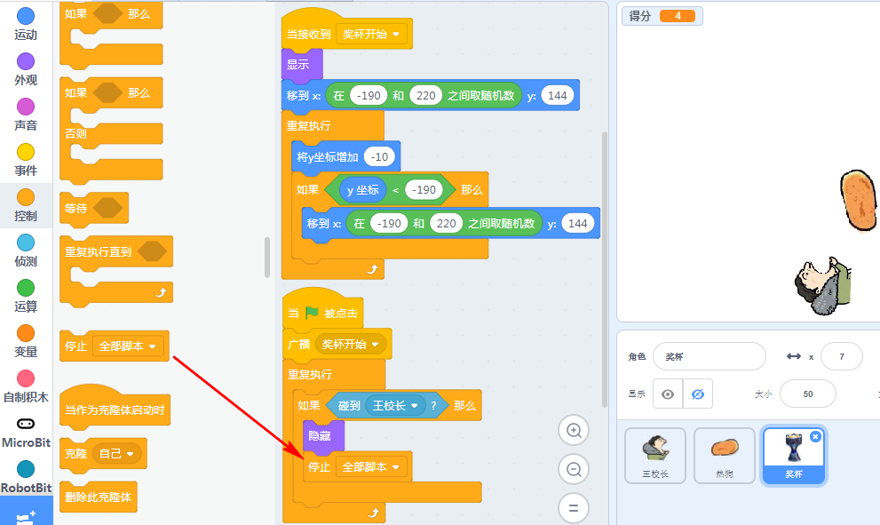

恢复固件后，软件设置断开连接（数据线），因为我们打算用蓝牙无线控制

重新选择连接，注意刷新下吗，这时候可以看到被搜索出来的Microbit，点击连接。

## 选择王校长这个角色

增加积木块编程如下，通过陀螺仪进行控制王校长的左右移动

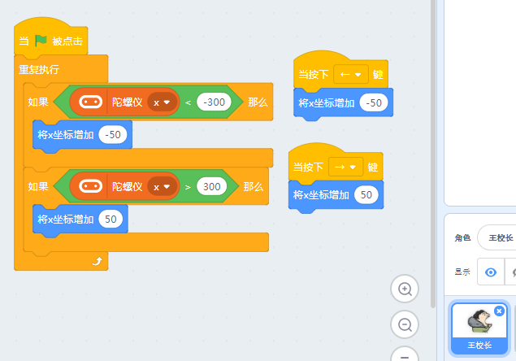

最终效果，如下图所示，其实程序很简单，只是为了照顾新手，所以写的比较详细，需要耐心慢慢看

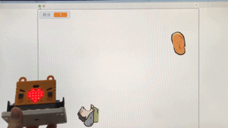

源程序已经上传到喵家社区，[下载或者试玩请戳我](http://www.kittenbot.cn/#/sb3/29c07b4aef04bd3de6693870e4b62f33)
