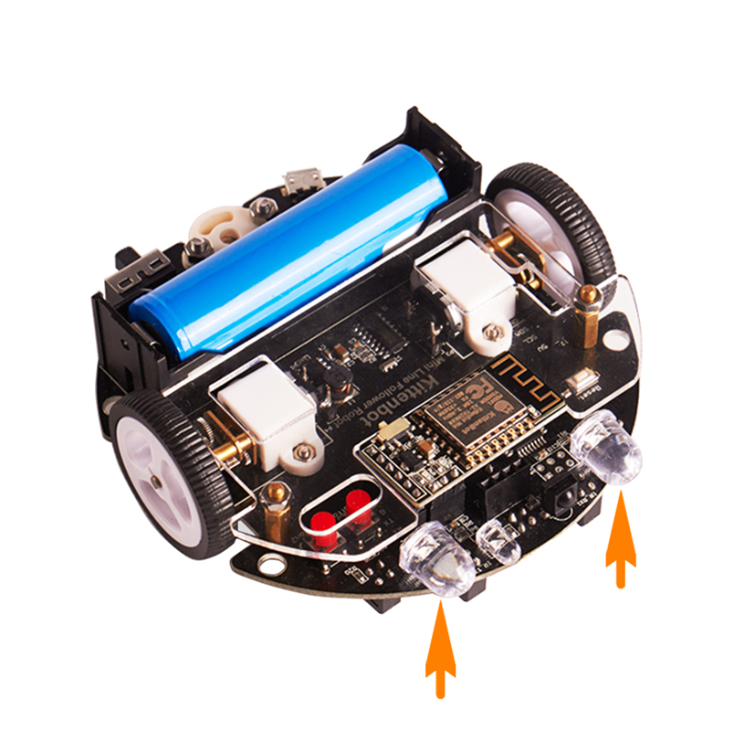

# 点亮车头LED灯

## 车头灯硬件

## 车头灯积木说明

这个积木块就是控制车头LED的开与关

## 程序

把积木块拖到积木块编程区中，并在下拉列表中可以更改左灯和右灯的状态。
可以复制，也可以重复拖出来。

## 在线模式测试

分别点那4个积木块，（保证小车已经恢复出厂固件）

可以看到车头LED灯的亮灭情况是和积木块相对应的。

所谓的在线模式，软件是必须打开，只要关闭了这个程序就是失效了。在线模式一般是用来调试的，可以快速看到编程的结果。即点就可以即运行。

另外一个是离线模式，当程序调试好了，这个时候就可以下载在电路板的芯片上，即使关闭电脑了，程序还是可以运行的。

大概测试了这个积木块的功能后，我们可以写一个车头灯一闪一闪的程序。

## 编写车头灯一闪一闪程序

根据上图操作，把积木块拖出来，组成一个完整的程序。

## 转译并下载程序

**下载中**

**下载完成**

## 车头灯一闪一闪现象

如果下载不成功，请检查：

- 板子类型是否选对？
- 是否连上COM口？
- USB线是否连接好？
- 程序是否正确？

如果以上都不能解决问题，请联系小喵科技，热诚为你服务

