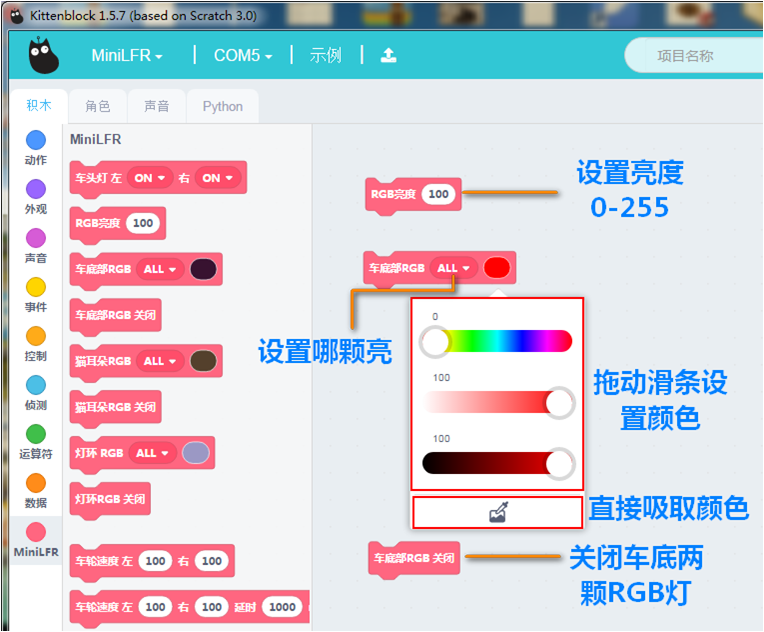
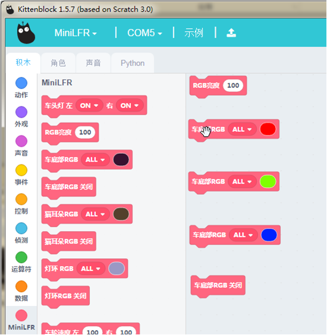
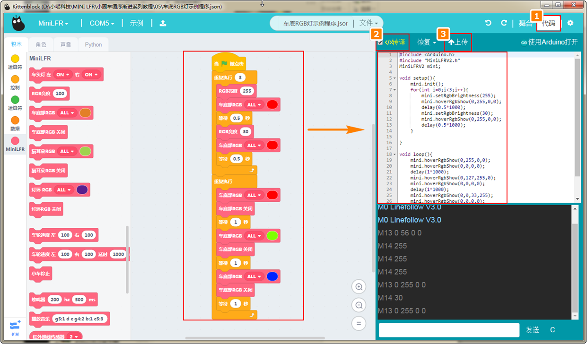
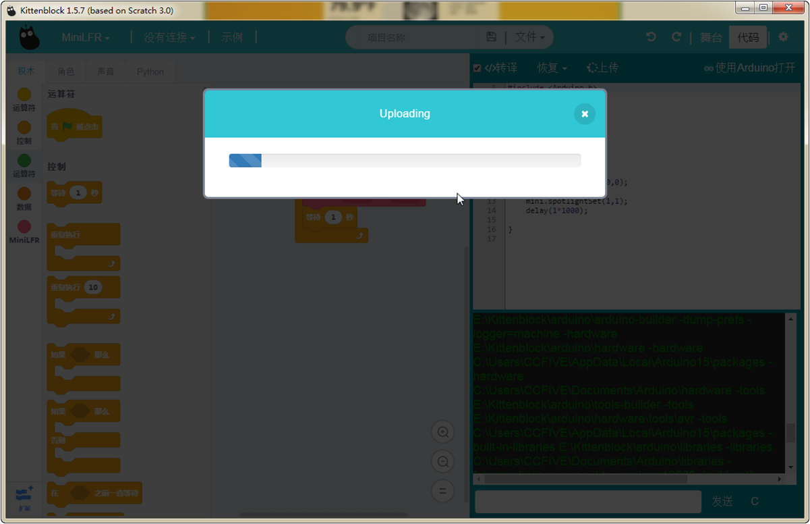

# 点亮车底RGB彩灯

## 车底RGB灯硬件示意图

## 车底RGB积木

这个积木块就是控制车底RGB灯

- 亮度
- 颜色
- 和亮灭

## 车底RGB积木详解

把积木块拖到积木块编程区中，并在下拉列表中可以更改RGB的颜色，或者设置亮度，或者关闭RGB灯

## 在线模式测试

分别点积木块（保证小车已经恢复出厂固件!恢复出厂固件!）

可以看到车底RGB的颜色、亮度是和积木块相对应的。现在这种模式就是在线模式，只要点积木块，就立马看到积木块的现象了。

**在线模式：**

	软件是必须打开，只要关闭了这个程序就是失效了。在线模式一般是用来调试的，可以快速看到编程的结果。即点就可以即运行.

**离线模式：**

	当程序调试好了，这个时候就可以下载在电路板的芯片上，即使关闭电脑了，程序还是可以运行的。

大概测试了这个积木块的功能后，我们可以写控制车底RBG灯的程序

## 编写车底灯交变颜色转译并下载程序

根据上图操作，把积木块拖出来，组成一个完整的程序。

绿色旗子积木块是必须的！

**下载中**

**下载完成**

## 车底RGB亮的现象

如果下载不成功，请检查：

- 板子类型是否选对？
- 是否连上COM口？
- USB线是否连接好？
- 程序是否正确？

如果以上都不能解决问题，请联系小喵科技，热诚为你服务

