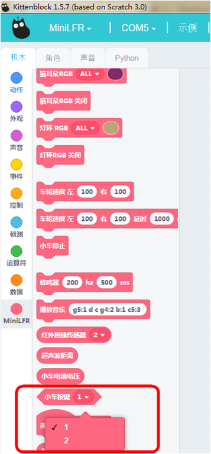
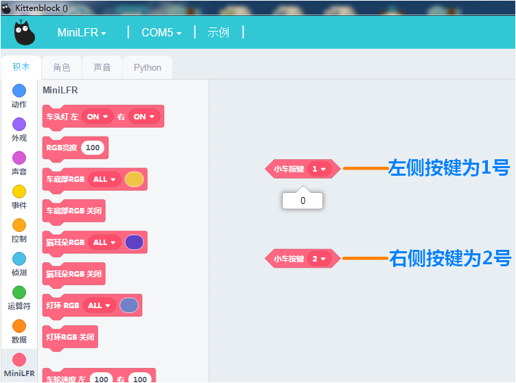
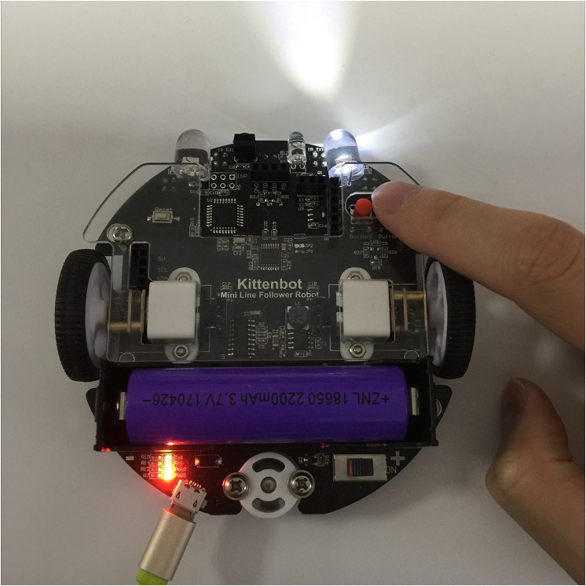

# 学习按键1和按键2

## 按键硬件示意图

## 按键积木

这个积木块就是控制按键

按键触发事件

## 按键积木详解

把积木块拖到积木块编程区中，可以设置按键触发后的事件

下拉菜单可选按键1或者按键2

## 在线模式测试

分别点积木块（保证小车已经恢复出厂固件!恢复出厂固件!）

可以看到当按键按下时候返回数值1，不按下的时候返回数值0。现在这种模式就是在线模式。1和0只表示按键状态，不表示电平状态。**按键按下就是1，没有按下就是0**

**在线模式：**

    软件是必须打开，只要关闭了这个程序就是失效了。在线模式一般是用来调试的，可以快速看到编程的结果。即点就可以即运行。

**离线模式：**

    当程序调试好了，这个时候就可以下载在电路板的芯片上，即使关闭电脑了，程序还是可以运行的。

大概测试了这个积木块的功能后，我们可以写控制按键控制的程序了

## 编写按键进行触发事件转译并下载程序

根据上图操作，把积木块拖出来，组成一个完整的程序。

绿色旗子积木块是必须的！

**下载中**

**下载完成**

## 按键触发的现象

如果下载不成功，请检查：

- 板子类型是否选对？
- 是否连上COM口？
- USB线是否连接好？
- 程序是否正确？

如果以上都不能解决问题，请联系小喵科技，热诚为你服务

