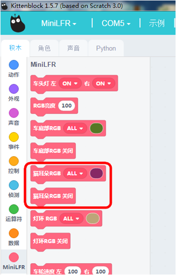
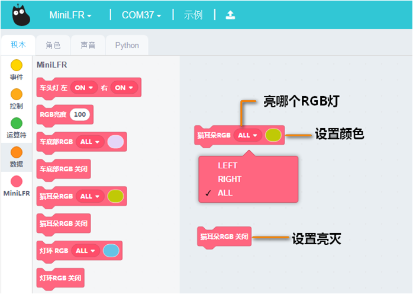

# 玩转猫头超声波RGB

## 猫头超声波RGB模块硬件示意图

## 猫头超声波RGB模块积木

这个积木块就是控制猫头超声波RGB颜色和亮灭

## 猫头超声波RGB模块积木详解

把积木块拖到积木块编程区中，可以控制猫头超声波RGB的状态

可单独控制任意个RGB灯的状态

颜色由RGB混合而成

包括RGB灯的亮度

## 在线模式测试

分别点积木块（保证小车已经恢复出厂固件!恢复出厂固件!）

可以看到当猫头超声波RGB显示的状态

**在线模式：**

    软件是必须打开，只要关闭了这个程序就是失效了。在线模式一般是用来调试的，可以快速看到编程的结果。即点就可以即运行。

**离线模式：**

    当程序调试好了，这个时候就可以下载在电路板的芯片上，即使关闭电脑了，程序还是可以运行的。

大概测试了这个积木块的功能后，我们可以写控制猫头超声波感应的程序了

## 编写猫头超声波RGB模块颜色变换转译并下载程序

根据上图操作，把积木块拖出来，组成一个完整的程序。

(或者直接打开我提供的程序)

绿色旗子积木块是必须的！

**下载中**

**下载完成**

## 猫头RGB就亮起来了

如果下载不成功，请检查：

- 板子类型是否选对？
- 是否连上COM口？
- USB线是否连接好？
- 程序是否正确？

如果以上都不能解决问题，请联系小喵科技，热诚为你服务
