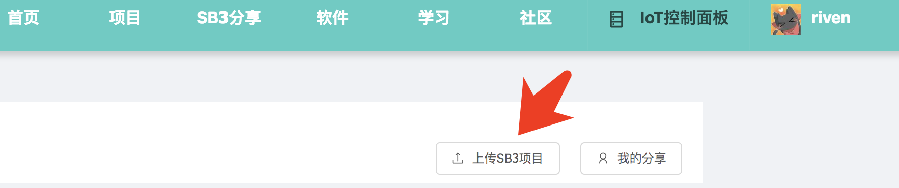
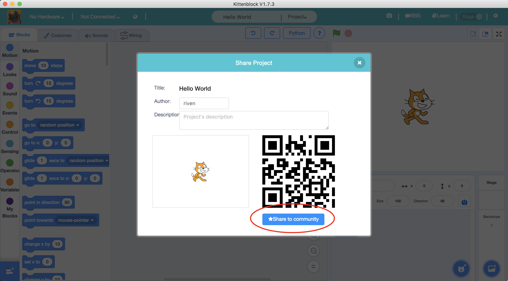
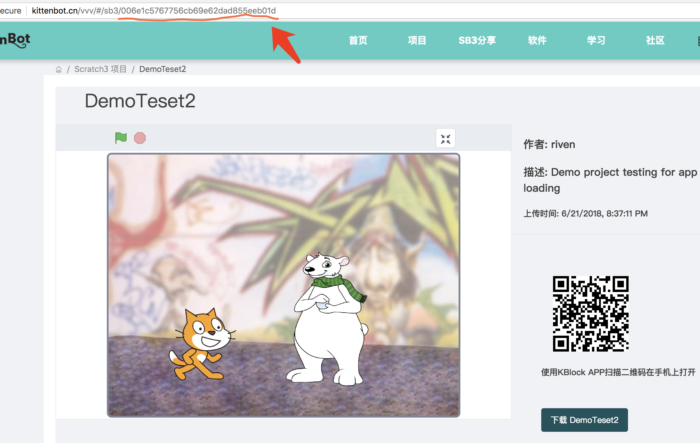
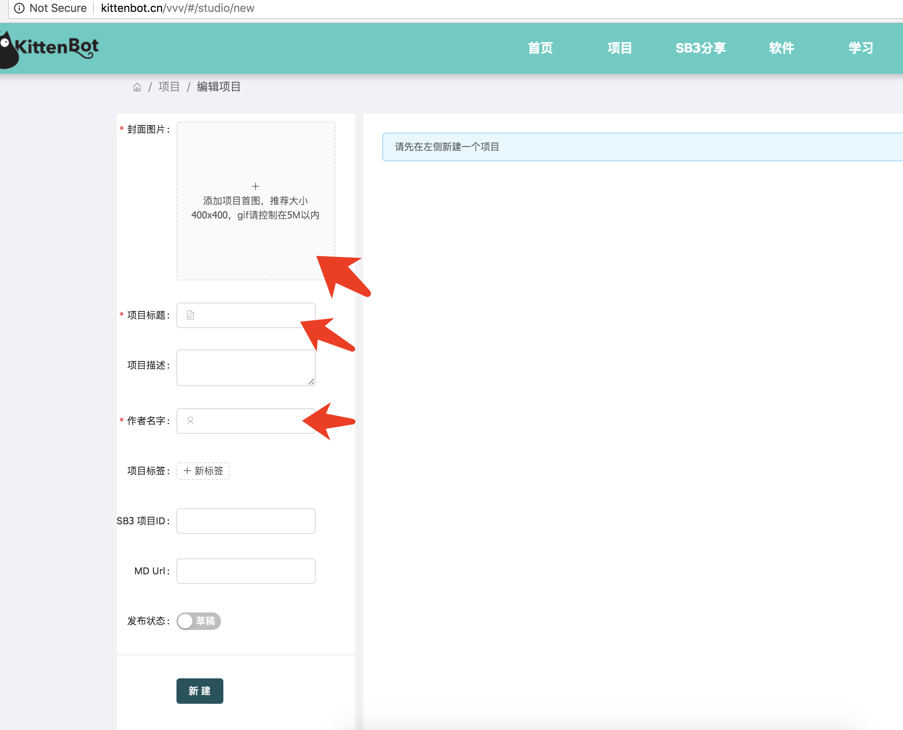
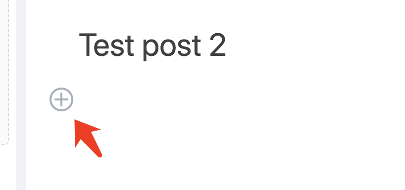
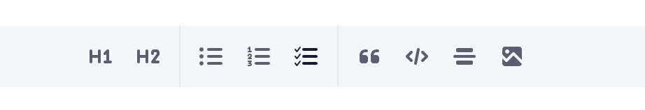
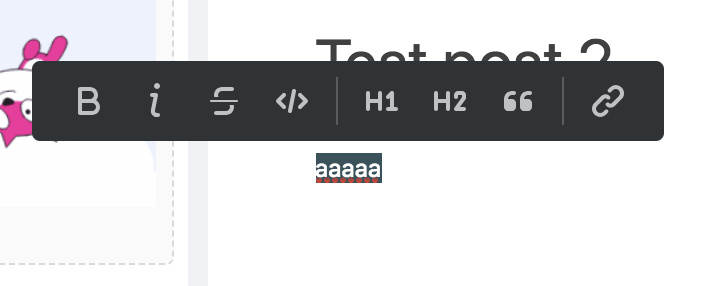
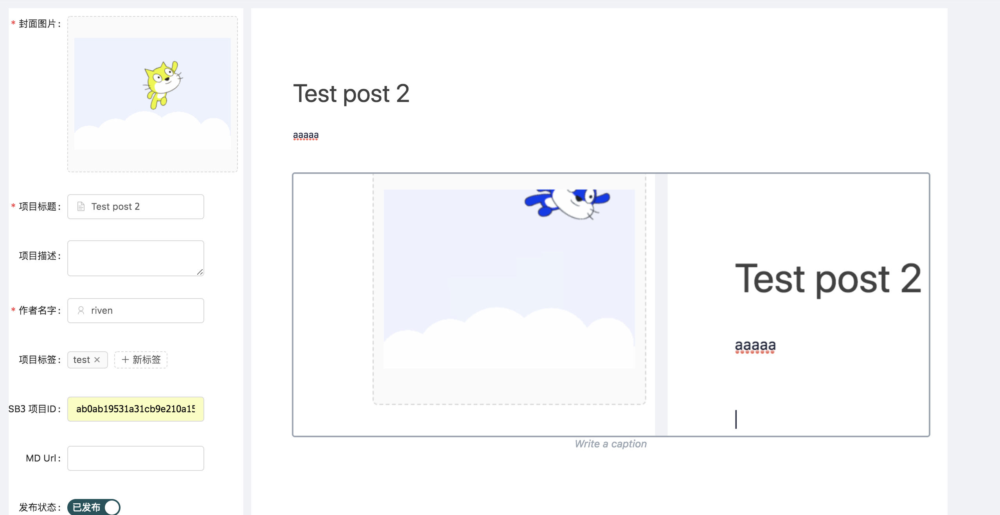
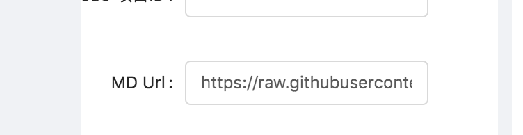
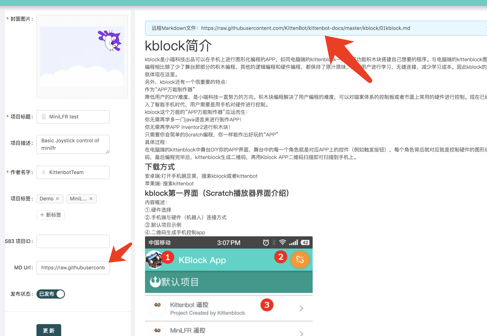

# 在大服务器编写项目文档

Kittenbot大服务器在今年4月底启动，并且断断续续地使用零碎时间进行开发。目前已经初具雏形了，这篇文档主要讲述如何在大服务器上传sb3项目和编写文档。后续喵家的App和其他文档都会使用类似的方式进行托管。

## 上传SB3项目到Kittenbot网站
大家可以在[http://kittenbot.cn/vvv/#/sb3]()看到网站上所有分享的SB3项目。

最简单的方法就是登陆后直接在网站上点击`上传SB3项目`就行了，SB3文件解析和保存需要点时间，请耐心等待。

另外一种方法就是在Kittenblock内点击分享到社区，由于旧版kittenblock内置跳转链接问题，可能上传完成后跳转到一个错误的网址。大家可以自行前往[http://kittenbot.cn/vvv/#/sb3]()就可以看到您刚刚分享的项目了。

## SB3项目ID

每个网站上的项目都有一个独立ID，这个ID由您上传的项目的MD5 Hash计算得出，只要项目有一点点不一样这个值都会不一样。

项目展示页面中已经继承了Scratch3引擎，大家可以直接播放项目。

## 上传Scratch2项目到Kittenbot网站
目前大服务器还不能解析Scratch2（SB2）文件，在网站直接上传可能会导致上传的项目内容解析失败。大家可以使用Kittenblock打开scratch2的项目文件，并分享到社区就行了。Kittenblock会自动将scratch2项目转换成scratch3兼容的格式。如果您想分享mit社区的项目，也是用类似方法将

## 编写Markdown文档
除了SB3项目分析，我们网站还可以编写各种项目文档。小喵家后续的所有的教程文档都会有一份markdown原型，对markdown
语法还不熟悉的同学可以前往[这里](https://www.jianshu.com/p/1b8d510eb931)学习，基本只要十分钟就可以入门了。

*windows下推荐markdownpad，mac下推荐macdown两款编辑器*

点击新建项目后需要先填写左边几个基本参数才能生成文档链接并进行编辑，红色星号为必填项。

如果您的文档有scratch3展示需求，请在**SB3项目ID**处填写前面分享的scratch3项目的id，具体看前面第二节介绍。

只有填写了项目文档ID在接下来更新的APP中才能正确下载项目并播放。

填写完基本信息新建项目后会自动跳转到项目编辑页面，所有的项目文档在服务器端均以markdown
格式进行保存。

在空行点击鼠标可以弹出快速添加元素按钮，

大家可以快速添加各种markdown元素

选中文字也会弹出样式自定义选择框

另外我们的编辑器已经内置了图片快速黏贴功能，大家可以用QQ等截图工具进行截图，之后在编辑器按Ctrl+V就可以将图片粘贴到文档中了，图片会自动上传到我们服务器的文件管理中心并在markdown中自动生成外链。

## 远程链接静态Markdown文档

如果您在其他地方已经编写好了文档，可以直接在文档中进行外链静态markdown文件。目前已经测试支持github的markdown文件可以直接外链，其他网站或服务器需要支持外链文档。

例如我们在MD Url下填入：
[https://raw.githubusercontent.com/KittenBot/kittenbot-docs/master/kblock/01kblock.md]()

在文档中会直接显示外链的markdown，只要有外链的MD Url就不再显示本地的markdown内容，所有的编辑都请在远端完成。

github请使用**https://raw.githubusercontent.com**代替文件的原链接。

## PS

如果您是小喵家员工或者合作伙伴，请注意将所有教程文档上传到**GITHUB**仓库，也欢迎大家在仓库发布ISSUE或者Pull requrest帮助我们改进。

[https://github.com/KittenBot/kittenbot-docs]()

文档内都请以外链MD url方式进行连接。由于github时不时会被大防火墙ban了，我们的github仓库会自动同步到国内的文件管理中心。[http://bucket.kittenbot.cn/kittenbot-docs]()

只需要将`https://raw.githubusercontent.com/KittenBot/`替换为`http://bucket.kittenbot.cn/`就行了。

