# 能量魔块

Powerbrick

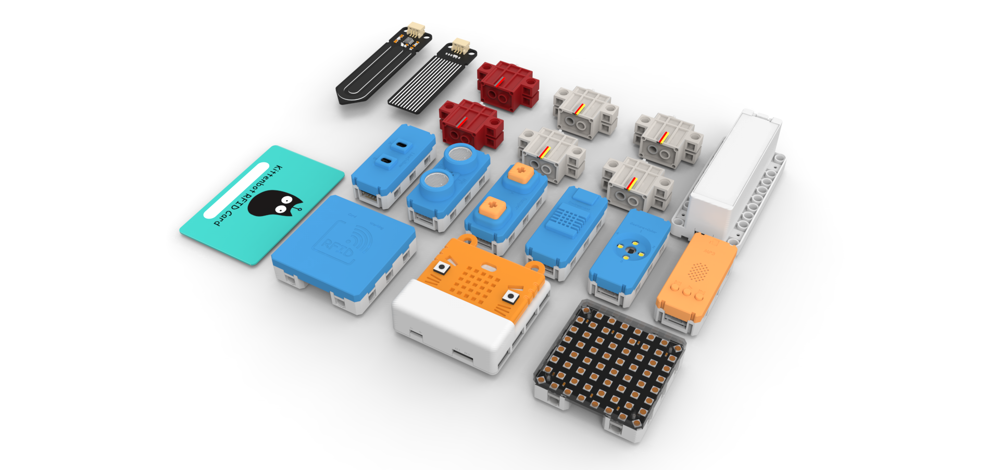

由小喵科技团队设计的一款使Microbit通向乐高的的新电子体系模块。因为模块非常有特色，所以我们用了“魔块”这个昵称。

各个模块的简介、特点、使用说明，我们后面会逐一详细讲解。

## 背景介绍

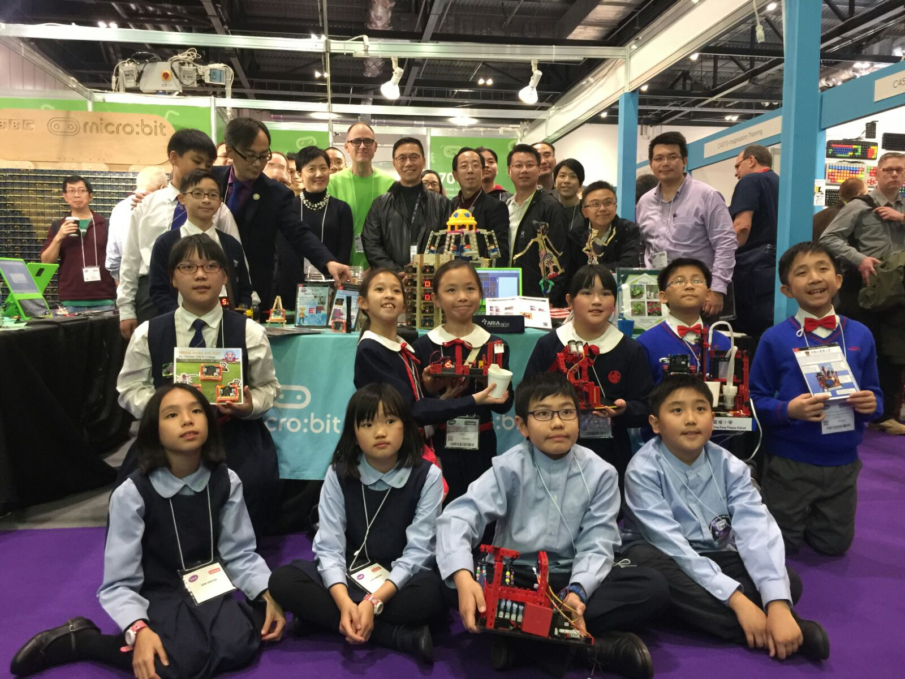

随着各国的科技力量的发展，国家层面上越来越重视青少年编程教育，全球不断涌现优秀的适合青少年使用的编程工具、编程语言、编程硬件。其中Microbit是由英国广播电视公司（BBC）为青少年编程教育设计，并联合微软，三星，ARM，英国兰卡斯特大学等共同完成开发的一款电子电路板。上面集成了多种可编程资源，点阵屏、按键、蓝牙、陀螺仪、指南针、可编程IO口等。

编程平台Makecode采用图形化编程或者原生态的JavaScript，MicroPython等语言进行编程。由于其软件使用简单方便，非常适合中小学生入门编程教育。对于老师与培训机构，无复杂连线，硬件简单便于收纳。软件门槛要求低，上手快，教学资源多

## 能量魔块设计目的

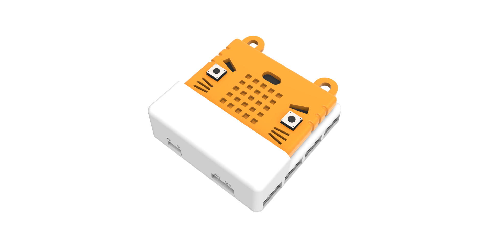

综上所述，Microbit比arduino更适合中小学生编程教育。Microbit正在全球的青少年编程教育中流行，英国本土青少年每人手上免费的microbit，加拿大被送去10万片Microbit…等等，Microbit已经有燎原之势了。

Microbit仅仅是一片裸露的板子，如果只是仅仅亮个LED灯是无法长久持续的吸引青少年进行持续学习编程。所以小喵科技为Microbit延伸了多种周边配套，有萌趣可爱的硅胶保护套，全IO口引出的IObit，有强大运动控制及多种编程资源的Robotbit，超声波、MP3灯条等等配套模块。

此过程中，我们发现杜邦线单独的连接对大部分中小学生还是一个高门槛的存在，对课堂上课并不友好，我们希望学生把更多的精力放在编程逻辑思考中，而不是杜邦线的连接。我们希望他们能快速利用家里常有的物件进行拼合快速实现自己的想法，把自己的程序逻辑思想以实物形式快速展现出来，熟练运用与生活相关的电子模块，以此来解决生活中的问题。结合孩子天性爱玩，在玩的过程中激发孩子的逻辑思维与动手能力，减少他们对虚拟电子游戏的依赖，让编程更有趣。

## 能量魔块解决问题

1. 解决一般编程教育公司束缚用户必须学习独家编程方式或软件，知识陈旧而落后，每出一款硬件又要学习一个新的软件。
1. 解决Microbit拓展延伸拓展的问题，停留在裸板上的编程的枯燥乏味
1. 解决杜邦线连线复杂，门槛高，解决杜邦线对教学实际情况的不友好。
1. 解决电路板裸露，课堂使用容易短路，容易损坏，锐利的插针可能割伤手等安全隐患问题。
1. 解决机械上的搭建难，普通用户需要花费大量金钱和时间去解决搭建创造的难题。

## 能量魔块特色

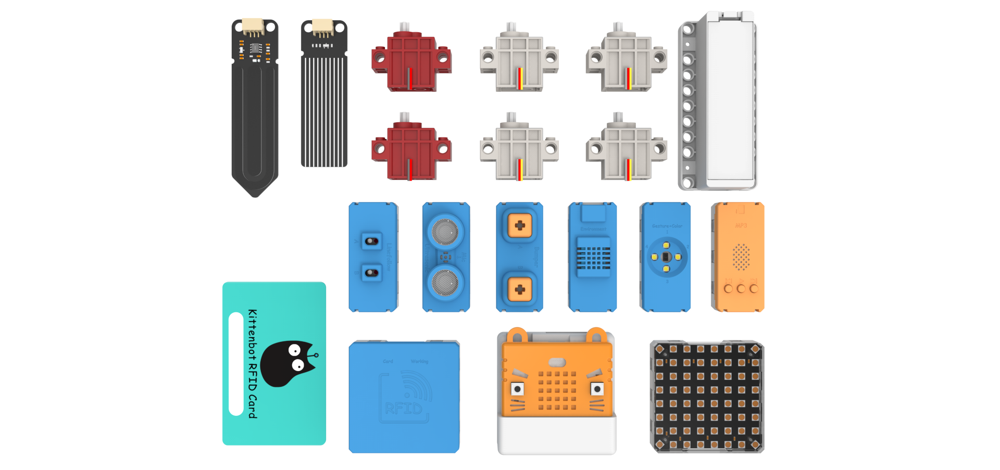

1. Armourbit扩展盒以Microbit作为主控，迎合当下热门的教育需求。以Madecode作为编程平台，让用户学习最通用最有效的编程方式，而不停留在某家硬件厂商特定的编程语言或软件。Armourbit扩展盒上自带舵机驱动、电机驱动、蜂鸣器
1. 充分解决Microbit与各种模块之间对接需求，能量魔块大部分模块将经常一起使用的模块集合成一个模块，因此大部分模块一般具有两种或两种以上的传感功能特性，让用户用最少的连接，获取更多的传感器功能。让Microbit的创造力呈几何倍数增长。
1. 接线上抛弃了杜邦线插接，采用柔软的排线，采用防反接带卡扣接头，保证创作的电气连接的稳定性，也保证了课堂教师教学的压力。
1. 电路外壳上不惜下重成本，采用每个模块单独完完全全不一样的上壳，这种全包壳的方式对电路板进行全方位的保护，非市面上的包底壳不包上壳的低成本方案，或者为了做成兼容多种电路板降低成本，上壳做成电路板开放式的伪包壳方案。我们上下壳以最彻底的方式对电路板进行保护。每个模块的外壳有显著的特征，便于低龄用户课堂上课的简易性。
1. 外壳既作为电路板的保护壳，也承载一部分机械结构件的作用。模块长宽尺寸上符合乐高标准，在底面与侧面有连接乐高摩擦销的通孔，通孔的位置也恰好符合乐高标准。便于与乐高机械件进行快速简单，把Microbit这个简单易用的编程硬件与乐高优秀的机械解决方案相结合，让创造门槛更低，迸发出源源不断的创意。

## 机械安装方式

### 乐高插销安装方式

3x7魔块（所谓的3x7是指以乐高孔距8MM为一个单位，3x7即宽度为24mm，长度为56mm）

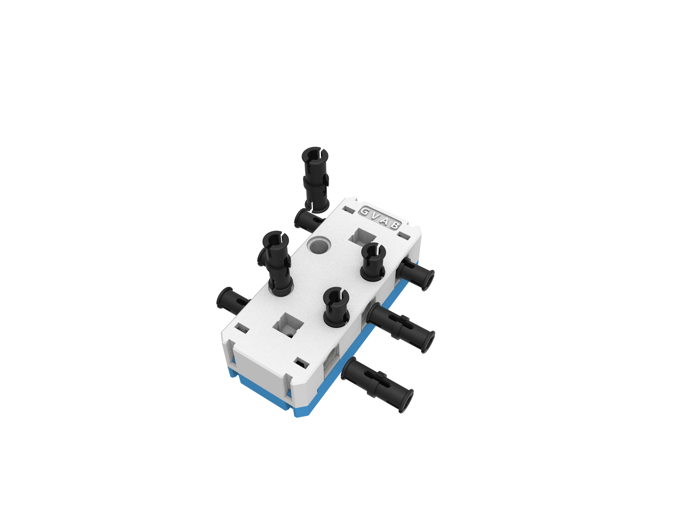

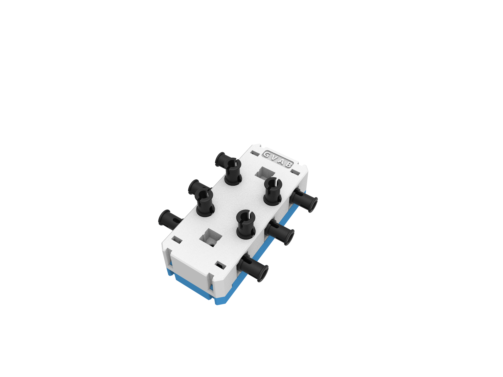

7x7魔块

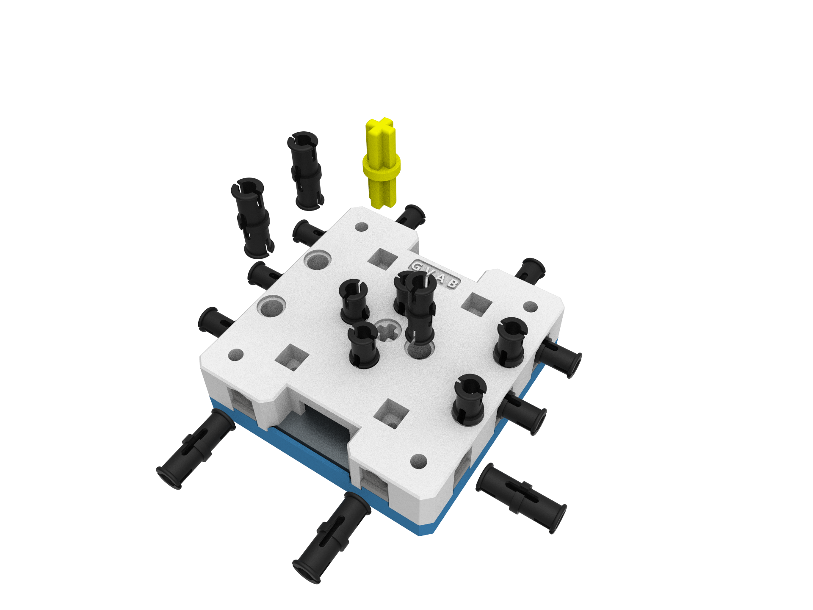

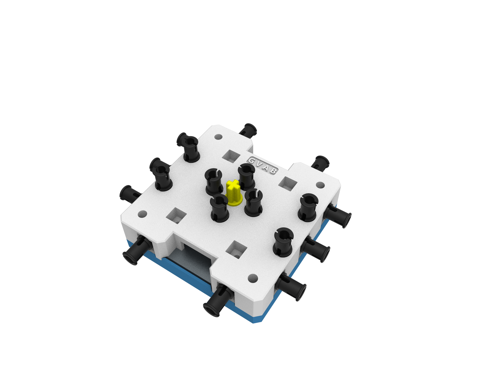

电池盒魔块

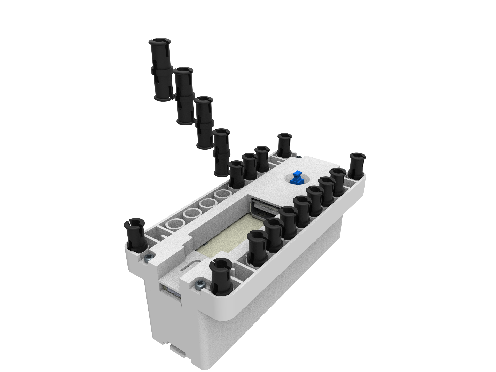

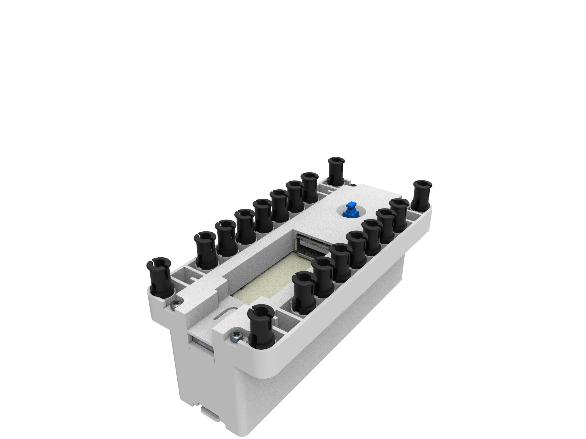

Armourbit魔块

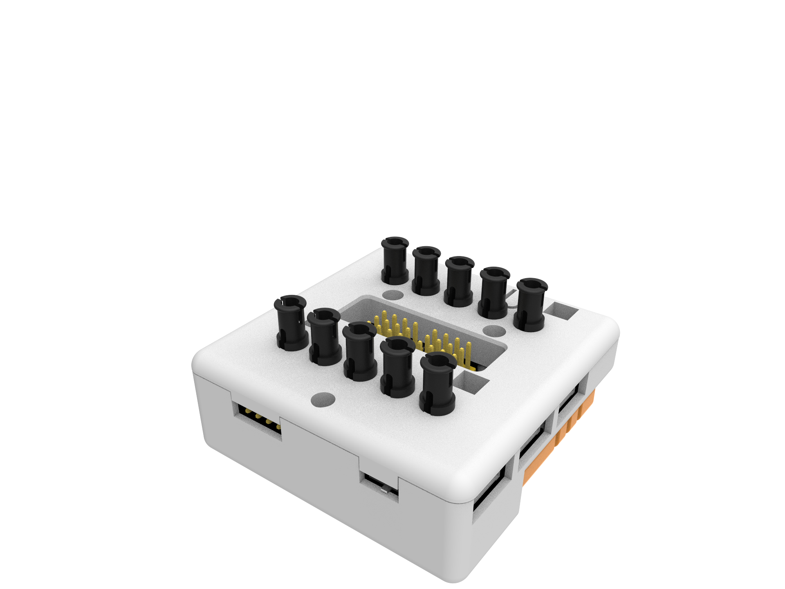

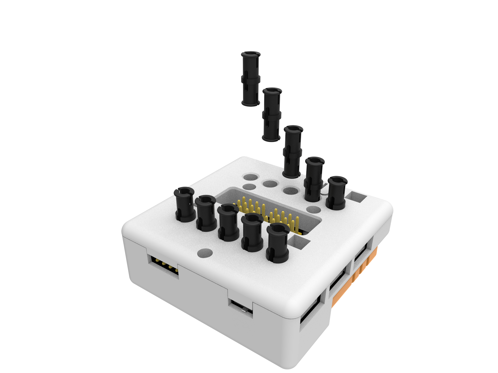

### 大小尺寸孔位位置尺寸

完美兼容乐高，符合乐高尺寸位置标准，轻松利用其家里的乐高机械件结构件进行搭建创造

### 磁铁吸附安装方式

每个模块后带有磁铁安装孔，可以吸附在白板或者金属表面上。课堂展示效果棒哒哒~

磁性吸附并不影响电线连接

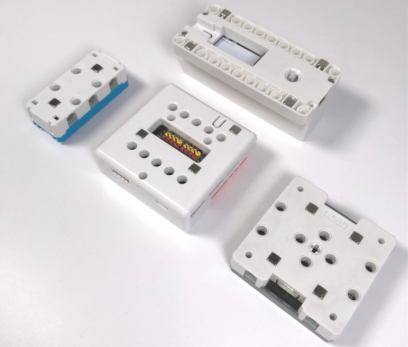

## 电子连接方式

采用4PIN防反接排线，不用再担心插错，不用再担心插接不良。让课堂接线更加轻松，培训老师上课压力更小。

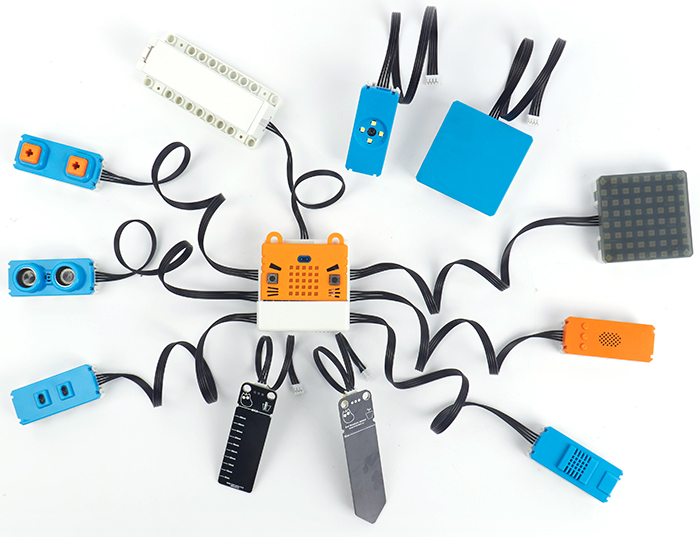

### 4PIN柔软防反接排线

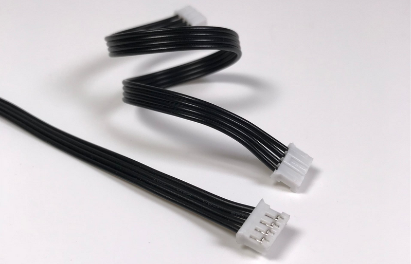

### 插接方便

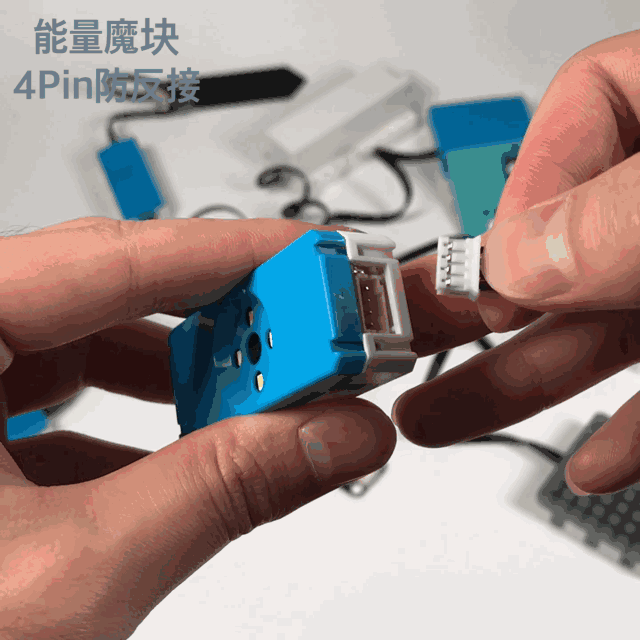

## 软件编程

### makecode

还是makecode原生的"味道"~，加载Powerbrick功能积木块好用到令你竖起大拇指！

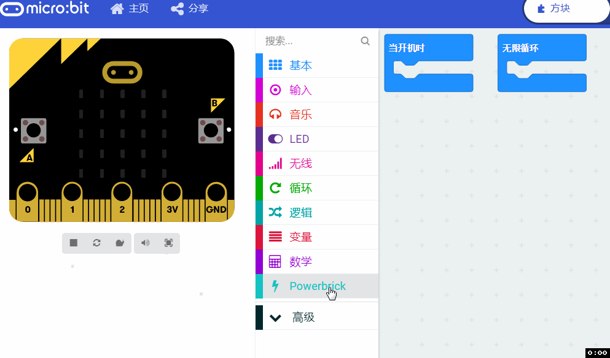

### Kittenblock

编程环境怎么少的了喵家的的Kittenblock，能量模块Powerbrick现已上线，请在插件栏查找。

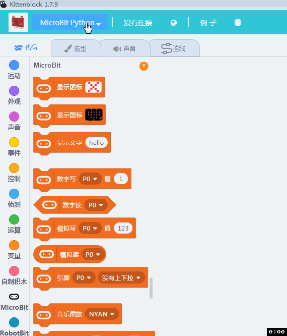

## F&Q 常见问题与解答

**1.能量魔块什么时候可以买得到？**

答：产品正式开卖大概在双12开卖，小喵们已经马不停蹄的在准备量产中~敬请留意小喵科技官方群消息

**2.能量魔块套件里面含有什么？**

答：根据不同套件，套件里对应含有能量魔块+机械塑料件+电气连接线+说明书+模块折页说明书+精美包装盒等，当然还包括喵家精心准备的Powerbrick插件与喵家贴心的服务。

**3.能量魔块套件价位大概多少？**

答：十合一机器人套件包含604块积木，零售价1499元。
不带积木版本零售价1299元。
培训机构如果需要批量采购欢迎联系Christina （email：c@kittenbot.cc）.

**4.能量魔块教程在哪里？**

答：你收到套件里面有模块的折页说明书和产品搭建说明书，或者你可以在我们Learn上学习对应模块的使用方法和更多的形态搭建。因为都是围绕Makecode做的插件，所以使用上没什么门槛。

**5.能量魔块有教材？**

答：“**能量魔块的教育版本**”会配搭16节的教材，需要购买教育版本请咨询大群主@C

**6.我是老师，我想为能量魔块写教材，跟小喵合作**

答：非常欢迎！详情请咨询Christina (E-mail:c@kittenbot.cc，欢迎各种方式的合作！

**7.能量魔块就只有这么多模块吗？**

答：不是的，这个只是小喵的第一步，为大家提供最基础的模块，下一步我们会结合老师们的需求出一些大家都需要的模块。

**8.能量魔块，我想特定买某个可以吗？**

答：后期能量模块都会单独上架销售，当然，单买肯定没有套件划算。但是如果你是学校或者机构大量采购某种模块，也可以咨询下我们淘宝客服会有优惠的。
