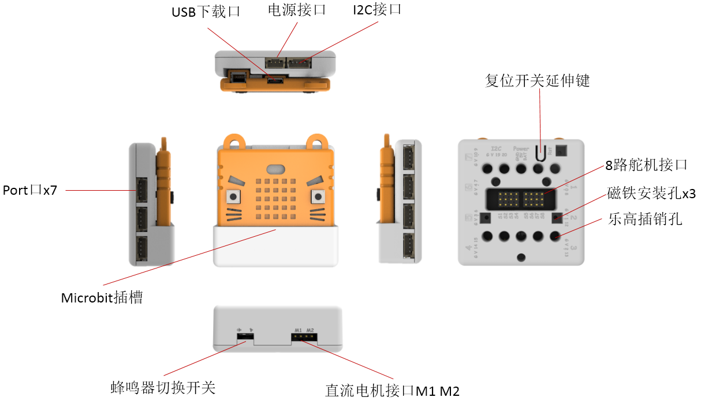
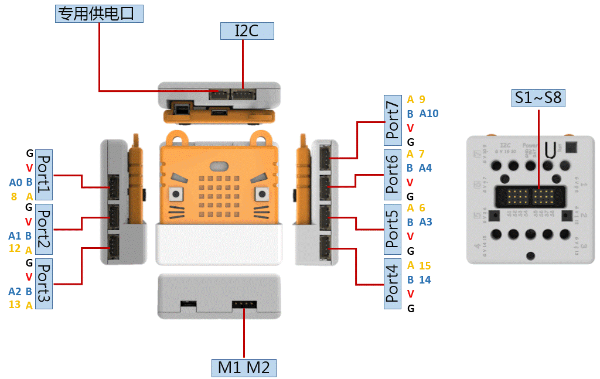

# Armourbit

Microbit的一款扩展配件，是能量魔块体系的主控盒，打通Microbit与各种能量魔块的连接，7组Port口，1组I2C接口，采用4PIN防反接端子口，自带蜂鸣器，两路电机驱动，八路舵机驱动。对电路板进行全包裹，全方位保护更安全，适合编程教育的使用场景。

Armour中文意思是指盔甲（Armour读法arm 么），喵家希望这个扩展盒能给予Microbit扩展板给予全方位的保护，更适合课堂的使用环境。

## 详细介绍

## 参数介绍

- 电压：3.3V（板载不带5V电压）
- 尺寸：61mm X 61mm X 23mm
- 接口：PH2.0 4PIN端子 ，引脚服从GVAB排布
- 直流电机接口：电压不超过5V，电流小于1A，适用于喵家黄色TT电机或者Geekservo电机
- 舵机接口：电压3.7~6V，单路电流小于100MA，总电流小于1A，适用9g蓝色小舵机或者Geekservo舵机

对应Makecode编程界面：

Makecode在线地址：https://makecode.microbit.org/

加载Powerbrick插件地址：https://github.com/KittenBot/pxt-powerbrick

## 引脚分布

- 新手用户无需记住Port口对应的引脚，只需记住port口使用即可。
- 使用**Port5-Port7**口需关闭LED点阵屏功能（如下图，关闭LED点阵操作）才能进行使用
- Port4口没有模拟读取功能（温湿度的土壤水位魔块不能使用）（因为Port5-Port7引脚与Microbit点阵屏复用了）

## 使用注意事项

- 舵机接口只能使用蓝色的9g小舵机或Geekservo舵机，禁止插接大电流舵机。
- 直流电机接口只适用于喵家TT电机或Geekservo电机，禁止插接大电流电机。
- 蜂鸣器与Microbit的P0复用，使用时需检查底部的拨动开关是否打开。（到手蜂鸣器切换开关默认开启蜂鸣器）
- 使用各个模块、电机、舵机，**必须接Powerbrick电池盒，否则因为电流不足，导致模块使用不正常。**

## Microbit安装到主控盒上演示

下方左侧的拨动开关是用来切换P0是否连接蜂鸣器

## 背部有复位开关演示

用于复位Microbit的程序（这样你就不用把下Microbit进行复位了）

## 编程介绍

### 点阵屏编程

与Microbit裸板操作一样

### 按键编程

与Microbit裸板操作一样

### 蜂鸣器编程

与Microbit裸板操作一样

### 直流电机编程

注意电机接口M1、M2，编程对应进行控制

### 舵机编程

注意舵机线序接法，注意舵机线序接口S1-S8，实物接线与程序编程需要对应。

