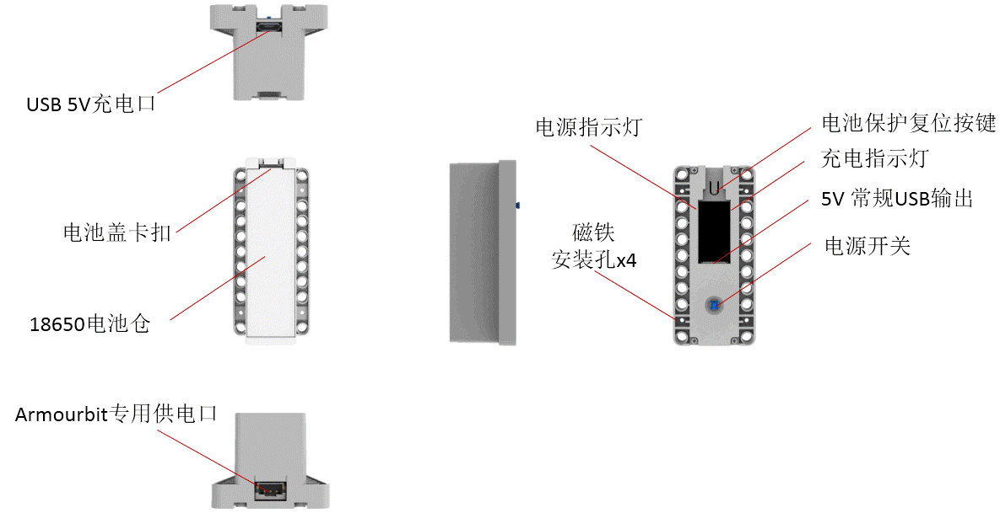
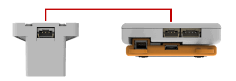

# 电池盒魔块

它是能量魔块套件的电源模块，用于Armourbit的供电，为Microbit与电机、舵机和各种能量魔块进行供电。支持5V充电，带短路过流保护电路。另外也可提供的USB 5V输出，为其它主控板进行供电（如rosbot、arduino uno）。电池可拆卸，适配标准18650锂电池。

## 详细介绍

## 参数介绍

- 输出电压： 3.7V（3PIN Armourbit电源口）或者5V（USB）
- 输出电流：最大1A
- 尺寸：88mm X 40mm X 32mm
- 输出接口：PH2.0 3PIN端子（Armourbit专用供电口）、5V USB输出口
- 充电接口：Micrusb，充电电流最大1A
- 自带冲放管理芯片，过流保护芯片

对应Makecode编程界面：
Makecode在线地址：https://makecode.microbit.org/

加载Powerbrick插件地址：https://github.com/KittenBot/pxt-powerbrick

## 使用注意事项

- 电池盒**首次安装好电池，需要点击电池复位按键**才能正常启动。
- 标配套件不配送18650电池，用户需另行购买合格的18650锂电池。
- 安装电池需要注意正负极，根据电池盒的正负极标识进行安装。
- 升级套件含18650电池，首次使用时，需要把电池盒的绝缘塑料隔片拿走。
- 长期不使用，请把电池取出，放在合适的地方进行保管。
- 请勿用金属物体去短路电池接口。
- 电池盒使用，尽量避免过冲过放，充电时候请放在有人看管的地方。
- 电池盒如果过流或者是短路，保护电路会启动，断开电源。需要自行排查问题后，点击电池复位按键。

## 供电方式

### Armourbit专用供电方式

### 5V usb常规供电方法

## 18650电池安装演示

1、注意正负极安装

2、**点击电池复位按钮**（一般新手都会忘记）

3、摁下自锁开关供电

## 电池盒安装Microbit主控盒演示

3PIN电源线（最新版已经更新为白色）

## 普通充电器给电池盒充电演示

**外部5V电源**（如手机5V充电器或者电脑USB口）可以给电池盒充电

## 电池盒给其它5V电路板供电演示

可以给其他5V电路板供电，相当于一个5V充电宝的作用。

