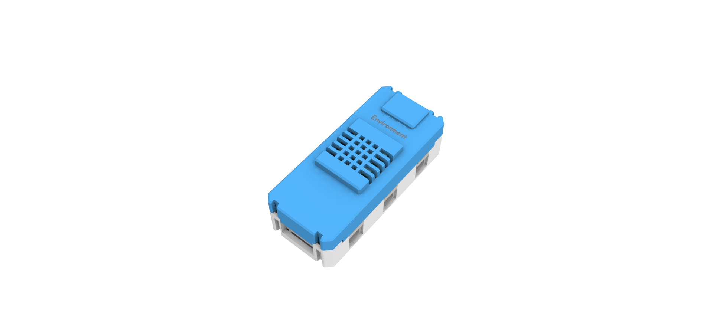
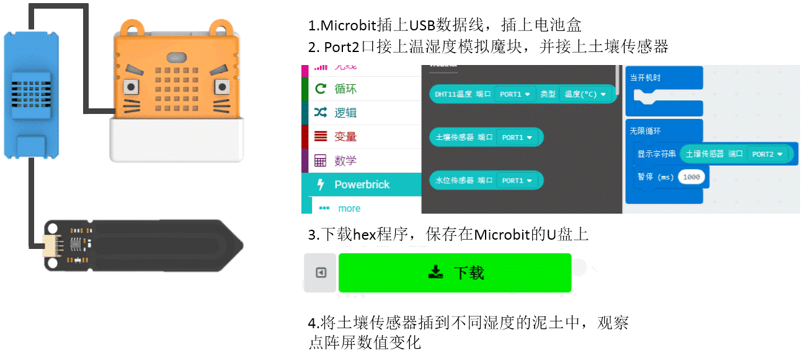

# 温湿度模拟魔块

此模块用于测环境温度、湿度与其他模拟数值的传感器。另含有3PIN接口，配套两种电路板，电容式土壤传感器用于检测土壤的湿度情况，土壤越湿润，数值越大； 雨点水位传感器用于检测水位的高低和是否有雨滴，水位越高，数值越大。

## 详细介绍

## 参数介绍

- 支持电压： 3V-5V
- 尺寸：56mm X 24mm X 19mm
- 接口：PH2.0 4PIN端子 ，引脚服从GVAB排布；PH2.0 3PIN端子接模拟传感器。
- 温度测量范围：0-50°C，温度测量精度±2°C
- 湿度测量范围：20-90%RH，湿度测量精度±5%RH
- 模拟数值测量范围:0-1023

对应Makecode编程界面：
Makecode在线地址：https://makecode.microbit.org/beta#editor
加载Powerbrick插件地址：https://github.com/KittenBot/pxt-powerbrick

## 使用注意事项

- 温湿度模块测试不能放入水中，放入水中会导致短路。
- 土壤传感器、雨滴水位传感器若长期不使用，请妥善放置干燥地方保管，防止潮湿被氧化。
- 土壤传感器、雨滴水位传感器上有最大限位线，请勿过度插入土壤或者水中。会导致电路损坏。

## 水位传感器演示

程序编写，检测水位越高，LED点阵越多（禁止水淹没过最大刻度位置）

## 土壤湿度传感器演示

程序编写，检测土壤湿度越湿，LED点阵用不开心变为开心（禁止土壤传感器插入土中超过最大刻度位置）

## 编程介绍

### 温度与湿度传感器编程

### 土壤湿度传感器编程

### 水位传感器编程

