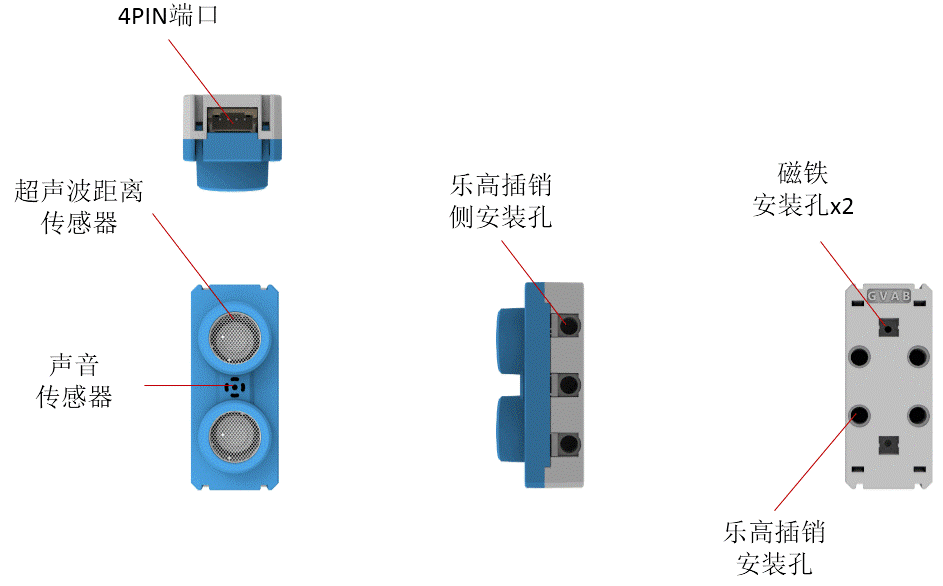
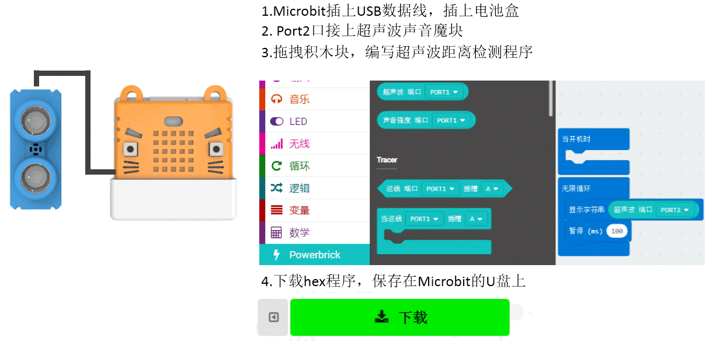
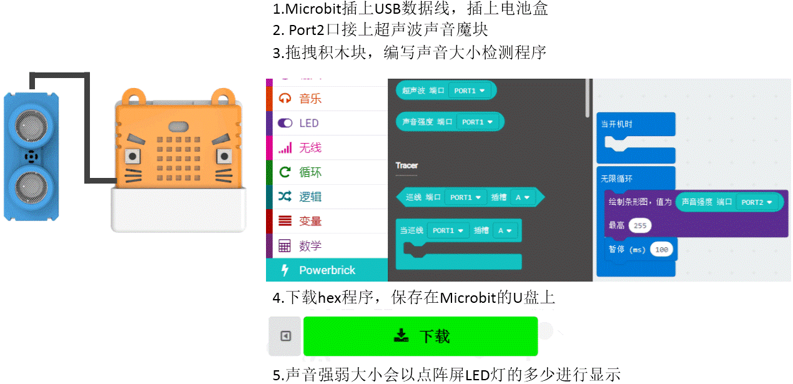

# 超声波声音魔块

模块利用超声波来检测与物体相距的距离。麦克风可检测环境的声音瞬时强弱情况。被誉为“千里眼与顺风耳”,将超声波与麦克风融合为一个模块，简化了模块接线。

## 详细介绍

## 参数介绍

- 支持电压： 3V-5V
- 尺寸：56mm X 24mm X 24mm
- 接口：PH2.0 4PIN端子 ，引脚服从GVAB排布
- 超声波探测距离：4cm-200cm（推荐范围）
- 声音模拟数值范围：0-1023

对应Makecode编程界面：

Makecode在线地址：https://makecode.microbit.org/

加载Powerbrick插件地址：https://github.com/KittenBot/pxt-powerbrick

## 使用注意事项

- 超声波距离检测要求物体表面比较平整，平面尽量垂直于超声波的发射方向。超声波发射是一个扇形波形，所以要注意测量距离之间是否有其他障碍物遮挡。
- 麦克风只能检测环境的声音情况，非分贝值，分贝值的测试需要更专业的仪器。检测声音的瞬时声音强弱数值。

## 编程介绍

### 超声波传感器编程

本程序通过读取超声波返回来的距离值，并把距离值显示在Microbit的点阵屏上

### 声音传感器编程

本程序通过读取麦克风返回来的数值大小，通过Microbit的条形图点阵屏上,声音越大，点阵屏的点数越满

