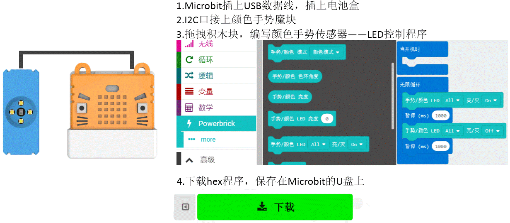

# 颜色手势魔块

Color/Gesture

此模块是一个多功能的模块，主要功能是识别颜色和识别手势。
颜色识别模式下，4颗LED常亮，颜色检测返回色环角度值。
手势识别模式下，手的运动方向，会触发对应方向的LED闪烁一下。
距离检测模式下，最远范围3cm左右，越靠近，4个LED亮度越亮。
无模式设置时，4颗LED亮度和亮灭状态可控。
颜色识别模式下，可以检测环境光强。

## 详细介绍

## 参数介绍

- 支持电压： 3V-5V
- 尺寸：56mm X 24mm X 16mm
- 接口：PH2.0 4PIN端子 ，引脚服从GVAB排布
- 手势识别模式下，可识别上右下左四个移动方向，分别返回值为1、2、3、4。没有检测到手势时，返回值为0。
- 近距模式下，最大检测距离为3cm左右，返回值为0-255，越靠近数值越大。
- 亮度检测返回值范围：0-255

对应Makecode编程界面：

Makecode在线地址：https://makecode.microbit.org/beta#editor

加载Powerbrick插件地址：https://github.com/KittenBot/pxt-powerbrick

## 使用注意事项

- 颜色手势魔块只能接在I2C接口上进行使用，其他Port口无效。
- 使用颜色手势魔块前，需要进行模式初始化设置。（如果不进行初始化设置，默认进入近距模式）
- 手势识别模式下，手的距离、运动方向、运动速度需要自己多次调整尝试，掌握合适的距离、方向、速度，才能触发正确的手势识别。
- 颜色返回值——色环角度，用于对颜色进行判断。
- 颜色识别下，魔块距离检测物体表面1cm左右，颜色识别效果最好。
- 在无模式设置下，才能对4颗LED进行亮灭控制和亮度控制。

## 编程介绍

### 颜色识别编程

### 近距离模式编程

### 手势识别编程

### LED控制编程

